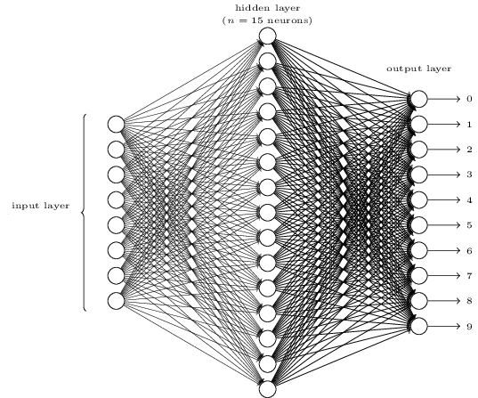
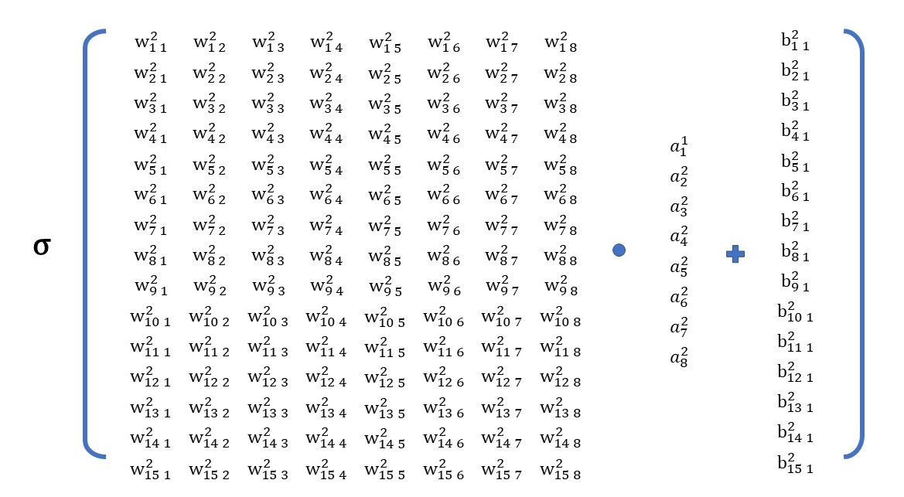
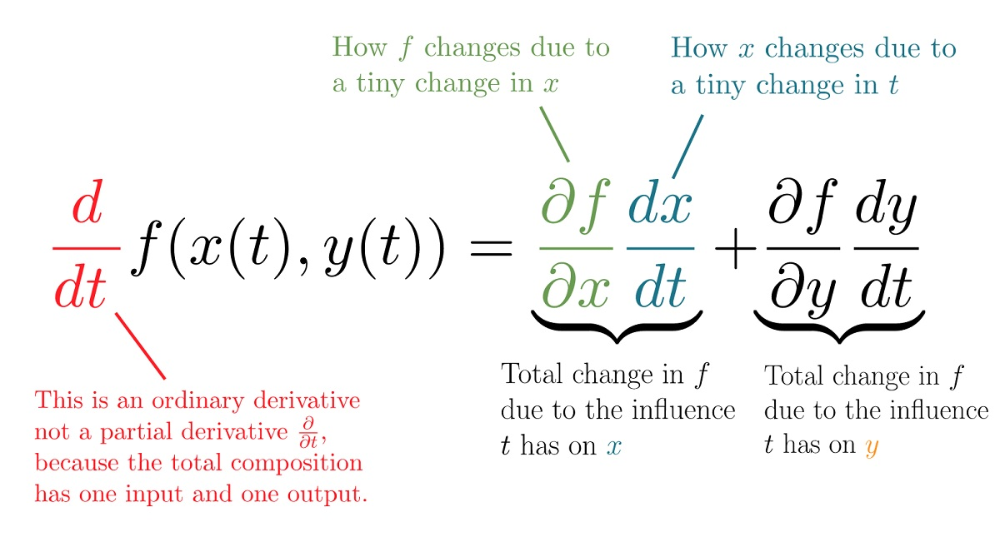

# 10 NN基本功：反传的推导

[上一篇 9 “驱魔”之反向传播大法](./9-“驱魔”之反向传播大法.md)引出了反向传播算法——神经网络的引擎，并在最后窥探了它的全貌。本篇将详细的讨论反向传播各方面的细节。尽管它被TensorFlow封装的很好，但仍强烈建议把它作为人工神经网络的基本功，理解并掌握它，回报巨大。

《Neural Network and Deep Learning》的作者Nielsen写道：

> It actually gives us detailed insights into how changing the weights and biases changes the overall behaviour of the network. That's well worth studying in detail.

> 实际上它（反向传播算法）给了我们更加细致的洞察：如何通过改变权重和偏置来改变网络的整体行为。非常值得深入的学习。

好在这里面最困难的——推导反向传播四大公式，也并非看上去那么难：keep calm and use chain rule（链式求导法则）。

## 先说前馈

为了能说清楚“反向传播”（Backpropagation），得先从“前馈”（Feedforward）说起。

到目前为止讨论的神经网络，都是以上一层的输出，作为下一层的输入，其中没有回路。也就是说网络中的信息总是从输入层向输出层传播，不存在反馈（Feedback）。这样的网络就是**前馈神经网络**。

对于前馈神经网络，当确定了网络的层数，每层神经元的个数，以及神经元的激活函数，那么给定输入，通过“层层前馈”就能计算输出。用ajl来表示第l层中第j个神经元的输出，那么输出的表达式为：

上式是l层第j个单个神经元的输出表达式，如果用矩阵来表示某一层所有神经元的输出的话，形式会更加的简单和优美：

上式表示了l层神经元的输出与输入（也就是上一层神经元的输出）之间的关系。

为了对上式的矩阵操作看的更加清晰，仍用之前的3层感知器网络举例。

简单回顾下矩阵的乘法的行列约束：Alm·Bmn=Cln，即一个l行m列的矩阵A与一个m行n列的矩阵B相乘，那么结果矩阵C是l行n列。

套用al的公式，计算a2(第二层输出)：

等价的微观视角：

有了前馈表达式，就可以计算出网络各层的输出al，乃至最终的输出aL（L代表网络的总层数）。这样，当前模型的损失也能计算出来了，仍以均方误差（MSE）作为损失函数：

用aL(x)代替下式中的output(x)，有：

其中对于单个独立样本Cx来说，有：

从上式的形式上来看，也可以把损失Cx看成神经网络输出aL的函数。

## 什么在反向传播？

前面介绍了**信息**的前馈，也明说了**信息**没有“反向回馈”。那么当我们在说反向传播时，我们在说什么？

答案是“**神经元的误差**”，“误差”在反向传播。

为了能从形式上看到这个“误差”，对于第l层的第j个神经元，定义神经元误差：

它是一个纯粹的形式定义，表达式的含义是：某个神经元的误差是损失函数C对于该神经元**加权输入**z的偏导数，其中加权输入z即神经元激活函数的输入：

之所以说误差会沿着网络反方向传播，主要基于对反向传播第2个公式的（BP2）的观察和理解。BP2显示：**被定义为神经元误差的δl，是由比它更靠近输出层神经元的误差δl+1决定的**：

基于这个数学形式，可以非常清晰和形象的看到“误差”的确是在反方向传播。

再次列出反向传播4大公式：

此时回看BP1，就会意识到BP1与BP2配合之强大了：只要通过BP1计算出输出层的δL，那么就可以通过BP2“层层反传”，计算出任意一层的δl。而损失函数C对于任意层中的wl和bl偏导数也就可以通过BP3和BP4得到了。

## 推导前的两个准备

### Hadamard乘积

在BP1与BP2中都用到了一个符号“⊙”，它连接两个矩阵完全相同的矩阵，表示Hadamard（哈达玛）乘积。它的运算规则非常的简单（仅次于矩阵加减法），就是两矩阵的对应元素相乘。一个例子：

### 链式求导法则

## BP1推导

BP1的另一种表达方式是分量表达式，对其进行推导。

对δjl的定义，运用链式求导法则：

只有当k=j时，ak=jL才与zjL有关系（ajL = σ(zjL)）。k≠j时，∂akL/∂zjL就消失了：

因为ajL = σ(zjL)，上式中∂ajL/∂zjL可以写为σ'(zjL)，即推导出BP1：

BP1给出了计算δjl的方法，计算起来比看上去要简单的多。把δjl的计算拆分成左右两个部分：∂C/∂ajL和σ'(zjL)。

如果我们使用均方差作为损失函数C，那么单个样本的情况下有：

所以∂C/∂ajL = (aj - yj)。

如果σ是sigmoid函数，有σ'(x) = σ(x) * (1 - σ(x))（可自行证明）。那么σ'(zjL) = σ(zjL) * (1 - σ(zjL))，其中zjL是通过前馈计算获得的。

## BP2推导

对BP2的分量表达式进行推导：

BP2会稍微复杂一点。要想办法将δkl+1 = ∂C/∂zkl+1引入，仍然应用链式求导法则：

为了求∂zkl+1/∂zjl，根据定义有：

代入∂zkl+1/∂zjl，得到

再将上式代回[推导BP2：1]，即推导出BP2：

## BP3推导

BP3是求取损失C对于偏置b的偏导数，性质非常好，居然就是δjl本身：

利用链式求导法则，引入∂C/∂zjl：

因为有：

即推出BP3:

## BP4推导

BP4是求取损失C对于偏置w的偏导数:

利用链式求导法则，引入∂C/∂zjl：

即推出BP4:

## 如果没有反向传播算法

之前提到，由于神经网络的权重参数过多，通过解偏导数方程来得到梯度是不现实的。那么在反向传播算法被应用之前，难道就真的没有任何办法吗？答案是有的，利用导数的定义即可：

wj表示第j个权重，对于wj上一个非常小的增量，通过网络的层层传递，最终会导致的损失函数的变化。在上式中，对wj求导，可以近似成等式右边的形式。对于偏置求导也是同理。

这个算法并不复杂，易懂易实现。看似比反向传播四大公式简单很多。

接下来我们算下计算量的帐，就不那么美好了。假设整个网络中有30000个权重（现实中非常小巧的网络），那么对于每一个样本，要得到“损失”对所有30000个参数的偏导，就要进行30001次前向传播计算（多出的1次零头是求初始的C(w)）。这是因为对每个权重求偏导，都需要获得当前的“损失”，而“损失”是由网络最后一层输出决定的。

对于海量的训练样本，以及现实中更加庞大的网络结构，计算量就是天文数字了。

反观反向传播算法，尽管其公式刚开始看上去有些凌乱（其实看久了是十分具有美感的），但是对于每一个样本，一趟前向传播，再加一趟反向传播，30000个权重就可以全部计算出来了。这才让大规模的网络训练具有了现实意义。