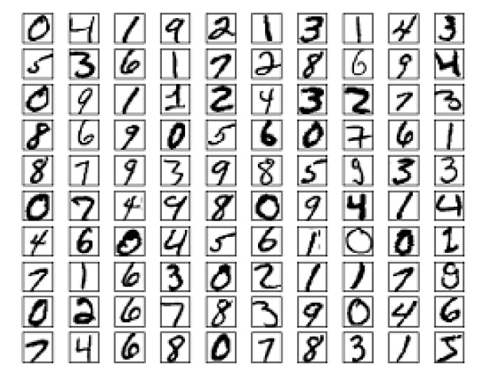
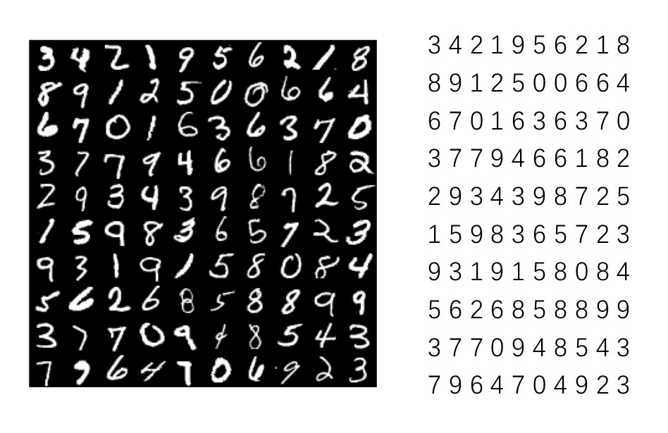
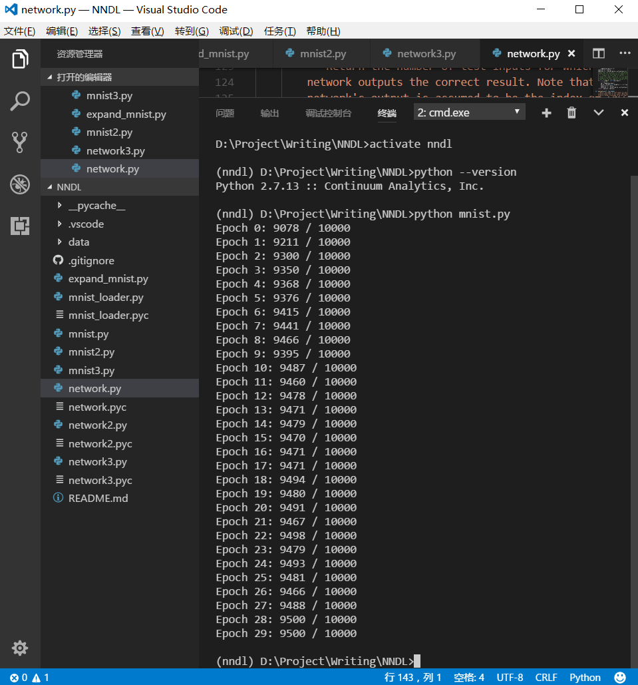

# 11 74行Python实现数字手写体识别

到目前为止，我们已经研究了梯度下降算法、人工神经网络以及反向传播算法，他们各自肩负重任：

- 梯度下降算法：机器自学习的算法框架；
- 人工神经网络：“万能函数”的形式表达；
- 反向传播算法：计算人工神经网络梯度下降的高效方法；

基于它们，我们已经具备了构建具有相当实用性的智能程序的核心知识。它们来之不易，从上世纪40年代人工神经元问世，到80年代末反向传播算法被重新应用，历经了近半个世纪。然而，实现它们并进行复杂的数字手写体识别任务，只需要74行Python代码（忽略空行和注释）。要知道如果采用编程的方法（非学习的方式）来挑战这个任务，是相当艰难的。

本篇将分析这份Python代码“network.py”，它基于NumPy，在对50000张图像学习后，即能够识别0-9手写体数字，正确率达到95%以上。强烈建议暂时忘记TF，用心感受凝结了人类文明结晶的沧桑算法。代码来自Micheal Nielsen的[《Neural Networks and Deep Learning》](http://neuralnetworksanddeeplearning.com/)，略有修改（格式或环境匹配），文末有下载链接。

## MNIST数据集

早在1998年，在AT&T贝尔实验室的Yann LeCun就开始使用人工神经网络挑战手写体数字识别，用于解决当时银行支票以及邮局信件邮编自动识别的需求。数据集MNIST由此产生。它包含从0-9共10种手写体数字，训练图片集60000张，测试图片集10000张，可在Yann LeCun的网站[下载](http://yann.lecun.com/exdb/mnist/)。

MNIST最初来源于NIST（National Institute of Standards and Technology，美国国家标准与技术研究院）数据库，后经过预处理成为更适合机器学习算法使用的MNIST，首字母M是“修改过的”（Modified）的意思。到目前为止，它仍是机器学习算法实验使用最广泛的基准数据集，就像生物学家经常用果蝇做实验一样，Geoffrey Hinton将其形容为“机器学习的果蝇”。而手写体数字识别，也成了机器学习的入门实验案例。

如上图所示，MNIST中的图像是灰度图像，像素值为0的表示白色，为1的表示黑色，中间值是各种灰色。每张样本图像的大小是28x28，具有784个像素。

### 训练集与测试集

MNIST中的60000张训练图像扫描自250个人的手写样本，他们一半是美国人口普查局的员工，一半是大学生。10000张测试图像来自另外250个人（尽管也是出自美国人口普查局和高校）。可是为什么要这么做呢？答案是为了**泛化**（Generalization）。

人们希望学习**训练集**（training set）后获得的**模型**，能够识别出从未见过的样本，这种能力就是泛化能力，通俗的说，就是举一反三。人类大脑就具有相当好的泛化能力，一个两岁小孩在见过少量的鸭子图片后，即可辨认出他从未见过的各种形态的鸭子。

基于这种考虑，**测试集**（test set）不会参于模型的训练，而是特意被留出以测试模型的泛化性能。周志华的西瓜书中有一个比方：如果让学生复习的题目，就是考试的考题，那么即便他们考了100分，也不能保证他们真的学会了。

### 标签

上图中右侧的部分，称为**标签**（Label），是和样本数据中的每张图片一一对应的，由人工进行标注。标签是数据集必不可少的一部分。模型的训练过程，就是不断的使识别结果趋近于标签的过程。基于标签的学习，称为**有监督学习**。

### 验证集与超参数

Micheal Nielsen的代码，把60000张训练集进行了进一步的划分，其中50000张作为训练集，10000张作为**验证集**（validation set）。所以代码使用MNIST数据集与Yann LeCun的是有些区别的，本篇所使用的MNIST从[这里](https://github.com/EthanYuan/NNDL/tree/master/data)下载。

模型的参数是由训练数据自动调整的，其他不被学习算法覆盖的参数，比如神经网络中的学习率、随机梯度下降算法中的mini batch的大小等，它们都被称为**超参数**。验证集被划分出来就是用于评估模型的泛化能力，并以此为依据优化超参数的。

这里容易产生一个疑问：评估模型的泛化能力，不是测试集要做的事情吗？

测试集的确是用于评估模型的泛化能力的，但是理想情况下是用于最终评测。也就是说，测试集产生的任何结果和反馈，都不应该用于改善模型，以避免模型对测试集产生过拟合。那么从训练集划分出验证集，就没有这个限制了，一方面验证集不参与训练，可以评估模型的泛化能力，另一方面，可以从评估的结果来进一步改善模型的网络架构、超参数。

验证数据不是MNIST规范的一部分，但是留出验证数据已经成了一种默认的做法。

## Python必知必会：张量构建

本篇使用与《Neural Networks and Deep Learning》示例代码一致的Python版本：

- Python 2.7.x，使用了conda创建了专用虚拟环境，具体方法参考[1 Hello, TensorFlow!](./1-Hello,TensorFlow!.md)；
- NumPy版本：1.13.1。

作为AI时代[头牌语言](http://www.jianshu.com/p/7aecc2ab003f)的Python，具有非常好的生态环境，其中数值算法库NumPy做矩阵操作、集合操作，基本都是“一刀毙命”。为了能顺畅的分析接下来的Python代码，我挑选了1处代码重点看下，略作修改（前两层神经元数量）可以单独运行。

	1 import numpy as np
	2 sizes = [8, 15, 10]	
	3 biases = [np.random.randn(y, 1) for y in sizes[1:]]
    4 weights = [np.random.randn(y, x) for x, y in zip(sizes[:-1], sizes[1:])]

第1行：导入numpy并启用np作为别名。

第2行：是一个数组定义，其中包含了3个元素。

第3行：

- 先看`sizes[1:]`，它表示sizes的一个子数组，包含元素从原数组的下标1开始，直到原数组最后1个元素，它的值可以算出是`[15, 10]`;
- 然后是NumPy的随机数生成方法`random.randn`，它生成的随机数，符合均值为0，标准差为1的标准正态分布；
- `random.randn`方法的参数，描述生成张量的形状，例如`random.randn(2,3)`会生成秩为2，形状为shape[2,3]的张量，是一个矩阵：`array([[-2.17399771,  0.20546498, -1.2405749 ], [-0.36701965,  0.12564214,  0.10203605]])`，关于张量请参考[2 TensorFlow内核基础](./2-TensorFlow核心编程.md)；
- 第3行整体来看才能感受到Python和NumPy的威力：**方法参数的参数化**，即调用`randn`方法时可传入变量：`randn(y, 1)`，而变量y遍历集合`sizes[1:]`，效果等同于`[randn(15, 1), randn(10, 1)]`；

第4行：

- 先看`sizes[:-1]`表示其包含的元素从原数组的第1个开始，直到原数组的最后1个的前一个（倒数第2个），此时`sizes[:-1]`是`[8, 15]`；
- 第4行`randn`的两个参数都是变量y和x，此时出现的`zip`方法，限制了两个变量是同步自增的，效果等同于`[randn(15, 8), randn(10, 15)]`。

## 矩阵与神经网络

分析了前面4行代码，我们知道了如何高效的定义矩阵，但是和神经网络的构建有什么关系呢？下面给出网络结构与矩阵结构的对应关系。

上面的神经网络结构即可描述为：`sizes = [8, 15, 10]`，第一层输入层8个神经元，第二层隐藏层15个神经元，第三层输出层10个神经元。

第一层是输入层，没有权重和偏置。

第二层的权重和偏置为：

第三层的权重和偏置为：

回看第3行代码，其等价于`[randn(15, 1), randn(10, 1)]`，相当于把网络中的两层偏置矩阵放在一起了：

	3 biases = [np.random.randn(y, 1) for y in sizes[1:]]

回看第4行代码，其等价于`[randn(15, 8), randn(10, 15)]`，相当于把网络中的两层权重矩阵放在一起了：

    4 weights = [np.random.randn(y, x) for x, y in zip(sizes[:-1], sizes[1:])]

而这4个矩阵本身，就代表了想要构建的神经网络模型，它们中的元素，构成了神经网络的所有可学习参数（不包括超参数）。当明了了神经网络与矩阵群的映射关系，在你的脑中即可想象出数据在网络中的层层流动，直到最后的输出的形态。

## 随机梯度下降算法框架

整个神经网络程序的骨架，就是梯度下降算法本身，在network.py中，它被抽象成了一个单独的函数SDG（Stochastic Gradient Descent）：

	def SGD(self, training_data, epochs, mini_batch_size, eta, test_data=None)

函数体的实现，非常清晰，有两层循环组成。外层是数据集的迭代（epoch）；内层是随机梯度下降算法中小批量集合的迭代，每个批量（batch）都会计算一次梯度，进行一次全体参数的更新（一次更新就是一个step）：

	for j in range(epochs):
		random.shuffle(training_data)
	    mini_batches = [
	    	training_data[k:k + mini_batch_size]
	        for k in range(0, n, mini_batch_size)]
	    for mini_batch in mini_batches:
	    	self.update_mini_batch(mini_batch, eta)

## BP

可以想象`self.update_mini_batch(mini_batch, eta)`中的主要任务就是获得每个参数的偏导数，然后进行更新，求取偏导数的代码即：

	delta_nabla_b，delta_nabla_w = self.backprop(x, y)

反向传播算法（BP）的实现也封装成了函数`backprop`：

	def backprop(self, x, y):
        """Return a tuple ``(nabla_b, nabla_w)`` representing the
        gradient for the cost function C_x. ``nabla_b`` and
        ``nabla_w`` are layer-by-layer lists of numpy arrays, similar
        to ``self.biases`` and ``self.weights``."""
        nabla_b = [np.zeros(b.shape) for b in self.biases]
        nabla_w = [np.zeros(w.shape) for w in self.weights]
        # feedforward
        activation = x
        activations = [x]  # list to store all the activations, layer by layer
        zs = []  # list to store all the z vectors, layer by layer
        for b, w in zip(self.biases, self.weights):
            z = np.dot(w, activation) + b
            zs.append(z)
            activation = sigmoid(z)
            activations.append(activation)
        # backward pass
        delta = self.cost_derivative(activations[-1], y) * \
            sigmoid_prime(zs[-1])
        nabla_b[-1] = delta
        nabla_w[-1] = np.dot(delta, activations[-2].transpose())
        # Note that the variable l in the loop below is used a little
        # differently to the notation in Chapter 2 of the book. Here,
        # l = 1 means the last layer of neurons, l = 2 is the
        # second-last layer, and so on. It's a renumbering of the
        # scheme in the book, used here to take advantage of the fact
        # that Python can use negative indices in lists.
        for l in range(2, self.num_layers):
            z = zs[-l]
            sp = sigmoid_prime(z)
            delta = np.dot(self.weights[-l + 1].transpose(), delta) * sp
            nabla_b[-l] = delta
            nabla_w[-l] = np.dot(delta, activations[-l - 1].transpose())
        return (nabla_b, nabla_w)

## 识别率

运行代码，在Python命令行输入以下代码：

	import mnist_loader
	import network

	training_data, validation_data, test_data = mnist_loader.load_data_wrapper()

	net = network.Network([784, 30, 10])
	net.SGD(training_data, 30, 10, 3.0, test_data=test_data)

上面代码中的mnist_loader负责MNIST数据的读取，这部分代码在[这里](https://github.com/EthanYuan/NNDL)下载，为了适配数据集的相对路径做了微调。

接下来，定义了一个3层的神经网络：

- 输入层784个神经元（对应28x28的数字手写体图像）；
- 隐藏层30个神经元；
- 输出层10个神经元（对应10个手写体数字）。

最后是梯度下降法的设置：

- epoch：30次；
- batch：10个样本图像；
- 学习率：3.0。

代码开始运行，30次迭代学习后，识别准确率即可达到95%。这个识别率是未去逐个优化超参数，就能轻松得到的，可以把它当做一个基线水准，在此基础上再去慢慢接近NN的极限（99.6%以上）。

运行结果如下：

## 附完整代码

	"""
	network.py
	~~~~~~~~~~
	A module to implement the stochastic gradient descent learning
	algorithm for a feedforward neural network. Gradients are calculated
	using backpropagation. Note that I have focused on making the code
	simple, easily readable, and easily modifiable. It is not optimized,
	and omits many desirable features.
	"""
	# Libraries
	# Standard library
	import random
	
	# Third-party libraries
	import numpy as np
	
	
	class Network(object):
	
	    def __init__(self, sizes):
	        """The list ``sizes`` contains the number of neurons in the
	        respective layers of the network. For example, if the list
	        was [2, 3, 1] then it would be a three-layer network, with the
	        first layer containing 2 neurons, the second layer 3 neurons,
	        and the third layer 1 neuron. The biases and weights for the
	        network are initialized randomly, using a Gaussian
	        distribution with mean 0, and variance 1. Note that the first
	        layer is assumed to be an input layer, and by convention we
	        won't set any biases for those neurons, since biases are only
	        ever used in computing the outputs from later layers."""
	
	        self.num_layers = len(sizes)
	        self.sizes = sizes
	        self.biases = [np.random.randn(y, 1) for y in sizes[1:]]
	        self.weights = [np.random.randn(y, x)
	                        for x, y in zip(sizes[:-1], sizes[1:])]
	
	    def feedforward(self, a):
	        """Return the output of the network if ``a`` is input."""
	        for b, w in zip(self.biases, self.weights):
	            a = sigmoid(np.dot(w, a) + b)
	        return a
	
	    def SGD(self, training_data, epochs, mini_batch_size, eta,
	            test_data=None):
	
	        """Train the neural network using mini-batch stochastic
	        gradient descent. The ``training_data`` is a list of tuples
	        ``(x, y)`` representing the training inputs and the desired
	        outputs. The other non-optional parameters are
	        self-explanatory. If ``test_data`` is provided then the
	        network will be evaluated against the test data after each
	        epoch, and partial progress printed out. This is useful for
	        tracking progress, but slows things down substantially."""
	        if test_data:
	            n_test = len(test_data)
	        n = len(training_data)
	        for j in range(epochs):
	            random.shuffle(training_data)
	            mini_batches = [
	                training_data[k:k + mini_batch_size]
	                for k in range(0, n, mini_batch_size)]
	            for mini_batch in mini_batches:
	                self.update_mini_batch(mini_batch, eta)
	            if test_data:
	                print("Epoch {0}: {1} / {2}".format(
	                    j, self.evaluate(test_data), n_test))
	            else:
	                print("Epoch {0} complete".format(j))
	
	    def update_mini_batch(self, mini_batch, eta):
	        """Update the network's weights and biases by applying
	        gradient descent using backpropagation to a single mini batch.
	        The ``mini_batch`` is a list of tuples ``(x, y)``, and ``eta``
	        is the learning rate."""
	        nabla_b = [np.zeros(b.shape) for b in self.biases]
	        nabla_w = [np.zeros(w.shape) for w in self.weights]
	        for x, y in mini_batch:
	            delta_nabla_b, delta_nabla_w = self.backprop(x, y)
	            nabla_b = [nb + dnb for nb, dnb in zip(nabla_b, delta_nabla_b)]
	            nabla_w = [nw + dnw for nw, dnw in zip(nabla_w, delta_nabla_w)]
	        self.weights = [w - (eta / len(mini_batch)) * nw for w, nw in zip(
	            self.weights, nabla_w)]
	        self.biases = [b - (eta / len(mini_batch)) * nb for b, nb in zip(
	            self.biases, nabla_b)]
	
	    def backprop(self, x, y):
	        """Return a tuple ``(nabla_b, nabla_w)`` representing the
	        gradient for the cost function C_x. ``nabla_b`` and
	        ``nabla_w`` are layer-by-layer lists of numpy arrays, similar
	        to ``self.biases`` and ``self.weights``."""
	        nabla_b = [np.zeros(b.shape) for b in self.biases]
	        nabla_w = [np.zeros(w.shape) for w in self.weights]
	        # feedforward
	        activation = x
	        activations = [x]  # list to store all the activations, layer by layer
	        zs = []  # list to store all the z vectors, layer by layer
	        for b, w in zip(self.biases, self.weights):
	            z = np.dot(w, activation) + b
	            zs.append(z)
	            activation = sigmoid(z)
	            activations.append(activation)
	        # backward pass
	        delta = self.cost_derivative(activations[-1], y) * \
	            sigmoid_prime(zs[-1])
	        nabla_b[-1] = delta
	        nabla_w[-1] = np.dot(delta, activations[-2].transpose())
	        # Note that the variable l in the loop below is used a little
	        # differently to the notation in Chapter 2 of the book. Here,
	        # l = 1 means the last layer of neurons, l = 2 is the
	        # second-last layer, and so on. It's a renumbering of the
	        # scheme in the book, used here to take advantage of the fact
	        # that Python can use negative indices in lists.
	        for l in range(2, self.num_layers):
	            z = zs[-l]
	            sp = sigmoid_prime(z)
	            delta = np.dot(self.weights[-l + 1].transpose(), delta) * sp
	            nabla_b[-l] = delta
	            nabla_w[-l] = np.dot(delta, activations[-l - 1].transpose())
	        return (nabla_b, nabla_w)
	
	    def evaluate(self, test_data):
	        """Return the number of test inputs for which the neural
	        network outputs the correct result. Note that the neural
	        network's output is assumed to be the index of whichever
	        neuron in the final layer has the highest activation."""
	
	        test_results = [(np.argmax(self.feedforward(x)), y)
	                        for (x, y) in test_data]
	        return sum(int(x == y) for (x, y) in test_results)
	
	    def cost_derivative(self, output_activations, y):
	        """Return the vector of partial derivatives \partial C_x /
	        \partial a for the output activations."""
	        return (output_activations - y)
	
	
	# Miscellaneous functions
	def sigmoid(z):
	    """The sigmoid function."""
	    return 1.0 / (1.0 + np.exp(-z))
	
	
	def sigmoid_prime(z):
	    """Derivative of the sigmoid function."""
	    return sigmoid(z) * (1 - sigmoid(z))

[下载 nndl_11_network.py](https://github.com/EthanYuan/NNDL/blob/master/nndl_11_network.py)