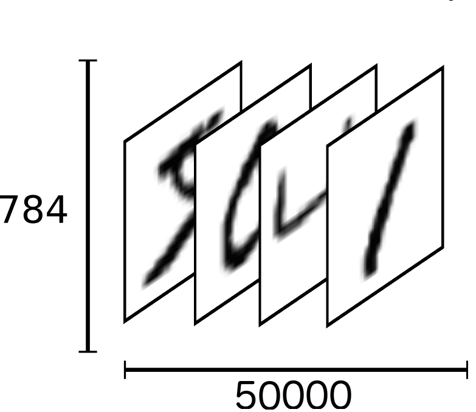

# 12 TF构建3层NN玩转MNIST

上一篇 [11 74行Python实现手写体数字识别](./11-74行Python实现手写体数字识别.md)展示了74行Python代码完成MNIST手写体数字识别，识别率轻松达到95%。这算不上一个好成绩，不过我并不打算立即着手改善它，而是回到本系列的主线上来，用TensorFlow重新实现一遍完全相同的算法。

TF官方的Get Started中，关于MNIST准备了Beginner和Expert两个版本的实现。前者与其说是一个两层的神经网络，不如说是一种线性判别，后者则实现了CNN。两者之间差了一个经典的3层全连接NN，本篇补上。

最终基于TF的代码只有43行（忽略空行和注释）。

## 分析代码的方式

与逐行分析代码不同，我偏好先清理代码涉及到的语言、工具的知识点，然后再去扫描逻辑。所以“Python必知必会”、“TensorFlow必知必会”将是首先出现的章节。

当然你也可以直接跳到代码部分：

- [mnist](https://github.com/EthanYuan/TensorFlow/tree/master/MNIST)：TF使用的MNIST数据集，注意与上一篇Python实现使用的数据集不是同一份；
- [tf_12_mnist_softmax.py](https://github.com/EthanYuan/TensorFlow/blob/master/TF1_1/tf_12_mnist_softmax.py)：TF MNIST for ML Beginner也一并奉上，修改了原始读取MNIST数据的路径，运行时请保持与本MNIST数据集的相对位置不变；
- [tf_12_mnist_nn.py](https://github.com/EthanYuan/TensorFlow/blob/master/TF1_1/tf_12_mnist_nn.py)：3层全连接NN实现；

代码运行环境：

- Python 3.5；
- TensorFlow 1.1。

## Python必知必会

###  `__futrue__`

TF MNIST for ML Beginner代码开头部分，出现了`__future__`模块，导入了`absolute_import`，`division`和`print_function`。其实它们并不是导入语句，所导入的也不能直接作为对象使用：

	from __future__ import absolute_import
	from __future__ import division
	from __future__ import print_function

解释之前，先对**向前兼容**和**向后兼容**做个区分。在中文语境下，它们的语义含混，极易搞反。但是看英文就会非常清楚，向前兼容**Forward Compatibility**，是指向未来兼容；向后兼容**Backward Compatibility**，是指向过去兼容。

上面看到的`__future__`模块，是Python提供的一种让新版本“代码”向后兼容老版本“环境”的方式。很多文章说不清楚这个概念，主要是没有区分清楚python代码的版本和python环境的版本。通常情况下，当代码是Python 3.x的时候，只要加上像上面的代码，就能在Python 2.x环境中执行（以Python 3.x的方式）。

从Python文档描述中看出，`__future__`模块和普通的`import`工作机制很不一样。它告诉解释器把其导入的未来模块替换掉现有模块，从而采用新的语义和语法的代码就可以正常执行：

> A future statement is a directive to the compiler that a particular module should be compiled using syntax or semantics that will be available in a specified future release of Python. The future statement is intended to ease migration to future versions of Python that introduce incompatible changes to the language. It allows use of the new features on a per-module basis before the release in which the feature becomes standard.

此外，`__future__`模块引入时必须在文件的顶部，之前只允许存在注释和空行。

至于[`absolute_import`（绝对导入方式）](https://www.python.org/dev/peps/pep-0328/)、[`division`（除法）](https://www.python.org/dev/peps/pep-0238/)、[`print_function`（打印函数）](https://www.python.org/dev/peps/pep-3105/)具体的兼容性（冲突）定义，可自行参考官方的[PEP文档（Python Enhancement Proposals）](https://www.python.org/dev/peps/)。

### `__name__`

TF MNIST for ML Beginner代码的结尾部分：

	if __name__ == '__main__':
	    parser = argparse.ArgumentParser()
	    parser.add_argument('--data_dir', type=str, default='/MNIST/',
	                        help='Directory for storing input data')
	    FLAGS, unparsed = parser.parse_known_args()
	    tf.app.run(main=main, argv=[sys.argv[0]] + unparsed)

这是Python模块的一种常见构造方式：**Make a script both importable and executable**（既可被调用又能作为main函数独立执行）。在其作为被调用模块时，`__name__`为“module”，而不再是`__main__`，此时上面代码段不会执行。

### list和numpy.array

这里区分下Python的list与NumPy的array。在做科学计算时，大多数时候我们使用后者。

Python中并没有数组，而一个看起来比较像数组的类型是list，可它的特性一定不会让你满意的：

	list1 = [1, 2, 3]
	list2 = [4, 5, 6]
	print(list1 + list2)
	print(list1 * 2)

输出：

	[1, 2, 3, 4, 5, 6]
	[1, 2, 3, 1, 2, 3]

NumPy中提供了array：

	import numpy
	array1 = numpy.array([1, 2, 3])
	array2 = numpy.array([4, 5, 6])
	print(array1 + array2)
	print(array1 * array2)

输出：

	[5 7 9]
	[4 10 18]

可见numpy.array才是我们需要的，一个如此简单的`*`就实现了Hadamard乘积⊙。TensorFlow处理数组的方式和NumPy是一致的。

## TensorFlow必知必会

### 输入层张量构建

在上一篇用Python实现NN的输入层时，我们构建了一个784 x 1的矩阵作为第一层神经元的输出x，网络每次只处理一幅图像。第二层神经元权重矩阵为一个30 x 784的矩阵W2，两者相乘W2·x，权重矩阵在前，前一层输出在后。

而TF的MNIST for ML Beginner代码在构建第一层神经元时，构建了一个n x 784的矩阵x，它一次可以输出n张图像（甚至全部50000张测试图像，如下图所示）。第二层神经元权重矩阵为一个784 x 30的矩阵W2，两者相乘x·W2，前一层输出在前，权重矩阵在后。

这是构建NN输入层张量时，TF与之前的Python方式上的差异。如果换个角度来理解，把TF的tensor的横坐标当作时间轴，那么n x 784就相当样本的时间序列，这样来看和Python方式在本质上几乎一样的。

### InteractiveSession

在MNIST for ML Beginner代码中，使用了`InteractiveSession`：

    sess = tf.InteractiveSession()

TF文档写道：

> The only difference with a regular Session is that an InteractiveSession installs itself as the default session on construction. 

也就是说，调用了`InteractiveSession`之后，上下文就有了默认的session。

使用Session的写法：

	init = tf.global_variables_initializer()
	sess = tf.Session()
	sess.run(init)

使用InteractiveSession则可以简化成：

	tf.InteractiveSession()
	...
	tf.global_variables_initializer().run()

### tf.nn.softmax_cross_entropy_with_logits

在MNIST for ML Beginner代码中出现了这个API，具体的用法如下：

	y = tf.matmul(x, W) + b
    y_ = tf.placeholder(tf.float32, [None, 10])

	cross_entropy = tf.reduce_mean(tf.nn.softmax_cross_entropy_with_logits(labels=y_, logits=y))

这个API一口气做了两件事情，将神经元的“加权和”`y = tf.matmul(x, W) + b`作为输入，首先计算了以柔性最大值为激活函数的神经元输出，然后又计算了交叉熵“损失”。虽然强大，但是从工程角度看它不够“简单”。在最后测试集上评估识别精度时，官方的sample code没有用真正的输出与标签进行比对：

    correct_prediction = tf.equal(tf.argmax(y, 1), tf.argmax(y_, 1))

虽然这不会对最终结果产生影响，但是更加符合理论算法的形式应该是：

	correct_prediction = tf.equal(tf.argmax(tf.nn.softmax(y), 1), tf.argmax(y_, 1))

### 什么是logits

tf.nn.softmax_cross_entropy_with_logits名字中最后一个词“logits”，让我困惑了很久。

本质上它其实就是NN输出层神经元的加权输入**zL=aL-1·WL + bL**（还未叠加最后的激活函数）。可是为什么叫logits呢？

TF官方文档上对这个参数的解释是：**unscaled log probabilitie**，让人费解。我觉得这不是个好名字，不仅在中文机器学习术语中鲜得一见，就是老外也[搞不清楚](https://stackoverflow.com/questions/40871797/tensorflow-softmax-cross-entropy-with-logits-asks-for-unscaled-log-probabilities)。

当然，这也绝不是TF的研发人员不负责任的表现，可能是一种领域术语习惯，见维基百科[对数概率](https://en.wikipedia.org/wiki/Log_probability)词条。

### tf.train.GradientDescentOptimizer

在[5 TensorFlow轻松搞定线性回归](./5-TensorFlow轻松搞定线性回归.md)中，我们已经见识过了最优化计算的封装——tf.train.GradientDescentOptimizer，现在模型从简单的线性模型，变成了复杂的人工神经网络，它还是一样轻松搞定。

之所以基于TensorFlow实现相同的MNIST数字识别，代码量可以少40%，要归功于GradientDescentOptimizer。仅仅一句代码，就自动包含了前馈计算、反向传播求偏导，并自动更新所有的权重和偏置：

	train_step = tf.train.GradientDescentOptimizer(3.0).minimize(loss)

### reduce_sum

无论是TensorFlow还是NumPy都提供了对于张量在不同的方向上做累加计算的支持。这里给出一个玩具代码自行体会：。这里给出一个玩具代码自行体会：

	import tensorflow as tf
	import numpy as np
	a = np.array([[1, 2, 3], [4, 5, 6]])
	tf.InteractiveSession()
	print(tf.reduce_sum(a).eval())
	print(tf.reduce_sum(a, 0).eval())
	print(tf.reduce_sum(a, 1).eval())

输出：

	21
	[5 7 9]
	[6 15]

### argmax

`argmax`也是基于张量的计算，求取某个方向上的最大值的下标，在做统计时十分有用。同样给出一个玩具代码自行体会：

	import tensorflow as tf
	import numpy as np
	a = np.array([[1, 2, 3], [4, 5, 6]])
	tf.InteractiveSession()
	print(tf.argmax(a).eval())
	print(tf.argmax(a, 0).eval())
	print(tf.argmax(a, 1).eval())
	np.argmax(a)
	np.argmax(a, 0)
	np.argmax(a, 1)

输出：

	[1 1 1]
	[1 1 1]
	[2 2]
	5
	[1 1 1]
	[2 2]

输出结果返回的是最大值的下标（从0开始）。注意TensorFlow与NumPy有些许差别。

## 代码分析

熟悉了前面的基础知识点，再去看完整的NN实现，就会无比轻松了。熟悉了前面的基础知识点，再去看完整的NN实现，就会无比轻松了。整体代码分为5大块：

- 读取数据；
- 构建神经网络计算图；
- 定义损失函数和优化器；
- 执行计算图，进行NN训练；
- 测试性能。

在TF官方MNIST for ML Beginner代码的基础上（tf_12mnist_softmax.py），只消做3处改动，即可实现与之前算法一模一样的经典3层NN。

1 追加一个有30个神经元隐藏层，使用S型函数作为激活函数：

    W_2 = tf.get_variable('W_2', [784, 30], initializer=tf.random_normal_initializer())
    b_2 = tf.get_variable('b_2', [30], initializer=tf.random_normal_initializer())
    z_2 = tf.matmul(x, W_2) + b_2
    a_2 = tf.sigmoid(z_2)

2 使用均方差（MSE）作为损失函数(为了和之前的算法保持一致):
	
	loss = tf.reduce_mean(tf.norm(y_ - a_3, axis=1)**2) / 2

3 设置超参数保持和之前算法一致：30次迭代，10个样本为一个mini batch，测试样本数取50000，学习率3.0:

    train_step = tf.train.GradientDescentOptimizer(3.0).minimize(loss)
    ...
    for epoch in range(30):
        for _ in range(5000):
            batch_xs, batch_ys = mnist.train.next_batch(10)
            ...

基于上述修改，结果出现了一个小状况：无论如何调整学习率，增加迭代次数，训练后模型的准确率最多只能达到60%。

### 参数初始化的坑

仔细比对之前算法的Python实现，终于发现了一处不起眼的差异：对参数W和b的初始化方式不同。立即由全零初始化改为随机初始化，再对模型进行训练，正确率终于达到了预期的95%。

	W_2 = tf.get_variable('W_2', [784, 30], initializer=tf.random_normal_initializer())
	b_2 = tf.get_variable('b_2', [30], initializer=tf.random_normal_initializer())
	...
	W_3 = tf.get_variable('W_3', [30, 10], initializer=tf.random_normal_initializer())
	b_3 = tf.get_variable('b_3', [10], initializer=tf.random_normal_initializer())

### 对比

对上一篇中的Python实现和本篇的TF实现做了一个简单的对比。

从代码量来看，TF实现只需要43行，完胜Python实现的74行。这是因为几乎所有的算法TF都进行了封装：

- 梯度下降算法；
- 前馈；
- 反向传播算法；
- 激活函数；

再看识别率。由于算法完全相同，所以识别率基本一致，都在95%上下浮动。

最后看执行效率。在相同运算量下，两者的运行时间相差悬殊，TF的计算图模式体现出了巨大的性能优势（对计算图的介绍见[2 TensorFlow内核基础](./2-TensorFlow核心编程.md)），对50000张训练数据，进行30次迭代训练：

- Python实现：4 min 17 sec
- TF实现：1 min 48 sec 

> 注：数据在笔记本上运行得到，i5-4300U CPU，12GB RAM。

总体来说，TF完胜：一半的代码，两倍的速度。

## 附完整代码

tf_12_mnist_nn.py:

	import argparse
	import sys
	from tensorflow.examples.tutorials.mnist import input_data
	import tensorflow as tf
	
	FLAGS = None
	
	
	def main(_):
	    # Import data
	    mnist = input_data.read_data_sets(FLAGS.data_dir, one_hot=True)
	
	    # Create the model
	    x = tf.placeholder(tf.float32, [None, 784])
	    # W_2 = tf.Variable(tf.zeros([784, 30]))
	    W_2 = tf.get_variable(
	        'W_2', [784, 30], initializer=tf.random_normal_initializer())
	    # b_2 = tf.Variable(tf.zeros([30]))
	    b_2 = tf.get_variable(
	        'b_2', [30], initializer=tf.random_normal_initializer())
	    z_2 = tf.matmul(x, W_2) + b_2
	    a_2 = tf.sigmoid(z_2)
	
	    # W_3 = tf.Variable(tf.zeros([30, 10]))
	    W_3 = tf.get_variable(
	        'W_3', [30, 10], initializer=tf.random_normal_initializer())
	    # b_3 = tf.Variable(tf.zeros([10]))
	    b_3 = tf.get_variable(
	        'b_3', [10], initializer=tf.random_normal_initializer())
	    z_3 = tf.matmul(a_2, W_3) + b_3
	    a_3 = tf.sigmoid(z_3)
	
	    # Define loss and optimizer
	    y_ = tf.placeholder(tf.float32, [None, 10])
	    # loss = tf.losses.tf.losses.mean_squared_error(y_, a_3)
	    loss = tf.reduce_mean(tf.norm(y_ - a_3, axis=1)**2) / 2
	    train_step = tf.train.GradientDescentOptimizer(3.0).minimize(loss)
	
	    sess = tf.InteractiveSession()
	    tf.global_variables_initializer().run()
	
	    # Train
	    best = 0
	    for epoch in range(30):
	        for _ in range(5000):
	            batch_xs, batch_ys = mnist.train.next_batch(10)
	            sess.run(train_step, feed_dict={x: batch_xs, y_: batch_ys})
	        # Test trained model
	        correct_prediction = tf.equal(tf.argmax(a_3, 1), tf.argmax(y_, 1))
	        accuracy = tf.reduce_sum(tf.cast(correct_prediction, tf.int32))
	        accuracy_currut = sess.run(accuracy, feed_dict={x: mnist.test.images,
	                                                        y_: mnist.test.labels})
	        print("Epoch %s: %s / 10000" % (epoch, accuracy_currut))
	        best = (best, accuracy_currut)[best <= accuracy_currut]
	
	    # Test trained model
	    print("best: %s / 10000" % best)
	
	
	if __name__ == '__main__':
	    parser = argparse.ArgumentParser()
	    parser.add_argument('--data_dir', type=str, default='/MNIST/',
	                        help='Directory for storing input data')
	    FLAGS, unparsed = parser.parse_known_args()
	    tf.app.run(main=main, argv=[sys.argv[0]] + unparsed)

[下载tf_12_mnist_nn.py](https://github.com/EthanYuan/TensorFlow/blob/master/tf_12_mnist_nn.py)。