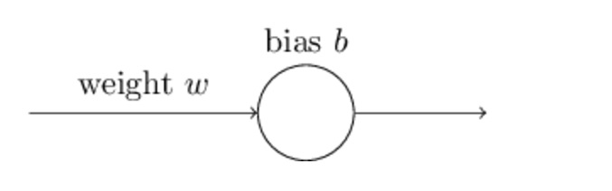
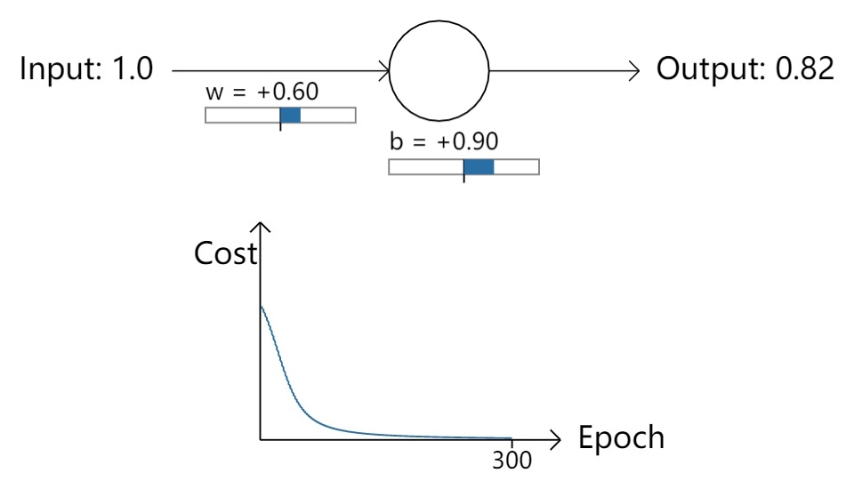
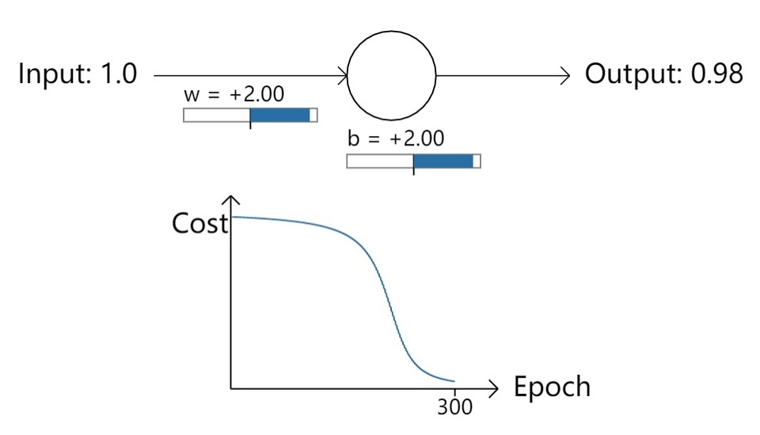
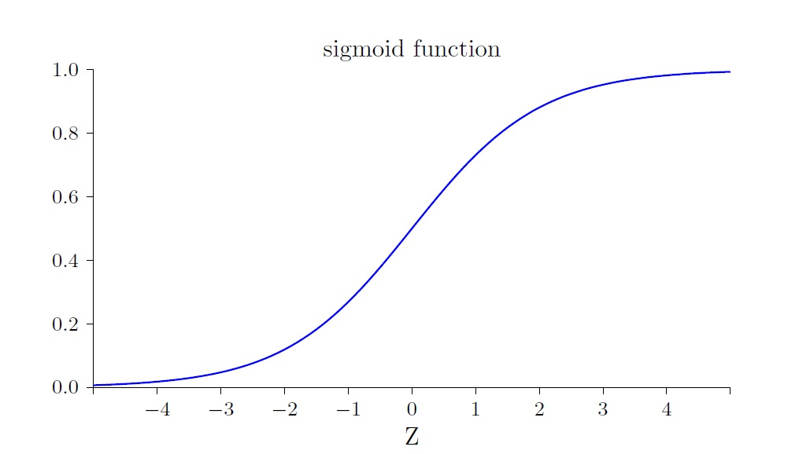
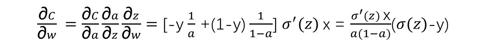
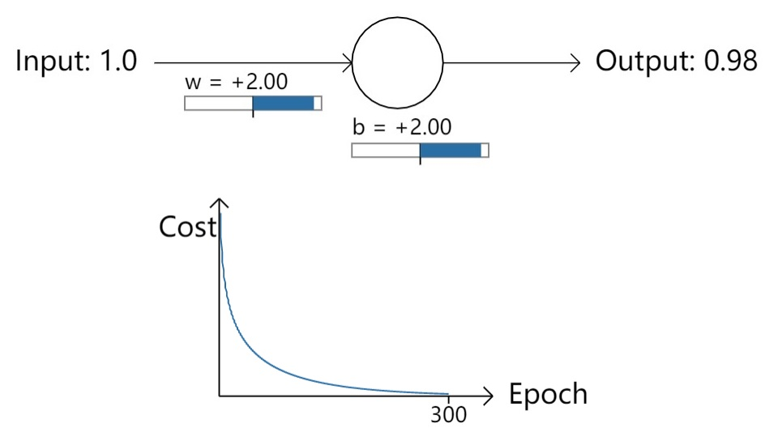

14 交叉熵损失函数——克服学习缓慢

通过上一篇 [13 驯兽师：神经网络调教综述](./13-AI驯兽师：神经网络调教综述.md)，对神经网络的调教有了一个整体印象，本篇从学习缓慢这一常见问题入手，根据Michael Nielsen的《Neural Networks and Deep Learning》[chap3 Improving the way neural networks learn](http://neuralnetworksanddeeplearning.com/chap3.html)中的建议，引入交叉熵损失函数，并分析它是如何克服学习缓慢问题。

## “严重错误”导致学习缓慢

回顾识别MNIST的网络架构，我们采用了经典的S型神经元，以及常见的基于均方误差（MSE）的二次函数作为损失函数。殊不知这种组合，在实际输出与预期偏离较大时，会造成学习缓慢。

简单的说，如果在初始化权重和偏置时，故意产生一个背离预期较大的输出，那么训练网络的过程中需要用很多次迭代，才能抵消掉这种背离，恢复正常的学习。这种现象与人类学习的经验相悖：**对于明显的错误，人类能进行快速的修正**。

为了看清楚这个现象，Michael用一个S型神经元，从微观的角度做了重现。这个神经元接受1个固定的输入“1”，期望经过训练后能输出“0”，因此待训练参数为1个权重w和1个偏置b，如下图：

先观察一个“正常”初始化的情况。

令w=0.6，b=0.9，可认为其符合均值为0，标准差为1的正态分布。此时，输入1，输出0.82。接下来开始使用梯度下降法进行迭代训练，从Epoch-Cost曲线可以看到“损失”快速降低，到第100次时就很低了，到第300次迭代时已经几乎为0，符合预期，如下图：

接下来换一种初始化策略。

将w和b都赋值为“2.0”。此时，输入1，输出为0.98——比之前的0.82偏离预期值0更远了。接下来的训练Epoch-Cost曲线显示200次迭代后“损失”依然很高，减少缓慢，而最后100次迭代才开始恢复正常的学习，如下图：

## 学习缓慢原因分析

单个样本情况下，基于均方误差的二次损失函数为：

一个神经元的情况下就不用反向传播求导了，已知a = σ(z)，z = wx + b，直接使用链式求导即可：

将唯一的一个训练样本（x=1，y=0）代入，得到：

观察σ(z)函数曲线会发现，当σ接近于1时，σ曲线特别的平坦，所以此处σ'(z)是一个非常小的值，由上式可推断C的梯度也会非常小，“下降”自然也就会变得缓慢。这种情况也成为**神经元饱和**。这就解释了前面初始的神经元输出a=0.98，为什么会比a=0.82学习缓慢那么多。

## 交叉熵损失函数

S型神经元，与二次均方误差损失函数的组合，一旦神经元输出发生“严重错误”，网络将陷入一种艰难而缓慢的学习“沼泽”中。

对此一个简单的策略就是更换损失函数，使用**交叉熵**损失函数可以明显的改善当发生“严重错误”时导致的学习缓慢，使神经网络的学习更符合人类经验——快速从错误中修正。

交叉熵损失函数定义如下：

在证明它真的能避免学习缓慢之前，有必要先确认它是否至少可以衡量“损失”，后者并不显而易见。

一个函数能够作为损失函数，要符合以下两个特性：

- 非负；
- 当实际输出接近预期，那么损失函数应该接近0。

交叉熵全部符合。首先，实际输出a的取值范围为(0, 1)，所以无论是lna还是ln(1-a)都是负数，期望值y的取值非0即1，因此中括号里面每项都是负数，再加上表达式最前面的一个负号，所以整体为非负。再者，当预期y为0时，如果实际输出a接近0时，C也接近0；当预期y为1时，如果实际输出a接近1，那么C也接近0。

接下来分析为什么交叉熵可以避免学习缓慢，仍然从求C的偏导开始。

单样本情况下，交叉熵损失函数可以记为：

对C求w的偏导数：

a = σ(z)，将其代入：

对于Sigmoid函数，有**σ'(z) = σ(z)(1-σ(z))**，所以上式中的σ'(z)被抵消了，得到：

由此可见，C的梯度不再与σ'(z)有关，而与a-y相关，其结果就是：**实际输出与预期偏离越大，梯度越大，学习越快**。

对于偏置，同理有：

更换损失函数为交叉熵后，回到之前学习缓慢的例子，重新训练，Epoch-Cost曲线显示学习缓慢的情况消失了。

## 推广到多神经元网络

前面的有效性证明是基于一个神经元所做的微观分析，将其推广到多层神经元网络也是很容易的。从分量的角度来看，假设输出神经元的预期值是y = y1，y2，...，实际输出aL = aL1，aL2，...，那么交叉熵损失函数计算公式如下：

评价交叉熵损失，注意以下3点：

- **交叉熵无法改善隐藏层中神经元发生的学习缓慢**。损失函数定义中的aL是最后一层神经元的实际输出，所以“损失”C针对输出层神经元的权重wLj求偏导数，可以产生抵消σ'(zLj)的效果，从而避免输出层神经元的学习缓慢问题。但是“损失”C对于隐藏层神经元的权重wL-1j求偏导，就无法产生抵消σ'(zL-1j)的效果。

- **交叉熵损失函数只对网络输出“明显背离预期”时发生的学习缓慢有改善效果**，如果初始输出背离预期并不明显，那么应用交叉熵损失函数也无法观察到明显的改善。从另一个角度看，应用交叉熵损失是一种防御性策略，增加训练的稳定性。

- **应用交叉熵损失并不能改善或避免神经元饱和**，而是当输出层神经元发生饱和时，能够避免其学习缓慢的问题。

## 小结

现有神经网络中存在一种风险：由于初始化或其他巧合因素，一旦出现输出与预期偏离过大，就会导致网络学习缓慢。本篇分析了该现象出现的原因，引入交叉熵损失函数，并推理证明了其有效性。

## 附完整代码

代码基于[12 TF构建3层NN玩转MNIST](./12-TensorFlow构建3层NN实现手写体数字识别.md)中的[tf_12_mnist_nn.py](https://github.com/EthanYuan/TensorFlow-Zero-to-N/blob/master/TF1_1/tf_12_mnist_nn.py)，修改了损失函数，TensorFlow提供了交叉熵的封装：

`loss = tf.reduce_mean(tf.nn.sigmoid_cross_entropy_with_logits(labels=y_, logits=z_3))
`

	import argparse
	import sys
	from tensorflow.examples.tutorials.mnist import input_data
	import tensorflow as tf
	
	FLAGS = None
	
	
	def main(_):
	    # Import data
	    mnist = input_data.read_data_sets(FLAGS.data_dir, one_hot=True)
	
	    # Create the model
	    x = tf.placeholder(tf.float32, [None, 784])
	    W_2 = tf.Variable(tf.random_normal([784, 30]))
	    b_2 = tf.Variable(tf.random_normal([30]))
	    z_2 = tf.matmul(x, W_2) + b_2
	    a_2 = tf.sigmoid(z_2)
	
	    W_3 = tf.Variable(tf.random_normal([30, 10]))
	    b_3 = tf.Variable(tf.random_normal([10]))
	    z_3 = tf.matmul(a_2, W_3) + b_3
	    a_3 = tf.sigmoid(z_3)
	
	    # Define loss and optimizer
	    y_ = tf.placeholder(tf.float32, [None, 10])
	
	    # loss = tf.reduce_mean(tf.norm(y_ - a_3, axis=1)**2) / 2
	    loss = tf.reduce_mean(tf.nn.sigmoid_cross_entropy_with_logits(labels=y_, logits=z_3))
	    train_step = tf.train.GradientDescentOptimizer(3.0).minimize(loss)
	
	    sess = tf.InteractiveSession()
	    tf.global_variables_initializer().run()
	
	    # Train
	    best = 0
	    for epoch in range(30):
	        for _ in range(5000):
	            batch_xs, batch_ys = mnist.train.next_batch(10)
	            sess.run(train_step, feed_dict={x: batch_xs, y_: batch_ys})
	        # Test trained model
	        correct_prediction = tf.equal(tf.argmax(a_3, 1), tf.argmax(y_, 1))
	        accuracy = tf.reduce_sum(tf.cast(correct_prediction, tf.int32))
	        accuracy_currut = sess.run(accuracy, feed_dict={x: mnist.test.images,
	                                                        y_: mnist.test.labels})
	        print("Epoch %s: %s / 10000" % (epoch, accuracy_currut))
	        best = (best, accuracy_currut)[best <= accuracy_currut]
	
	    # Test trained model
	    print("best: %s / 10000" % best)
	
	
	if __name__ == '__main__':
	    parser = argparse.ArgumentParser()
	    parser.add_argument('--data_dir', type=str, default='/MNIST/',
	                        help='Directory for storing input data')
	    FLAGS, unparsed = parser.parse_known_args()
	    tf.app.run(main=main, argv=[sys.argv[0]] + unparsed)

[下载 tf_14_mnist_nn_cross_entropy.py](https://github.com/EthanYuan/TensorFlow/blob/master/TF1_1/tf_14_mnist_nn_cross_entropy.py)。