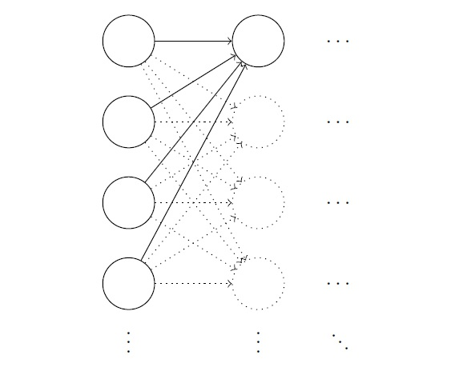
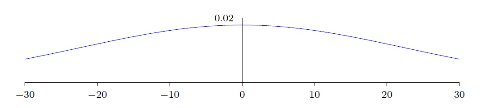
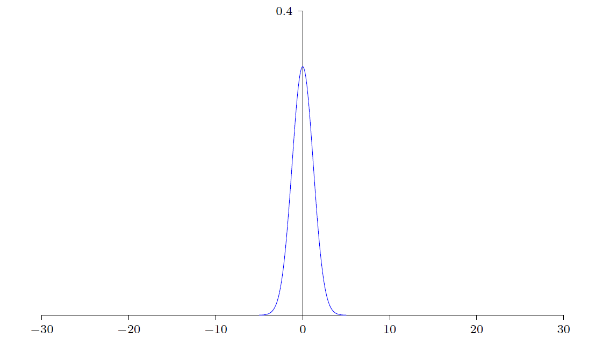
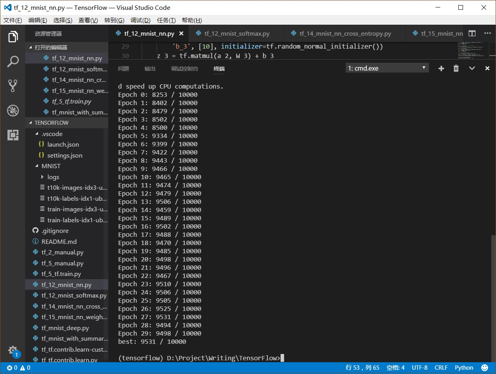
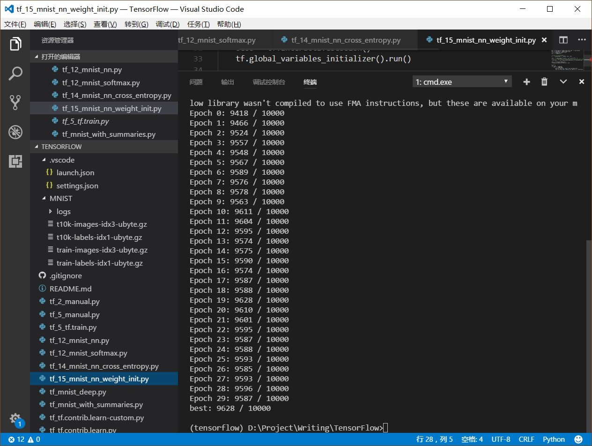

# 15 重新思考神经网络初始化

上一篇[14 交叉熵损失函数——克服学习缓慢](./14-交叉熵损失函数——防止学习缓慢.md)从最优化算法层面入手，将二次的均方误差（MSE）更换为交叉熵作为损失函数，避免了当出现“严重错误”时导致的学习缓慢。

本篇引入**1/sqrt(nin)**权重初始化方法，从另一个层面——参数初始化（神经网络调教的5个层面归纳在[13 AI驯兽师：神经网络调教综述](./13-AI驯兽师：神经网络调教综述.md)）入手改善网络的学习速度。

相比之前采用的标准正态分布初始化，1/sqrt(nin)权重初始化不仅明显的加快了学习速度，而且单纯性（其他任何参数不变）的提升了测试集识别精度1-2个百分点。

理解了1/sqrt(nin)权重初始化的思想，就能很容易的理解Xavier、He权重初始化方法。

## 参数初始化之“重”

神经网络的训练过程，就是自动调整网络中参数的过程。在训练的起初，网络的参数总要从某一状态开始，而这个初始状态的设定，就是神经网络的初始化。

之所以要重新思考神经网络权重和偏置的初始化，是因为它对于后续的训练非常重要。

在[12 TensorFlow构建3层NN玩转MNIST](./12-TensorFlow构建3层NN实现手写体数字识别.md)中就踩了“参数初始化的坑”：简单将权重和偏置初始化为0，导致了网络训练陷入了一个局部最优沼泽而无法自拔，最终识别率仅为60%。

不仅有“局部最优”的坑，在[14 交叉熵损失函数——防止学习缓慢](./14-交叉熵损失函数——防止学习缓慢.md)还见识了初始化导致“神经元饱和”的坑。

**合适网络初始值，不仅有助于梯度下降法在一个好的“起点”上去寻找最优值，还能避免神经元发生学习饱和**。

## 重新审视标准正态分布

在之前实现的MNIST数字识别案例中，权重和偏置的初始化采用的是符合**均值为0、标准差为1的标准正态分布（Standard Noraml Distribution）随机化方法**。但它是最佳的初始化策略吗？

它如此“特别”更像是一个警告：我们并不总能轻易的得到最佳答案，一定还有“压榨”的空间。

一个寻找切入点的常用方法，就是人为诱导其产生问题。Michael在[《Neural Networks and Deep Learning》](http://neuralnetworksanddeeplearning.com/chap3.html)中让一个具有1000个神经元输入层的网络，以标准正态分布做随机初始化，然后人造干预：令输入层神经元一半（500个）值为1，另一半（另500个）值为0。现在聚焦到接下来隐藏层中的一个神经元：

如上图所示，1000个输入层神经元全部连接到了隐藏层的第一个神经元。此时考察神经元的加权和z = ∑jwjxj + b：

- 将z的表达式展开，初始共有1001项（不要漏掉偏置b）；
- 人为令输入xj中的500个为0，所以z的表达式最终有501项；
- 人为令输入xj的其余500个为1，所以z由500项wj和1项b组成，它们符合标准正态分布N(0,1)；
- 推导得到z符合均值为0，标准差为√501（501的平方根）的正态分布，推导过程稍后解释；

通过人为设置特殊的输入，由权重w和偏置b的统计分布，得到了z的统计分布：

从图中可见，由于标准差√501非常大，导致z的分布从-30到30出现的比例都很高，也就是说，∣z∣ >> 1出现的概率非常大。还记得Sigmoid曲线吗？当∣z∣ >> 1时，σ'(z)就会变得非常小，神经元学习饱和。

类似的，网络中后续层中的神经元也有同样的性质。

虽然是人为制造特殊的输入数据暴露了网络的问题，但是从中可以得到一个启示：**如果网络的权重和偏置采用N(0,1)初始化，那么网络中各层的神经元数量n越多，造成后续层神经元加权和z的标准差越大，∣z∣ >> 1出现的概率也越大，最终造成神经元饱和——学习缓慢**。

## 1/sqrt(nin)权重初始化

顺着上面的分析，一个比较自然的思路是：既然神经元加权和z的标准差与网络上一层神经元的数量nin有相关性，那么为了抵消掉神经元数量的影响，初始化分布的标准差就不应该是一个常数。

本篇引入的1/sqrt(nin)权重初始化就是答案所在：**使用均值为0，标准差为1/sqrt(nin)的正态分布来初始化权重**。sqrt表示开根号，同√。

继续使用之前的人为输入数据和网络架构：

- 将z的表达式展开，初始共有1001项；
- 人为令输入xj中的500个为0，所以z的表达式最终有501项；
- 人为令输入xj的其余500个为1，所以z由500项wj和1项b组成，它们符合正态分布N(0,1/sqrt(nin))；
- 推导得到z符合均值为0，标准差为√(3/2)（3/2的平方根）正态分布，推导过程稍后解释；

得到了新的z的统计分布：

此时的正态曲线变的非常尖锐，z的可能取值都在0附近，再看Sigmoid曲线就会发现，z在0附近时，σ(z)曲线最“陡”，σ'(z)值越大，学习速度越快。

注意一点，由于神经元的偏置b对于加权和z的贡献不受上一层神经元数量nin的影响，所以偏置b的初始化可以沿用之前的N(0,1)。

## z的概率分布推导

回来解释下已知w和b的分布，如何计算z = ∑jwj + b的分布（xj为1，故省略）。

先准备两个特性：

- **独立随机变量和的方差，是每个独立随机变量方差的和**；
- **方差是标准差的平方**；

权重和偏置分布为N(0,1)情况下的推导：

- 已知wj和b的标准差是1，那么wj和b的方差也是1；
- 由于人为输入，z的展开式有501=1000/2+1项，每项标准差为1；
- z的方差 = 12 x 501；
- z的标准差 = √501；

权重分布为N(0,1/sqrt(1))，偏置分布为N(0,1)情况下的推导：

- 已知wj的标准差是1/sqrt(nin)，那么wj的方差是1/nin，已知b的标准差是1，那么b的方差也是1；
- 由于人为输入，z的展开式有nin/2+1项，前nin/2项为权重wj，每项方差为1/nin，最后1项为偏置b，方差为1；
- z的方差 = 1/n x n/2 + 1 = 3/2；
- z的标准差 = √(3/2)；

## 结果对比

本篇基于[12 TensorFlow构建3层NN玩转MNIST](./12-TensorFlow构建3层NN实现手写体数字识别.md)中的实现，单纯性的使用N(0,1/sqrt(nin))权重初始化与前者进行了对比，结果如下：

从输出明显看出，采用N(0,1/sqrt(nin))权重初始化的学习速度明显快了很多，第一次迭代Epoch 0就获得了94%的识别率，而前面的N(0,1)实现到Epoch 7才达到了94%。

经过30次迭代，采用N(0,1/sqrt(nin))权重初始化的识别精度比前者高了1个百分点，达到了96%以上。

## 小结

本篇引入1/sqrt(nin)权重初始化方法，改变了神经元加权和z的随机概率分布，有效的避免了神经元饱和，最终不仅加快了学习速率，而且网络的性能也有明显的改善。

有很多其他的权重初始化方法，比如Xavier、He等，其基本思想都是相似的。

## 附完整代码

N(0,1/sqrt(nin))权重初始化的有效性分析，花了不少功夫，但是代码实现却异常简洁：

	W_2 = tf.Variable(tf.random_normal([784, 30]) / tf.sqrt(784.0))
	...
    W_3 = tf.Variable(tf.random_normal([30, 10]) / tf.sqrt(30.0))

完整代码：

	import argparse
	import sys
	from tensorflow.examples.tutorials.mnist import input_data
	import tensorflow as tf
	
	FLAGS = None
	
	
	def main(_):
	    # Import data
	    mnist = input_data.read_data_sets(FLAGS.data_dir, one_hot=True)
	
	    # Create the model
	    x = tf.placeholder(tf.float32, [None, 784])
	    W_2 = tf.Variable(tf.random_normal([784, 30]) / tf.sqrt(784.0))
	    b_2 = tf.Variable(tf.random_normal([30]))
	    z_2 = tf.matmul(x, W_2) + b_2
	    a_2 = tf.sigmoid(z_2)
	
	    W_3 = tf.Variable(tf.random_normal([30, 10]) / tf.sqrt(30.0))
	    b_3 = tf.Variable(tf.random_normal([10]))
	    z_3 = tf.matmul(a_2, W_3) + b_3
	    a_3 = tf.sigmoid(z_3)
	
	    # Define loss and optimizer
	    y_ = tf.placeholder(tf.float32, [None, 10])
	
	    loss = tf.reduce_mean(tf.norm(y_ - a_3, axis=1)**2) / 2
	    # loss = tf.reduce_mean(tf.nn.sigmoid_cross_entropy_with_logits(labels=y_, logits=z_3))
	    train_step = tf.train.GradientDescentOptimizer(3.0).minimize(loss)
	
	    sess = tf.InteractiveSession()
	    tf.global_variables_initializer().run()
	
	    # Train
	    best = 0
	    for epoch in range(30):
	        for _ in range(5000):
	            batch_xs, batch_ys = mnist.train.next_batch(10)
	            sess.run(train_step, feed_dict={x: batch_xs, y_: batch_ys})
	        # Test trained model
	        correct_prediction = tf.equal(tf.argmax(a_3, 1), tf.argmax(y_, 1))
	        accuracy = tf.reduce_sum(tf.cast(correct_prediction, tf.int32))
	        accuracy_currut = sess.run(accuracy, feed_dict={x: mnist.test.images,
	                                                        y_: mnist.test.labels})
	        print("Epoch %s: %s / 10000" % (epoch, accuracy_currut))
	        best = (best, accuracy_currut)[best <= accuracy_currut]
	
	    # Test trained model
	    print("best: %s / 10000" % best)
	
	
	if __name__ == '__main__':
	    parser = argparse.ArgumentParser()
	    parser.add_argument('--data_dir', type=str, default='/MNIST/',
	                        help='Directory for storing input data')
	    FLAGS, unparsed = parser.parse_known_args()
	    tf.app.run(main=main, argv=[sys.argv[0]] + unparsed)

[下载 tf_15_mnist_nn_weight_init.py](https://github.com/EthanYuan/TensorFlow/blob/master/TF1_1/tf_15_mnist_nn_weight_init.py)