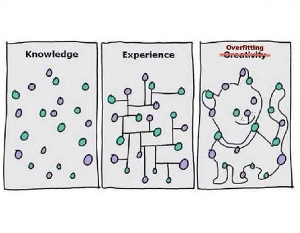
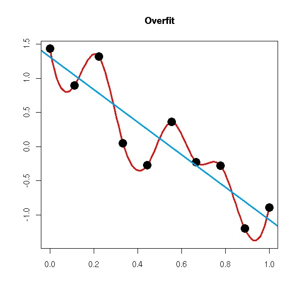
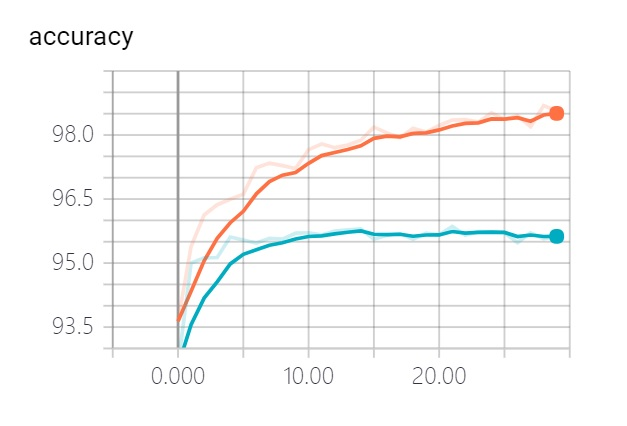
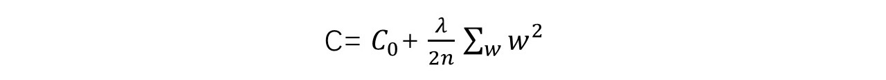
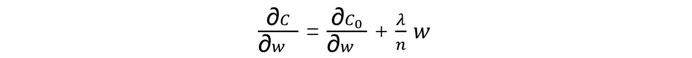
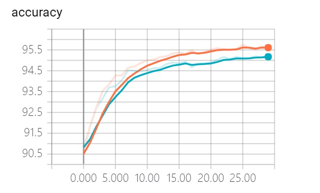

# 16 L2正则化对抗“过拟合”

前面的[14 交叉熵损失函数——防止学习缓慢](./14-交叉熵损失函数——防止学习缓慢.md)和[15 重新思考神经网络初始化](./15-重新思考神经网络初始化.md)从学习缓慢问题入手，尝试改进神经网络的学习。本篇讨论**过拟合**问题，并引入与之相对的**L2正则化（Regularization）**方法。

## 无处不在的过拟合

**模型对于已知数据的描述适应性过高，导致对新数据的泛化能力不佳，我们称模型对于数据过拟合（overfitting）**。

过拟合无处不在。

罗素的火鸡对自己的末日始料未及，曾真理般存在的牛顿力学沦为[狭义相对论](https://zh.wikipedia.org/wiki/%E7%8B%AD%E4%B9%89%E7%9B%B8%E5%AF%B9%E8%AE%BA)在低速情况下的近似，[次贷危机](https://baike.baidu.com/item/%E7%BE%8E%E5%9B%BD%E6%AC%A1%E8%B4%B7%E5%8D%B1%E6%9C%BA)破灭了美国买房只涨不跌的神话，[血战钢锯岭](https://movie.douban.com/subject/26325320/)的医疗兵Desmond也并不是懦夫。

凡是基于经验的学习，都存在过拟合的风险。动物、人、机器都不能幸免。

## 谁存在过拟合？

对于一些离散的二维空间中的样本点，下面两条曲线谁存在过拟合？

遵循[奥卡姆剃刀](https://zh.wikipedia.org/wiki/%E5%A5%A5%E5%8D%A1%E5%A7%86%E5%89%83%E5%88%80)的一派，主张“如无必要,勿增实体”。他们相信相对简单的模型泛化能力更好：上图中的蓝色直线，虽然只有很少的样本点直接落在它上面，但是不妨认为这些样本点或多或少包含一些噪声。基于这种认知，可以预测新样本也会在这条直线附近出现。

或许很多时候，倾向简单会占上风，但是真实世界的复杂性深不可测。虽然在自然科学中，奥卡姆剃刀被作为启发性技巧来使用，帮助科学家发展理论模型工具，但是它并没有被当做逻辑上不可辩驳的定理或者科学结论。总有简单模型表达不了，只能通过复杂模型来描述的事物存在。很有可能红色的曲线才是对客观世界的真实反映。

> 康德为了对抗奥卡姆剃刀产生的影响，创建了他自己的反剃刀：“存在的多样性不应被粗暴地忽视”。
> 
> 阿尔伯特·爱因斯坦告诫：“科学理论应该尽可能简单，但不能过于简单。” 

所以仅从上图来判断，**一个理性的回答是：不知道**。即使是如此简单的二维空间情况下，在没有更多的新样本数据做出验证之前，不能仅通过模型形式的简单或复杂来判定谁存在过拟合。

## 过拟合的判断

二维、三维的模型，本身可以很容易的绘制出来，当新的样本出现后，通过观察即可大致判断模型是否存在过拟合。

然而现实情况要复杂的多。对MNIST数字识别所采用的3层感知器——输入层784个神经元，隐藏层30个神经元，输出层10个神经元，包含23860个参数（23860 = 784 x 30 + 30 x 10 + 30 + 10），靠绘制模型来观察是不现实的。

最有效的方式是通过识别精度判断模型是否存在过拟合：**比较模型对验证集和训练集的识别精度，如果验证集识别精度大幅低于训练集，则可以判断模型存在过拟合**。

至于为什么是验证集而不是测试集，请复习[11 74行Python实现手写体数字识别](./11-74行Python实现手写体数字识别.md)中“验证集与超参数”一节。

然而静态的比较已训练模型对两个集合的识别精度无法回答一个问题：**过拟合是什么时候发生的**？

要获得这个信息，就需要**在模型训练过程中动态的监测每次迭代（Epoch）后训练集和验证集的识别精度，一旦出现训练集识别率继续上升而验证集识别率不再提高，就说明过拟合发生了**。

这种方法还会带来一个额外的收获：确定作为超参数之一的迭代数（Epoch Number）的量级。更进一步，甚至可以不设置固定的迭代次数，以过拟合为信号，一旦发生就**提前停止（early stopping）**训练，避免后续无效的迭代。

## 过拟合监测

了解了过拟合的概念以及监测方法，就可以开始分析我们训练MNIST数字识别模型是否存在过拟合了。

所用代码：[tf_16_mnist_loss_weight.py](https://github.com/EthanYuan/TensorFlow/blob/master/TF1_1/tf_16_mnist_loss_weight.py)。它在[12 TensorFlow构建3层NN玩转MNIST](./12-TensorFlow构建3层NN实现手写体数字识别.md)代码的基础上，使用了交叉熵损失，以及1/sqrt(nin)权重初始化：

- 1个隐藏层，包含30个神经元；
- 学习率：3.0；
- 迭代数：30次；
- mini batch：10；

训练过程中，分别对训练集和验证集的识别精度进行了跟踪，如下图所示，其中红线代表训练集识别率，蓝线代表测试集识别率。图中显示，大约在第15次迭代前后，测试集的识别精度稳定在95.5%不再提高，而训练集的识别精度仍然继续上升，直到30次迭代全部结束后达到了98.5%，两者相差3%。

由此可见，模型存在明显的过拟合的特征。

## 过拟合的对策：L2正则化

对抗过拟合最有效的方法就是增加训练数据的完备性，但它昂贵且有限。另一种思路是减小网络的规模，但它可能会因为限制了模型的表达潜力而导致识别精度整体下降。

本篇引入**L2正则化（Regularization）**，可以在原有的训练数据，以及网络架构不缩减的情况下，有效避免过拟合。L2正则化即在损失函数C的表达式上追加**L2正则化项**：

上式中的C0代表原损失函数，可以替换成均方误差、交叉熵等任何一种损失函数表达式。

关于L2正则化项的几点说明：

- 求和∑是对网络中的所有**权重**进行的；
- λ（lambda）为自定义参数（超参数）；
- n是训练样本的数量（**注意不是所有权重的数量！**）；
- L2正则化并没有**偏置**参与；

该如何理解正则化呢？

对于使网络达到最小损失的权重w，很可能有非常多不同分布的解：有的均值偏大、有的偏小，有的分布均匀，有的稀疏。那么在这个w的解空间里，该如何挑选相对更好的呢？正则化通过添加约束的方式，帮我们找到一个方向。

L2正则化表达式暗示着一种倾向：**训练尽可能的小的权重，较大的权重需要保证能显著降低原有损失C0才能保留**。

至于正则化为何能有效的缓解过拟合，这方面数学解释其实并不充分，更多是基于经验的认知。

## L2正则化的实现

因为在原有损失函数中追加了L2正则化项，那么是不是得修改现有反向传播算法（BP1中有用到C的表达式）？答案是不需要。

C对w求偏导数，可以拆分成原有C0对w求偏导，以及L2正则项对w求偏导。前者继续利用原有的反向传播计算方法，而后者可以直接计算得到：

C对于偏置b求偏导保持不变：

基于上述，就可以得到权重w和偏置b的更新方法：

## TensorFlow实现L2正则化

TensorFlow的最优化方法`tf.train.GradientDescentOptimizer`包办了梯度下降、反向传播，所以基于TensorFlow实现L2正则化，并不能按照上节的算法直接干预权重的更新，而要使用TensorFlow方式：
	
    tf.add_to_collection(tf.GraphKeys.WEIGHTS, W_2)
    tf.add_to_collection(tf.GraphKeys.WEIGHTS, W_3)
    regularizer = tf.contrib.layers.l2_regularizer(scale=5.0/50000)
    reg_term = tf.contrib.layers.apply_regularization(regularizer)

    loss = (tf.reduce_mean(
        tf.nn.sigmoid_cross_entropy_with_logits(labels=y_, logits=z_3)) +
        reg_term)

对上述代码的一些说明：

- 将网络中所有层中的权重，依次通过`tf.add_to_collectio`加入到`tf.GraphKeys.WEIGHTS`中；
- 调用`tf.contrib.layers.l2_regularizer`生成L2正则化方法，注意所传参数**scale=λ/n(n为训练样本的数量)**;
- 调用`tf.contrib.layers.apply_regularization`来生成损失函数的L2正则化项`reg_term`，所传第一个参数为上面生成的正则化方法，第二个参数为none时默认值为`tf.GraphKeys.WEIGHTS`；
- 最后将L2正则化`reg_term`项追加到损失函数表达式；

向原有损失函数追加L2正则化项，模型和训练设置略作调整：

- 1个隐藏层，包含100个神经元；
- 学习率：0.5；
- 迭代数：30次；
- mini batch：10；

重新运行训练，跟踪训练集和验证集的识别精度，如下图所示。图中显示，在整个30次迭代中，训练集和验证集的识别率均持续上升（都超过95%），最终两者的差距控制在0.5%，过拟合程度显著的减轻了。

需要注意的是，尽管正则化有效降低了验证集上过拟合程度，但是也降低了训练集的识别精度。所以在实现L2正则化时增加了隐藏层的神经元数量（从30到100）来抵消识别精度的下降。

## 附完整代码

	import argparse
	import sys
	from tensorflow.examples.tutorials.mnist import input_data
	import tensorflow as tf
	
	FLAGS = None
	
	
	def main(_):
	    # Import data
	    mnist = input_data.read_data_sets(FLAGS.data_dir, one_hot=True,
	                                      validation_size=10000)
	
	    # Create the model
	    x = tf.placeholder(tf.float32, [None, 784])
	    W_2 = tf.Variable(tf.random_normal([784, 100]) / tf.sqrt(784.0))
	    '''W_2 = tf.get_variable(
	        name="W_2",
	        regularizer=regularizer,
	        initializer=tf.random_normal([784, 30], stddev=1 / tf.sqrt(784.0)))'''
	    b_2 = tf.Variable(tf.random_normal([100]))
	    z_2 = tf.matmul(x, W_2) + b_2
	    a_2 = tf.sigmoid(z_2)
	
	    W_3 = tf.Variable(tf.random_normal([100, 10]) / tf.sqrt(100.0))
	    '''W_3 = tf.get_variable(
	        name="W_3",
	        regularizer=regularizer,
	        initializer=tf.random_normal([30, 10], stddev=1 / tf.sqrt(30.0)))'''
	    b_3 = tf.Variable(tf.random_normal([10]))
	    z_3 = tf.matmul(a_2, W_3) + b_3
	    a_3 = tf.sigmoid(z_3)
	
	    # Define loss and optimizer
	    y_ = tf.placeholder(tf.float32, [None, 10])
	
	    tf.add_to_collection(tf.GraphKeys.WEIGHTS, W_2)
	    tf.add_to_collection(tf.GraphKeys.WEIGHTS, W_3)
	    regularizer = tf.contrib.layers.l2_regularizer(scale=5.0 / 50000)
	    reg_term = tf.contrib.layers.apply_regularization(regularizer)
	
	    loss = (tf.reduce_mean(
	        tf.nn.sigmoid_cross_entropy_with_logits(labels=y_, logits=z_3)) +
	        reg_term)
	
	    train_step = tf.train.GradientDescentOptimizer(0.5).minimize(loss)
	
	    sess = tf.InteractiveSession()
	    tf.global_variables_initializer().run()
	
	    correct_prediction = tf.equal(tf.argmax(a_3, 1), tf.argmax(y_, 1))
	    accuracy = tf.reduce_mean(tf.cast(correct_prediction, tf.float32))
	
	    scalar_accuracy = tf.summary.scalar('accuracy', accuracy)
	    train_writer = tf.summary.FileWriter(
	        'MNIST/logs/tf16_reg/train', sess.graph)
	    validation_writer = tf.summary.FileWriter(
	        'MNIST/logs/tf16_reg/validation')
	
	    # Train
	    best = 0
	    for epoch in range(30):
	        for _ in range(5000):
	            batch_xs, batch_ys = mnist.train.next_batch(10)
	            sess.run(train_step, feed_dict={x: batch_xs, y_: batch_ys})
	        sess.run(train_step, feed_dict={x: batch_xs, y_: batch_ys})
	        # Test trained model
	        accuracy_currut_train = sess.run(accuracy,
	                                         feed_dict={x: mnist.train.images,
	                                                    y_: mnist.train.labels})
	
	        accuracy_currut_validation = sess.run(
	            accuracy,
	            feed_dict={x: mnist.validation.images,
	                       y_: mnist.validation.labels})
	
	        sum_accuracy_train = sess.run(
	            scalar_accuracy,
	            feed_dict={x: mnist.train.images,
	                       y_: mnist.train.labels})
	
	        sum_accuracy_validation = sess.run(
	            scalar_accuracy,
	            feed_dict={x: mnist.validation.images,
	                       y_: mnist.validation.labels})
	
	        train_writer.add_summary(sum_accuracy_train, epoch)
	        validation_writer.add_summary(sum_accuracy_validation, epoch)
	
	        print("Epoch %s: train: %s validation: %s"
	              % (epoch, accuracy_currut_train, accuracy_currut_validation))
	        best = (best, accuracy_currut_validation)[
	            best <= accuracy_currut_validation]
	
	    # Test trained model
	    print("best: %s" % best)
	
	
	if __name__ == '__main__':
	    parser = argparse.ArgumentParser()
	    parser.add_argument('--data_dir', type=str, default='../MNIST/',
	                        help='Directory for storing input data')
	    FLAGS, unparsed = parser.parse_known_args()
	    tf.app.run(main=main, argv=[sys.argv[0]] + unparsed)
	