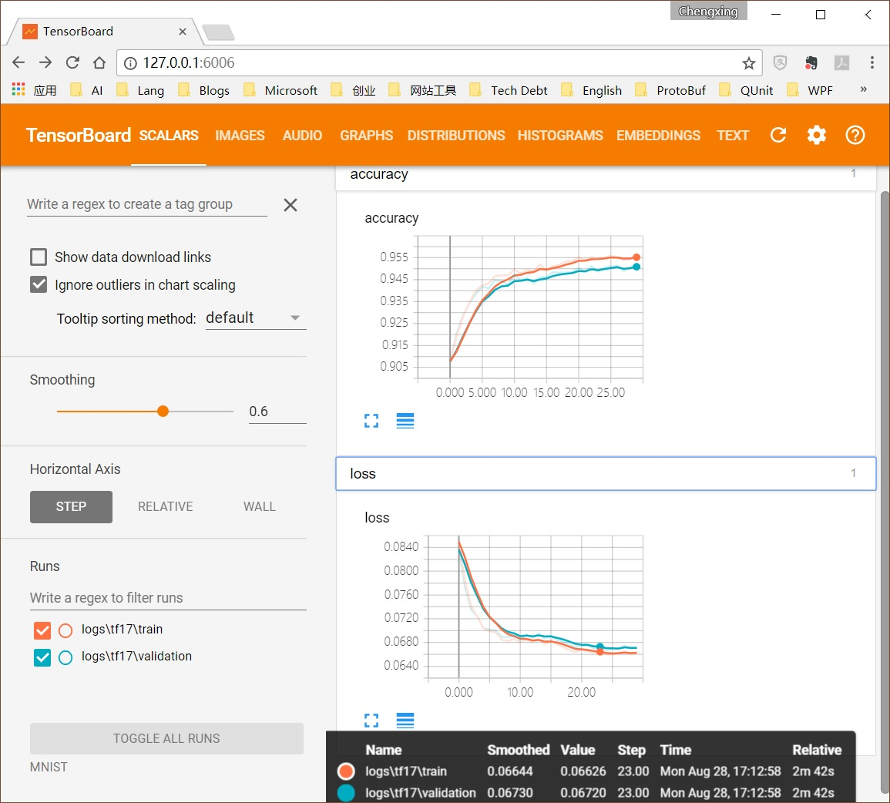
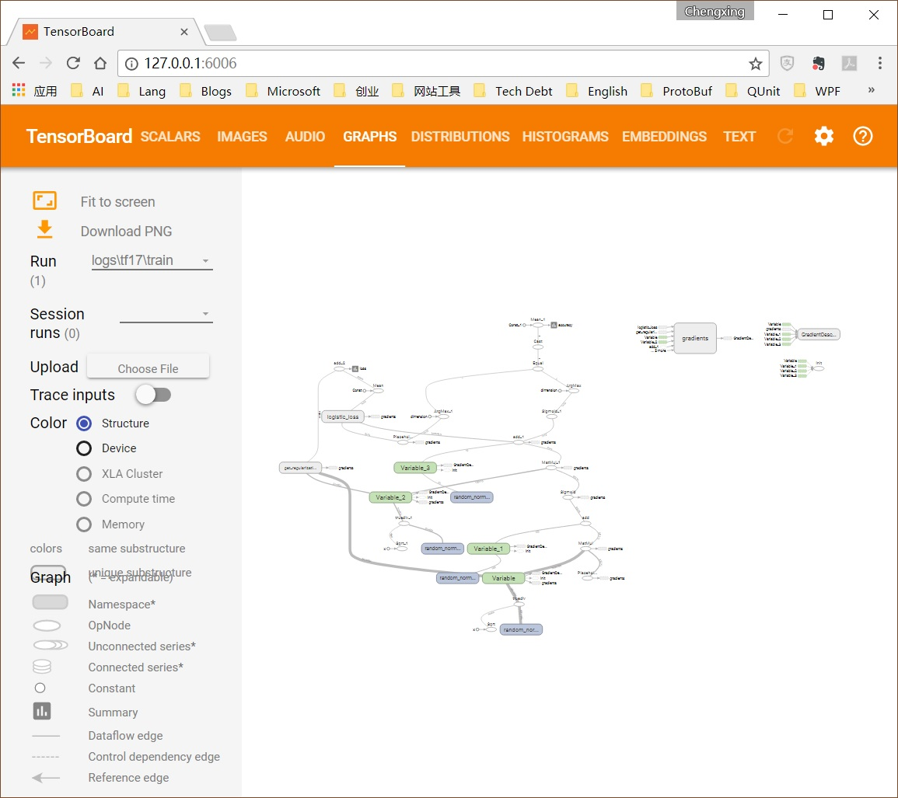

# 17 Step By Step上手TensorBoard

上一篇[16 L2正则化对抗“过拟合”](./16-L2正则化对抗“过拟合”.md)提到，为了检测训练过程中发生的过拟合，需要记录每次迭代（甚至每次step）模型在训练集和验证集上的识别精度。其实，为了能更好的调试和优化TensorFlow程序，日志（logging）和监测（monitoring）需求远不止“识别精度”。在训练过程中不断变化的“损失”、“更新速率”（step/sec）甚至“概率分布”等信息，都是帮助我们深入理解模型与训练的关键信息。

对此，TensorBoard提供了尽善尽美的支持。它能将所记录的动/静态信息，方便的可视化成直观的图形，帮助人们更容易的分析并获得洞察，让神经网络“黑盒”变得透明。

本篇介绍TensorBoard的基本用法：绘制MNIST案例中计算图、识别精度和损失。

TensorBoard生成图形的流程框架，简单概括起来就两点：

- TensorFlow运行并将log信息记录到文件；
- TensorBoard读取文件并绘制图形。

在代码实现和组织层面，通常只要在“正常”代码后集中添加负责logging的代码即可，两者能够很好的区隔，不会发生严重的耦合。以下示例代码基于[16 L2正则化对抗“过拟合”](./16-L2正则化对抗“过拟合”.md)，修改了logging的部分。

## step 1：构造summary node

TensorBoard以[protocol buffer](https://en.wikipedia.org/wiki/Protocol_Buffers) 的方式记录信息，它是Google开发的一种序列化结构数据的方法。

我们的目标是记录accuracy和loss，更准确的说是记录accuracy node和loss node的输出值，那么首先需要将数据转换成protocol buffer object，而负责转换动作的就是TensorFlow提供的summary节点（summary有汇总和概括的含义，暂不做翻译）。

	accuracy_scalar = tf.summary.scalar('accuracy', accuracy)
    loss_scalar = tf.summary.scalar('loss', loss)

上面的`tf.summary.scalar`方法称为[summary operation](https://www.tensorflow.org/api_guides/python/summary)。它接受一个要跟踪的节点，并返回一个scalar summary节点，该节点以protocol buffer的方式表示一个标量值。

summary节点与其他节点一样，依靠Session运行才会有输出。如果跟踪的节点非常多，还可以进行节点合并，Session在运行时会自动遍历运行所有的summary节点：

	merged = tf.summary.merge_all()

## step 2：构造summary file writer

构造好summary node后，就要构造summary文件写入器了，所有跟踪的信息都依靠它来写入文件，而TensorBoard绘制的图形正是基于这些文件的。

	train_writer = tf.summary.FileWriter('MNIST/logs/tf17/train')
    validation_writer = tf.summary.FileWriter('MNIST/logs/tf17/validation')

`tf.summary.FileWriter`构造summary文件写入器，接受一个log的目录作为保存文件的路径。log目录如果不存在，会被程序自动创建。通常训练集日志和验证集日志分开存放，分别构造各自的summary文件写入器即可。

## step 3：运行summary节点

在运行summary节点时，出于性能考虑（尽可能少的运行计算图），会与使用相同输入数据的“正常”节点一起执行，下面代码基于训练数据，使用了合并的summary节点：

	summary, accuracy_currut_train = sess.run(
        [merged, accuracy],
        feed_dict={x: mnist.train.images, y_: mnist.train.labels})

在summary节点不多时，当然也可以分别运行节点，下面代码基于验证数据，使用了单独的summary节点：

    (sum_accuracy_validation,
     sum_loss_validation,
     accuracy_currut_validation) = sess.run(
        [accuracy_scalar, loss_scalar, accuracy],
        feed_dict={x: mnist.validation.images, y_: mnist.validation.labels})

## step 4：向记录器添加

运行summary节点的输出，即可通过文件写入器的`add_summary`方法进行添加，该方法除了接受summary节点的运行输出值，还接受一个`global_step`参数来作为序列号：

    train_writer.add_summary(summary, epoch)
    validation_writer.add_summary(sum_accuracy_validation, epoch)
    validation_writer.add_summary(sum_loss_validation, epoch)

## step 5：启动TensorBoard Server

启动TensorBoard Server可以与前面的记录写入并行，TensorBoard会自动的扫描日志文件的更新。

重新生成并绘制，只需手工删除现有数据或者目录即可。

新启动一个命令行窗口，激活虚拟环境，键入命令`tensorboard`，其参数logdir指出log文件的存放目录，可以只给出其上级目录，TensorBoard会自动递归扫描目录。

	tensorboard --logdir=TF1_1/MNIST

当TensorBoard服务器顺利启动后，即可打开浏览器输入地址：http://127.0.0.1:6006/ 查看。注意在Windows环境下输入http://0.0.0.0:6006/无效。下图就是TensorBoard绘制出的accuracy和loss的图形：

## 图形“同框”技巧

上图中的accuracy和loss图形中，训练集曲线和验证集曲线以不同颜色“同框”出现，特别便于对比分析。同框需要满足以下两点：

- 要同框的曲线跟踪的必须是同一个节点，比如跟踪accuracy节点或loss节点；
- 各曲线的数据记录在不同的目录下，可以通过构造两个不同的文件写入器来达到；

## 绘制计算图

TensorBoard除了绘制动态数据，绘制静态的graph（计算图）更是easy，在构造“文件写入器”多添加一个参数`sess.graph`即可：

	train_writer = tf.summary.FileWriter('MNIST/logs/tf17/train', sess.graph)

重新运行TensorFlow程序后，启动TensorBoard Server，在浏览器打开页面，点选GRAPHS菜单，即可看到：

## 附完整代码

	import argparse
	import sys
	from tensorflow.examples.tutorials.mnist import input_data
	import tensorflow as tf
	
	FLAGS = None
	
	
	def main(_):
	    # Import data
	    mnist = input_data.read_data_sets(FLAGS.data_dir, one_hot=True,
	                                      validation_size=10000)
	
	    # Create the model
	    x = tf.placeholder(tf.float32, [None, 784])
	    W_2 = tf.Variable(tf.random_normal([784, 100]) / tf.sqrt(784.0))
	    '''W_2 = tf.get_variable(
	        name="W_2",
	        regularizer=regularizer,
	        initializer=tf.random_normal([784, 30], stddev=1 / tf.sqrt(784.0)))'''
	    b_2 = tf.Variable(tf.random_normal([100]))
	    z_2 = tf.matmul(x, W_2) + b_2
	    a_2 = tf.sigmoid(z_2)
	
	    W_3 = tf.Variable(tf.random_normal([100, 10]) / tf.sqrt(100.0))
	    '''W_3 = tf.get_variable(
	        name="W_3",
	        regularizer=regularizer,
	        initializer=tf.random_normal([30, 10], stddev=1 / tf.sqrt(30.0)))'''
	    b_3 = tf.Variable(tf.random_normal([10]))
	    z_3 = tf.matmul(a_2, W_3) + b_3
	    a_3 = tf.sigmoid(z_3)
	
	    # Define loss and optimizer
	    y_ = tf.placeholder(tf.float32, [None, 10])
	
	    tf.add_to_collection(tf.GraphKeys.WEIGHTS, W_2)
	    tf.add_to_collection(tf.GraphKeys.WEIGHTS, W_3)
	    regularizer = tf.contrib.layers.l2_regularizer(scale=5.0 / 50000)
	    reg_term = tf.contrib.layers.apply_regularization(regularizer)
	
	    loss = (tf.reduce_mean(
	        tf.nn.sigmoid_cross_entropy_with_logits(labels=y_, logits=z_3)) +
	        reg_term)
	
	    train_step = tf.train.GradientDescentOptimizer(0.5).minimize(loss)
	
	    sess = tf.InteractiveSession()
	    tf.global_variables_initializer().run()
	
	    correct_prediction = tf.equal(tf.argmax(a_3, 1), tf.argmax(y_, 1))
	    accuracy = tf.reduce_mean(tf.cast(correct_prediction, tf.float32))
	
	    accuracy_scalar = tf.summary.scalar('accuracy', accuracy)
	    loss_scalar = tf.summary.scalar('loss', loss)
	    merged = tf.summary.merge_all()
	    train_writer = tf.summary.FileWriter(
	        'MNIST/logs/tf17/train', sess.graph)
	    validation_writer = tf.summary.FileWriter(
	        'MNIST/logs/tf17/validation')
	
	    # Train
	    best = 0
	    for epoch in range(30):
	        for _ in range(5000):
	            batch_xs, batch_ys = mnist.train.next_batch(10)
	            sess.run(train_step, feed_dict={x: batch_xs, y_: batch_ys})
	        sess.run(train_step, feed_dict={x: batch_xs, y_: batch_ys})
	        # Test trained model
	        summary, accuracy_currut_train = sess.run(
	            [merged, accuracy],
	            feed_dict={x: mnist.train.images,
	                       y_: mnist.train.labels})
	
	        (sum_accuracy_validation,
	         sum_loss_validation,
	         accuracy_currut_validation) = sess.run(
	            [accuracy_scalar, loss_scalar, accuracy],
	            feed_dict={x: mnist.validation.images,
	                       y_: mnist.validation.labels})
	
	        train_writer.add_summary(summary, epoch)
	        validation_writer.add_summary(sum_accuracy_validation, epoch)
	        validation_writer.add_summary(sum_loss_validation, epoch)
	
	        print("Epoch %s: train: %s validation: %s"
	              % (epoch, accuracy_currut_train, accuracy_currut_validation))
	        best = (best, accuracy_currut_validation)[
	            best <= accuracy_currut_validation]
	
	    # Test trained model
	    print("best: %s" % best)
	    train_writer.close()
	    validation_writer.close()
	
	
	if __name__ == '__main__':
	    parser = argparse.ArgumentParser()
	    parser.add_argument('--data_dir', type=str, default='../MNIST/',
	                        help='Directory for storing input data')
	    FLAGS, unparsed = parser.parse_known_args()
	    tf.app.run(main=main, argv=[sys.argv[0]] + unparsed)

[下载 tf_17_tensorboard.py](https://github.com/EthanYuan/TensorFlow/blob/master/TF1_1/tf_17_tensorboard.py)