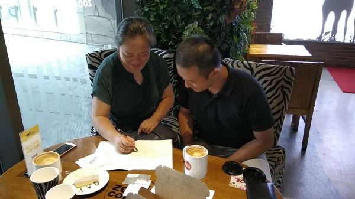

# 19 回顾

《TensorFlow从0到1》就要结束了。

## 3条主线

这个部分共包含18篇文章，4万余字（简书的严格统计不到4万）。总的来说，它无外乎两方面内容：人工神经网络，及其TensorFlow实现。稍细分的话，有3条主线。

主线1：神经网络理论基础：

- [3 人类学习的启示](./3-人类学习的启示.md)
- [4 第一个机器学习问题](./4-第一个机器学习问题.md)
- [6 解锁梯度下降算法](./6-解锁梯度下降算法.md)
- [8 万能函数的形态](./8-万能函数的形态：人工神经网络.md)
- [9 “驱魔”之反向传播大法](./9-“驱魔”之反向传播大法.md)
- [10 NN基本功：反向传播的推导](./10-NN基本功：反向传播的推导.md)

主线2：TensorFlow入门：

- [1 Hello,TensorFlow!](./1-Hello,TensorFlow!.md)
- [2 TensorFlow核心编程](./2-TensorFlow核心编程.md)
- [5 TensorFlow轻松搞定线性回归](./5-TensorFlow轻松搞定线性回归.md)
- [7 TensorFlow线性回归的参数溢出之坑](./7-TensorFlow线性回归的参数溢出之坑.md)
- [11 74行Python实现手写体数字识别](./11-74行Python实现手写体数字识别.md)
- [12 TensorFlow构建3层NN玩转MNIST](./12-TensorFlow构建3层NN实现手写体数字识别.md)
- [17 Step By Step上手TensorBoard](./17-Step-By-Step上手TensorBoard.md)
- [18 升级手记：TensorFlow 1.3.0](./18-TensorFlow1.3.0安装手记.md)

主线3：神经网络优化：

- [13 AI驯兽师：神经网络调教综述](./13-AI驯兽师：神经网络调教综述.md)
- [14 交叉熵损失函数——防止学习缓慢](./14-交叉熵损失函数——防止学习缓慢.md)
- [15 重新思考神经网络初始化](./15-重新思考神经网络初始化.md)
- [16 L2正则化对抗“过拟合”](./16-L2正则化对抗“过拟合”.md)

希望这么分类后，能帮助读者快速定位所需内容。

## 神经网络——深度学习的基石

这个主题是关于TensorFlow的，可我很确定的是：没有理论基础的支持，而直接学习工具，几乎寸步难行。所以，整个主题用到的几乎全部是算法概念对照的底层API，而没有高级API的身影。

我也没有急于展开“火热的”CNN、RNN，也是因为：凡有建造，先固基石。现代深度学习知识体系的基石，正是人工神经网络。我花了超过一半的篇幅来回填使用TensorFlow这一强大工具的前置条件，来实现事先的承诺：**坚持通过启发性的方式，循序渐进构建系统化的理解，搭建一个“缓坡道”**。而此时，你再回到[TensorFlow游乐场](http://playground.tensorflow.org)，就会发现所有的设施都了无秘密。

尽管如此，限于篇幅，仍然有很多的重要知识点来不及一一记录和表达，还需要学习者自行钻研。

## 感谢

特别感谢我的恩师[朱虹](http://www.xaut.edu.cn/Teachers/2016-05-24/136.html)教授，以及[朱虹图像研究室](http://www.xautdipl.com/)的杜森和薛杉博士，在我决定要转型AI领域时，你们倾囊相授，快速帮我建立了本领域最新的知识框架。

在输出这个主题的过程中，我自己受益匪浅。尽管10年前就对神经网络有所了解，可是当真正付诸表达，才发现认识的肤浅。

感谢我的首批读者们，你们的关注、点赞、建议和纠错，都让这个主题变得更好，也是对我个人的极大鼓励。你们每一位的留言都会永久保留。

此外，不用担心《从0到1》的结束，因为《从1到2》即将开始。