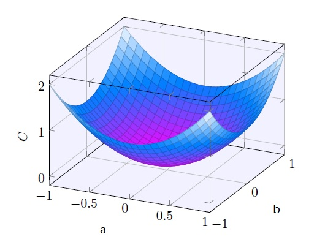

# 4 第一个机器学习问题

[上一篇 3 机器人类学习的启示](./3-人类学习的启示.md)借鉴人类学习的模式，描绘了数据驱动的机器学习方法论：通过大量数据来确定模型，从而让模型具有预测价值。本篇提出第一个机器学习问题，进一步看清楚机器学习的具体形式。

## 平行世界

在宇宙的一个平行世界中，天空是平面的，人们只能看到位于第一象限的星星。他们发现天上最亮的那颗星在缓慢的移动，于是收集了近千年以来所有天文学家的观测数据，共得到4次观测记载:

- 2200年，(22, 18)
- 2500年，(25, 15)
- 2800年，(28, 12)
- 3000年，(30, 10)

由于这颗星的意义非凡，人们想计算出这颗星的运行轨道，并预测当4000年来临时它是否会消失。

## 从数据得到模型

先套用下人类的学习模式：

- 获取数据：仅有的4次记录全部拿到；
- 分析数据：将4次记录全部画在直角坐标系平面上，发现全部落在一条直线上；
- 建立模型：利用函数知识得出一般的直线函数式为y=ax+b，但是a，b未知；
- 预测未知：一旦知道了a和b的确切值，就得到了运行轨迹（直线）的模型，根据模型即可开展预测，比如给定任意的x坐标，即可得出y坐标。

到此，第一个机器学习问题就是直线模型的参数a和b如何得出？

*实际上预设模型的表示（representation）为直线已经大大降低了“学习难度”*。

对了，平行世界的人们还不会解二元一次方程组。他们要用数据去训练这个模型。

## 损失函数

他们希望有个算法，能找到模型的a和b，以至于模型的训练输出y，能够拟合所有的训练输入x。为了量化该目标，他们定义了损失函数：

对函数的形式做一些说明：

- C是变量a和b的二元函数，而且是二次函数，C ≥ 0；
- n是训练数据的个数；
- output表示当输入为x时当前模型的实际输出；
- y(x)表示训练输入为x时，对应的训练输出y。

这个损失函数的意义何在呢？

以终为始，假设找到了正确的a和b，确定了模型y=ax+b，那么对于任一x的取值，损失函数中的output(x)将等于y(x)，即y(x)-output(x) = 0，此时“损失”为0。换句话说，确定最终a和b的过程，就是让损失函数达到其最小值的过程。此时，训练输出y“拟合了”训练输入x。

损失函数的形式，也是常见的一种统计定义，被称为均方误差MSE（Mean Squared Error），在这个语境下，y(x)被称为期望值，output(x)为观测值。任何误差都会被放大并累积起来。

到此，问题好像变的复杂了。没错，待确定模型y=ax+b虽然是一个一元一次函数，但是其损失函数却是二元二次函数。从函数图形上看它是一个曲面，而函数的最小值点处的a和b的取值，就是我们的线性模型的最佳参数。

## 训练

他们找了台机器准备开始训练模型，4次观测数据全部用于训练(22, 18)，(25, 15)，(28, 12)，(30, 10)。

先给个初始值，让a = -1， b = 50，看看“损失”是多少？

C(-1, 50) = 1/8 x [(18 - (-22 + 50))2 + (15 - (-25 + 50))2 + (12 - (-28 + 50))2 + (10 - (-30 + 50))2] = 50。

看来离“损失”为0还有差距。

换个值接着练，让a = -1， b = 40，再计算下“损失”：

C(-1, 40) = 1/8 x [(18 - (-22 + 40))2 + (15 - (-25 + 40))2 + (12 - (-28 + 40))2 + (10 - (-30 + 40))2] = 0。

运气不要太好！“损失”降至0，此时a = -1， b = 40。

## 确定模型并预测

训练做了2次，就找到了损失函数的最小值，这背后有种神秘的力量，指引(a，b)从(-1,50)迁移到了(-1,40)。不管怎样，天空最亮的那颗星的运行轨道模型总算是建立好了：y = -x + 40。这将载入史册，成为天文学的一个里程碑。

接下来完成预测吧：4000年来临时它会消失吗？

基于历史数据：

- 2200年，(22, 18)
- 2500年，(25, 15)
- 2800年，(28, 12)
- 3000年，(30, 10)

可以看出该星的x方向的速度是1/100年，那么到了4000年时，其位置的x坐标为：30 + 1/100年 x (4000-3000) = 40。

将x = 40，代入模型y = -x + 40，得到y = 0。就是说4000年来临时，该星的位置坐标是(40, 0)。预测非常悲观：届时它就要消失在第一象限之外了！