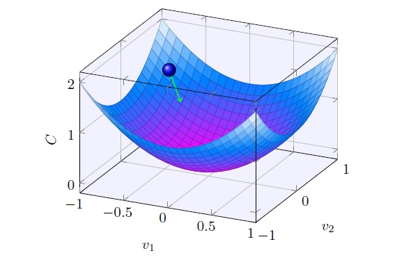

# 6 解锁梯度下降算法

上一篇[5 TF轻松搞定线性回归](./5-TensorFlow轻松搞定线性回归.md)，我们知道了模型参数训练的方向是由梯度下降算法指导的，并使用TF的封装`tf.train.GradientDescentOptimizer(0.01)`（学习率为0.01）完成了机器自学习的过程。本篇开启梯度下降算法的黑盒一探究竟，并解锁几个TF API常用参数的真正含义：

- learning rate；
- steps；
- epoch；
- mini batch。

## 一般函数的最小值问题

[4 第一个机器学习问题](./4-第一个机器学习问题.md)引入了损失函数的定义，即待训模型参数为自变量，计算模型输出与预期（label）的均方误差（MSE）。如下所示。

所获得的这个新函数C(a，b)的最小值处的(a, b)值，就是我们所寻找的理想模型参数。就这样，一个回归问题变成了更加具体的求函数极值的问题。

跟进一步，本节将之前损失函数自变量a和b一般化表示为v1，v2，把求解损失函数的最小化问题，转换为更一般的函数**C(v1,v2)**最小化问题，C(v1,v2)具有任意的函数形式。如果找到一般的函数最小值求解方法，那么具有特殊形式的损失函数最小值求解自不在话下。

对于C是一个或者少数几个变量的函数，可以通过函数极值点处的导数特性来获得多元方程组，直接求解极值点。但是我们准备放弃这种尝试，因为对于一个真实世界的机器学习问题，其模型的复杂程度通常会远远的高于线性模型，参数的个数也远不止两个，损失函数的形式会变成：**C(v1, v2 ... vn)**，如果n数以亿计，用微积分的方法简直就是噩梦。

## 雪山速降的启发

把函数曲面的某个局部，想象成前面图中的雪山，如果想速降（以最快的速度下山），那么直觉上的最佳路径就是沿着雪山**最陡峭**的方向下山。

再打个比方，考虑有两个自变量的二次函数C(v1, v2)，在三维视图中，它是一个曲面。假设有个小球靠自身重力滚落到曲面的底部，可以想象其路径也是沿着**最陡峭**的方向的。

如果我们不能直接看出函数的最小值，或者通过直接求解的方式得到函数最小值，那么利用雪山速降、小球滚落的启发，总是沿着**最陡峭**的下降方向移动，就会最快到达最小值点。

那么，“最陡峭”方向在数学上该怎么表达呢？

## 梯度的定义

微积分告诉我们，当把v1，v2，...， vn各个自变量移动一个很小的值，C将有如下变化：

**梯度**定义有：

v的变化量为∆v ≡ (∆v1, ∆v2, ..., ∆vn)T，则C的变化量可重写为梯度向量▽C与v的变化向量∆v的点乘：

## 梯度下降算法

直觉上，如果v朝某个方向上移动，导致C的增量是个负数，那么可以肯定C在“下降”。

开下脑洞，直接令**∆v = -η▽C**，其中η是一个正数，代入公式B-C-F-3有：

**∆C ≈ -η▽C·▽C = -η‖▽C‖2 ≤ 0**，此时∆C一定小于等于0，C在下降。

幸运的是，数学上可以证明对于一个非常小的步长∆v，令∆v = -η▽C可以使C的减小最大化。

总结起来就是：

- **-η▽C正是我们期望的∆v——移动方向是▽C的反方向，移动的幅度是η‖▽C‖**；
- **v移动∆v所造成的C的∆C，是-η‖▽C‖2**；

**上面这个η就叫做学习率learning rate**。

回头再来看“最陡峭的一小步”的数学解释，那就是**沿着梯度的反方向上走一小步**。只要一小步一小步朝着正确的方向移动，迟早可以走到C(v1, v2, ..., vn)的最小值处。“梯度下降”，名副其实。

梯度下降的具体操作方法如下：

1.	随机选取自变量的初始位置v（以后会专门讨论初始化的技巧）；
2.	**v → v' = v - η▽Cv**（v移动到v'，▽Cv是v处的梯度，η保持不变）；
3.  **v' → v'' = v' - η▽Cv'**（v'移动到v''，▽Cv'是v'处的梯度，η保持不变）；
4. ...

**v移动的次数，即训练的步数steps**。

v是各个自变量(v1, v2, ..., vn)的向量表示，那具体到每个自变量该如何移动呢？以v1，v2为例：

## 随机梯度下降算法

到此，梯度下降算法解决了如何寻求一般函数C(v1, v2, ..., vn)的最小值问题，再应用到机器学习之前，先别急，还差一小步。

回到损失函数，再仔细看看其形式，发现它有个特别之处，即函数表达式与训练样本的数量密切相关，它是多个样本方差的累加，最后再求均值。一个样本集的样本数动辄成千上万，为了“梯度下降”一小步中要用到的▽C，这么多样本都要参与计算吗？

并不需要，实践中有巧妙的方法：

首先，损失函数的梯度▽C，实践中一般是通过样本集中单个样本梯度值▽Cx的均值得到。如果你对这个公式持怀疑态度，这不奇怪，一个简单的消除疑虑的做法就是用之前的线性模型和损失函数，用两个样本值分别计算一下等式两边，看是否相等即可。

对于样本集成千上万个样本，对每个样本x都求其▽Cx，计算量似乎更大了。先别急，往下看。可以用一个小批量样本，通过其中每个样本▽Cx的均值，来近似为▽C：

这就是实践中采用的方法，被称为**随机梯度下降法**。那个**小批量样本就是一个mini batch**。

**把全部样本集分成一批批的小样本集，每全部遍历使用过1次，就称为1次epoch**。

据此，每个自变量更新的公式如下：

