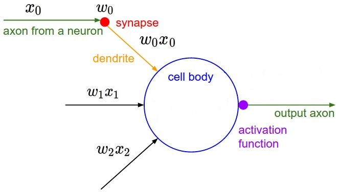
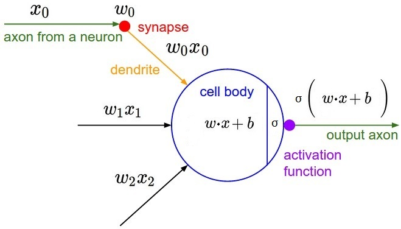
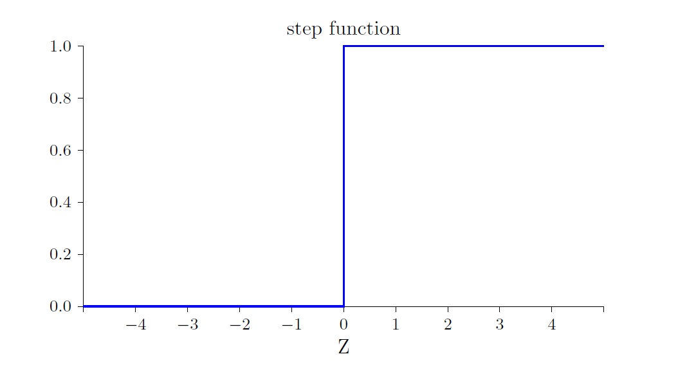

# 8 万能函数的形态：人工神经网络

之前花了不小的篇幅来解释线性回归，尽管线性模型本身十分简单，但是确定模型参数的过程，却是一种数据驱动的、自学习的通用方式。准确的说，这个过程，是基于数据的、运用梯度下降算法来优化模型（减小损失）的算法框架。无论模型变得多复杂（多维、高阶），理论上我们都可以利用这个算法过程拟合模型。

似乎当有了数据就有了一切，但是这其中隐藏着一个假设：要事先知道模型的函数形式。

在复杂的现实问题面前，这个假设注定是毫无用处的。如果要对手写体数字进行分类，那么这个模型是几元的？几次的？包含多少项？不知道。这个时候，仅有大量的样本数据还不够，我们还需要一种“万能函数”的表达方式。

为了得到“万能函数”，人们转向模仿人类的大脑。大脑中并没有事先存储好的、用于分类各类事物的函数模型，而是1千亿(1011)个神经元。**大量的、具有单一功能的单元的聚合，能够产生极其复杂的功能**。神经元之于人脑，晶体管之于CPU，莫不如是。

## 神经元

神经科学的研究成果一步步的揭开了神经元工作机制秘密。第一个提出神经元工作机制的赫布，在他1949年出版的《行为的组织》一书中写道：

> “当A细胞的轴突和B细胞足够近，并且重复或不断地对其放电时，A、B中的一个细胞或者两个细胞都会经历生长过程或者代谢改变，这样A细胞的效率就会得到提高”。

这段话经常被转述成“一起放电的神经元也会被串联在一起”。通过相互激发而连接的神经元集群，可以编码各种概念和记忆。

## 感知器神经元

1943年，Warren McCulloch和Walter Pitts设计了第一个人工神经元模型。到了50年代，Frank Rosenblat基于麦卡洛克-皮茨神经元，发明了广为人知的**感知器（Perceptron）**神经元。此时，把感知器神经元组合在一起而形成的人工神经网络，不仅可以模拟通用的数字电路，而更使其与前者不同的是：**人工神经网络能自动学习**。通过学习算法，神经网络中的每个神经元可以根据外部刺激而调整自身（权值和偏置），从而形成新的功能。

人工神经元模仿大脑神经元细胞，有多个树突（dendrite）接受多路输入，一个轴突（axon）作为输出。**因为神经元的输出是其他神经元的输入，所以神经元的输入和输出共享一个取值范围**。感知器人工神经元如下图所示：

感知器的特征：

- 神经元细胞左侧是很多个“树突”，可以接受n个输入x1, x2, ... xn，每个输入的取值范围是0或1；
- 每个输入，都对应一个不同的**权值**w；
- 神经元细胞右侧的1个“轴突”，是神经元的输出；
- 如果输入的加权和小于**阈值**，则输出0；如果加权和大于阈值，则输出1。

对于输出稍作精简，引入**偏置**b = -threshold，并用**向量点积**代替加权和的形式:

## S型神经元

一个更加通用的神经元模型如下图所示，这里引入了**激活函数**σ。也就是说，输出是**加权输入**z=w·x+b的函数σ(z)。

对比一下之前讨论的线性模型y=ax+b，你会发现，一个神经元就已经比线性模型复杂很多了：

- 线性模型只有一个输入，对应一个权值w，而神经元是多个；
- 线性模型没有激活函数。

一个重要的激活函数形式是sigmoid，《终极算法》甚至把它形容为世界上最重要的曲线。以sigmoid函数作为激活函数的神经元，就是目前应用最广泛的一种人工神经元——**S型神经元**。

sigmoid函数定义如下：

sigmoid函数图如下：

sigmoid函数的输出范围是[0, 1]区间中的任意数。而这也是S型神经元的特性，相较于感知器神经元，它的输入和输出不再只是0和1二进制数了，而是[0, 1]一个连续变化区间中任意值。这解决了感知器神经元的一个重大的缺陷：在加权输入z=w·x+b接近0的情况下，一个很小的变化△z就会导致输出的反转。

与S型感知器不同，感知器的激活函数是一个阶跃函数，这里给出函数图形以作比较：

## 万能函数的形态：人工神经网络

模仿人脑神经元的连接方式，将大量S型人工神经元堆叠成具有特定结构的网络，或许离我们想要的“万能函数”就不远了。下图是一个经典的3层神经网络结构，也被称为多层感知器MLP(Multilayer Perceptron)。明明是S型神经元构成的网络，却被称为多层感知器？的确如此。这里只需要知道这是由于历史原因造成的就可以了。

其中第一层是输入层，提供整个网络的数据输入。输入层的每个神经元没有输入，仅仅提供1个输出。第二层称为隐藏层。第三层称为输出层。这种每个神经元都连接了上一层所有神经元输出的连接方式，称为**全连接**，以此方式连接的神经网络称为**全连接神经网络**。

神经元之间的连接，是将1个神经元的输出连接到下一个神经元的输入上，**虽然图中显示神经元的输出连接到后一层的每个神经元的输入，但是要注意这些是同一个输出，而不是有多个输出**。

从输入、输出的角度再来观察神经网络，会发现其本身也是一种函数，输入为x，输出为f(x)，尽管函数具体形式无法直接描述，但是直觉上它应该可以表达极其复杂的形式。因为它是由大量的、每个都要比线性函数复杂的多的神经元组成的。

神经网络就是我们要找的“万能函数”的形态。1989年，George Cybenko证明了神经网络的普遍性定理：**无论函数的形式f(x)有多复杂，总存在⼀个神经⽹络，对于任何可能的输⼊x，能够输出f(x)或其足够精度的近似值。**对此，推荐阅读Michael Nielsen的《Neural Networks and Deep Learning》中做的一个可视化的、归纳式的[证明](http://neuralnetworksanddeeplearning.com/chap4.html)。

尽管又引入了一堆问题——隐藏层数的确定，隐藏层神经元个数的确定，激活函数的选择等等，但是我们获得了一种“万能函数”的表达方式。至此，终于可以说，只要有了足够多的样本数据，基于神经网络，就能自动的、智能的训练出所需的模型。