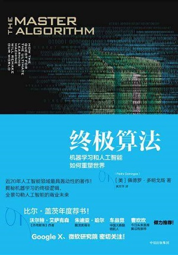

# 0 前言

我是黑猿大叔，转战AI的大叔程序猿，你好。

我以官方文档为主线，开始对TensorFlow的学习。这期间会把我的理解进行持续的输出，作为《TensorFlow从0到1》系列。它不会止于翻译和笔记、语言和工具，而是坚持通过启发性的方式，循序渐进构建系统化的理解，搭建一个坚实可靠的、连接“零基础”与“AI/机器学习/深度学习”领域之间的缓坡道，或许能帮你起步。

更期待一起探索的学习者都能开辟出自己的路，仅把这里作为一个参照。

除了[TensorFlow文档](https://www.tensorflow.org)之外，我还会参考：

- [Neural Networks and Deep Learning](http://neuralnetworksanddeeplearning.com/)（[中译版](https://github.com/zhanggyb/nndl/releases)），Micheal Nielsen
- [CS231n: Convolutional Neural Networks for Visual Recognition](http://cs231n.stanford.edu/)（[网易云课堂中文字幕](http://study.163.com/course/introduction.htm?courseId=1003223001)），Fei-Fei Li
- [机器学习](https://book.douban.com/subject/26708119/)，周志华
- [智能时代](https://book.douban.com/subject/26838557/)，吴军
- [终极算法](https://book.douban.com/subject/26931905/)，佩德罗·多明戈斯
- [Python Cookbook（第3版）中文版](https://book.douban.com/subject/26381341/)，大卫·比斯利（David Beazley），布莱恩·K.琼斯（Brian K.Jones）

*注：按对主题的影响程度排序，持续调整中。*

关于机器学习如何重塑世界我就不啰嗦了，捡些实惠的与你分享。

> 根据麦肯锡全球研究院估计，截至2018年，仅美国就需要再培养14万~19万机器学习专家才够用，另外还需要150万有数据头脑的经理。

佩德罗·多明戈斯在《终极算法》一书中还说道：

> 一个懒惰又不那么聪明的计算机科学家，机器学习就是理想的职业，因为学习算法会完成所有事情，功劳却是你的。

未来见！

