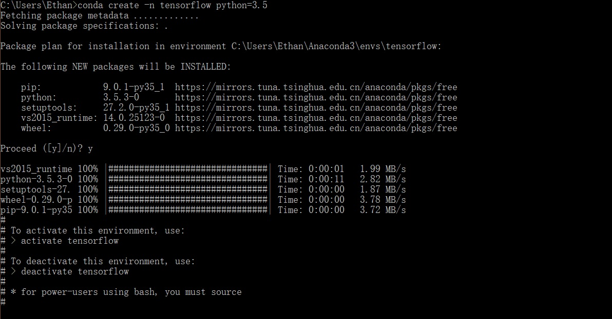
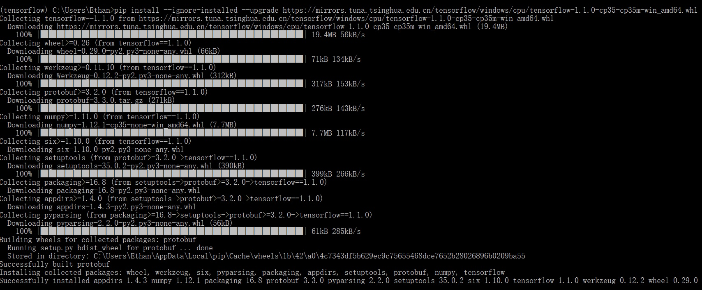
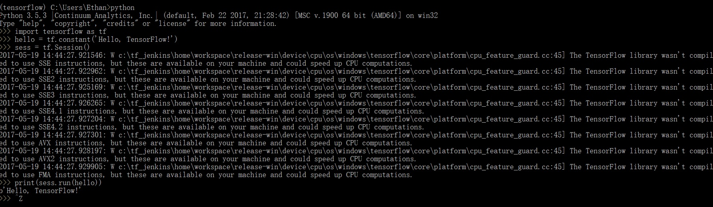

# Hello，TensorFlow！

在学习任何新的编程语言时，我们都会在第一时间完成Hello World，以宣告自己开发环境的完美搭建。TensorFlow也不例外。TensorFlow充分考虑了各种软/硬件平台上的安装，本篇记录了在我的笔电Win 10环境下**TensorFlow 1.1**的安装（在国内这应该是最常见的一种个人环境）并打印出“Hello TensorFlow !”的过程。

## 确认安装选项

确定了Windows平台仅仅是第一步，还需要确定另外两个选项：

- CPU or GPU；
- Native pip or Anaconda。

在[TensorFlow的官方文档](https://www.tensorflow.org/install/install_windows)中明确提到，即使你的机器中有NVIDIA GPU，也建议初学者先尝试CPU的版本。

对于第二个选项，安装Anaconda是个更好的选择。它是一个Python的发行版，包含Python和一个包管理器conda，而且囊括了常见的科学计算库，比起pip安装这些库要容易的多。此外利用conda可以直接创建和管理虚拟环境，比Native pip方式更加独立和灵活，这个在后面还会提到。

TF文档强调**Anaconda是社区支持，而非官方支持**，同时TF团队也不会测试和维护conda package。可以把它看成TensorFlow的免责声明，而非建议Native pip方式。

## 安装Anaconda

我是从[Anaconda官方](https://www.continuum.io/downloads)下载的最新的“Anaconda3-4.3.1-Windows-x86_64.exe”（422M），下载了3个小时。事后才知道清华大学提供了[Anaconda镜像](https://mirror.tuna.tsinghua.edu.cn/help/anaconda/)，建议从此下载。

安装路径要求不能有空格，于是使用了默认安装路径：“C:\Users\Ethan”，一路Next安装完毕。安装过程会自动设置Anaconda环境变量。打开命令行，直接键入`conda --version`，即可检查。为了conda能快速安装其他包，我立即设置了清华的镜像源。操作如下：

    conda config --add channels http://mirrors.tuna.tsinghua.edu.cn/anaconda/pkgs/free
    conda config --set show_channel_urls yes

## 创建conda虚拟环境

为了安装TensorFlow，首先用conda创建一个conda虚拟环境。

conda不仅可以manage package，虚拟环境管理是其另一个非常强大的特性，在虚拟环境下可以隔离不同的package版本组合。我们创建一个干净的tensorflow环境，可以专用于研究和学习TF，而不需要为此动到Python的主环境（主环境可能还要支持其他的项目）。

通过以下命令创建一个名称为tensorflow的虚拟环境（虚拟环境的名字可以任意指定）：

	C:> conda create -n tensorflow python=3.5

TensorFlow安装文档中有明确提到：**在Windows上TensorFlow仅支持的Python版本是3.5.x**。可是前面我安装的Anaconda 4.3.1默认搭配的是Python 3.6。为了防止后续出现兼容性问题，我在上面的命令的末尾加了`python=3.5`。这个参数表示当前创建的tensorflow虚拟环境搭配3.5.x的Python版本（此时是否看出了conda的威力），conda会自动的下载并安装3.5.x最新的版本。

创建虚拟环境的整个过程，如下图所示：

## 安装TensorFlow

TensorFlow是要安装到刚才创建的虚拟环境中去的。于是要先激活tensorflow环境：

	C:> activate tensorflow
	（tensorflow）C:> # Your prompt should change

然后再安装TensorFlow 1.1.0的CPU版本：**tensorflow-1.1.0-cp35-cp35m-win_amd64.whl**。

尽管conda也是包管理器，但是TensorFlow官方建议使用Python原生的包管理器来安装TensorFlow，使用`pip install`命令，而不要用`conda install`命令。此外，我这里还使用了清华的TensorFlow镜像url，也就是把官方的`https://storage.googleapis.com/`替换为`https://mirrors.tuna.tsinghua.edu.cn/`即可。安装速度非常快，一两分钟即可装好。

	(tensorflow)C:> pip install --ignore-installed --upgrade https://mirrors.tuna.tsinghua.edu.cn/tensorflow/windows/cpu/tensorflow-1.1.0-cp35-cp35m-win_amd64.whl 

pip install常见参数解释：

- ignore-installed：强制安装，即便已经安装；
- upgrade：升级；
- no-deps：忽略依赖关系；
- no-cache-dir：不使用缓存；

在安装Tensorflow时，像Numpy这些依赖会自动安装，见下图：

## Hello, TensorFlow

终于要到Say Hello了。不要退出上节启动的虚拟环境，启动python，并直接键入后面的代码即可。

	$ python
	>>> import tensorflow as tf
	>>> hello = tf.constant('Hello, TensorFlow!')
	>>> sess = tf.Session()
	>>> print(sess.run(hello))

代码中TensorFlow的各种函数调用，会在后面讲解。

实际运行如下图：

