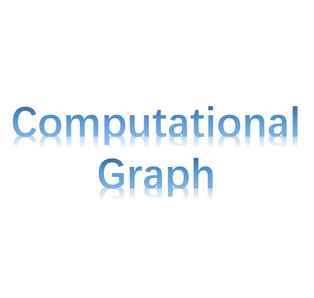
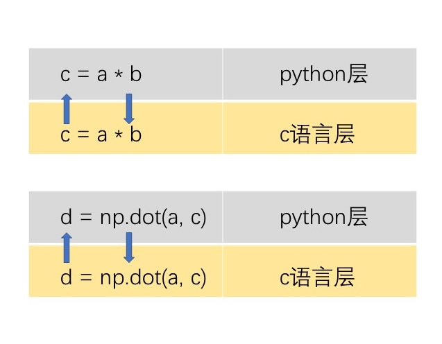

# 2 TensorFlow核心编程

上一篇[1 Hello, TensorFlow!](./ML-2017-1-Hello%2CTensorFlow!.md)中的代码还未解释，本篇介绍TensorFlow核心编程的几个基本概念后，那些Python代码就很容易理解了。

与TensorFlow核心（Core）相对的是TensorFlow提供的高级API。后者是基于前者构建的。对于机器学习研究以及需要对编程、模型完全控制的场景，TensorFlow核心编程是首选。如果为了快速、便捷的执行一个模型训练任务，那么高级的API更容易使用，输出也更具一致性。作为研究学习，显然需要从更基础的TensorFlow核心编程开始。

## 张量

Tensor（张量）是TensorFlow中最核心的数据结构单元，它可以表示任意维数的数组，维度用**rank（秩）**表示。

可以通过下面的例子来理解张量：

- 3 # 一个秩为0的张量；它是一个标量，形状为shape[]；
- [1. ,2., 3.] # 一个秩为1的张量；它是一个向量，形状为shape[3]；
- [[1., 2., 3.], [4., 5., 6.]] # 一个秩为2的张量；它是一个矩阵，形状为shape[2,3]；
- [[[1., 2., 3.]], [[7., 8., 9.]]] # 一个秩为3的张量；形状为shape[2, 1, 3]。

由此可见，如果要做矩阵运算，使用上面第3种方式来表达即可。

注意，张量（Tensor）并非TensorFlow的内部概念，它是一个通用的数学概念，有非常丰富的内涵。

## 计算图

TensorFlow核心编程，通常是由两大阶段组成：

- 1 构建计算图
- 2 运行计算图

**计算图**，The Computational Graph，是由计算节点（node）构成的图。

**节点**，node，代表一种运算操作，输入≥0个张量，输出1个张量，下图右侧是一个加法节点，接受两个输入：

TensorFlow提供了很多的API。在Python中使用它，只需要一行导入语句，即可访问TensorFlow的所有类和方法：

	import tensorflow as tf

上面就是由3个节点构建的计算图，Python代码如下：

	import tensorflow as tf

	node1 = tf.constant(3.0, tf.float32)
	node2 = tf.constant(4.0) # also tf.float32 implicitly
	node3 = tf.add(node1, node2)
	
	sess = tf.Session()
	print("node3: ", node3)
	print("sess.run(node3): ",sess.run(node3))

程序输出：

	node3:  Tensor("Add_2:0", shape=(), dtype=float32)
	sess.run(node3):  7.0

一些说明：

- 代码分3块：导入语句、构建计算图和运行计算图；
- node1和node2是常量节点，常量节点：没有输入，输出是事先存储在其内部的值；
- node3是一个加法操作，2个输入分别是node1和node2的输出，输出是1个相加后的结果；
- 构建好计算图之后，如果直接打印node3，只会打印出该节点的相关信息，但是计算并没有执行；
- 只有通过sess.run运行计算图，才会看到node3真正的输出张量的值。

## Session

上节的示例代码中，计算图构建完成后，最后让计算图执行运算的是Session的Run方法。Session封装了对TensorFlow运行时的控制，及其状态，为用户提供了交互的接口。

## 计算图，Why？

了解了张量和计算图，也许觉得它不难理解，Python的Numpy不也可以提供矩阵运算吗？

的确，Numpy提供了大量矩阵处理的函数，而且其内部是由最高效的C语言实现的。但是要注意C语言与Python之间的交互是有成本的。举个例子：

	import numpy as np
	a = np.array([[1, 2, 3],[4, 5, 6],[7, 8, 9]])
	b = a.copy()
	c = a * b
	d = np.dot(a, c)
	print(c)
	print(d)

程序输出：
	
	[[1  4  9]
 	 [16 25 36]
     [49 64 81]]

	[[180  246  324]
     [378  525  702]
     [576  804 1080]]

上面的代码，首先构建了两个矩阵a和b，然后a和b进行Hadamard乘积得到c，最后用a和c进行矩阵乘法得到d。代码上十分干净利落，接下来分析下C语言和Python的交互成本：

每进行一次矩阵操作，python层都要获得计算结果，所以每行矩阵操作代码都造成一次C语言和Python之间的交互。numpy不仅要计算，还得“折返跑”。

到现在，你或许已经猜到TF的计算图的工作方式了。在构建计算图时，每一步操作的返回值并不是计算结果，而是一个节点。直到运行`sess.run`，TF会一口气从头到尾（目标节点）把运算做完后进行一次输出，中间路过的节点根本“不停车”。而这种连续的管线操作才有可能让其充分的利用GPU，以及分布式处理带来的加速。这就是计算图的先进之处。

尽管TensorFlow被广泛的应用于深度神经网络方面，但是正如上面的分析，它更是一个基于计算图的通用数值计算库。TF官方如此写道：

> TensorFlow is a powerful library for doing large-scale numerical computation. One of the tasks at which it excels is implementing and training deep neural networks.

## 其他类型节点

前面的代码中，包含了两种类型的节点，常量节点和操作节点，本节再介绍几个重要的节点：

- 占位节点
- 变量节点

### 占位节点

占位节点，可以在构建计算图阶段先定义节点（只需定义类型），而在稍后的运行计算图时提供节点的值。使用`tf.placeholder`生成。

	a = tf.placeholder(tf.float32)
	b = tf.placeholder(tf.float32)
	adder_node = a + b  

	print(sess.run(adder_node, {a: 3, b:4.5}))
	print(sess.run(adder_node, {a: [1,3], b: [2, 4]}))

程序输出：

	7.5
	[ 3.  7.]

一些说明：

- a和b都是float32类型的占位节点；
- adder_node = a + b，会产生一个操作节点，同tf.add(a, b)；
- 运行计算图时，必须提供占位节点的值；
- 占位节点只负责占位，但是无记忆，运行计算图提供的值是临时性的。

### 变量节点

比占位节点更加灵活的、即可以动态修改、又具有记忆的节点是变量节点，使用`tf.Variable`生成。

	W = tf.Variable([.3], tf.float32)
	b = tf.Variable([-.3], tf.float32)
	x = tf.placeholder(tf.float32)
	linear_model = W * x + b
	
	init = tf.global_variables_initializer()
	sess.run(init)

	print(sess.run(linear_model, {x:[1,2,3,4]}))

	fixW = tf.assign(W, [-1.])
	fixb = tf.assign(b, [1.])	
	sess.run([fixW, fixb])
	print(sess.run(linear_model, {x:[1,2,3,4]}))

程序输出：

	[ 0.          0.30000001  0.60000002  0.90000004]
	[ 0. -1. -2. -3.]

一些说明：

- 变量节点在定义时，需提供初始值和类型；
- 通过tf.global_variables_initializer得到初始化器，需要sess.run后才完成初始化；
- 通过tf.assign动态改变变量节点的值，需要sess.run完成赋值。

## 词汇表

- rank： 秩，表示张量的维数；
- scalar： 标量，相对于向量而言；
- tensor： 张量，TensorFlow定义的核心的数据单元；

## 附完整代码

    import tensorflow as tf

    node1 = tf.constant(3.0, tf.float32)
    node2 = tf.constant(4.0)  # also tf.float32 implicitly
    node3 = tf.add(node1, node2)

    sess = tf.Session()
    print("node3: ", node3)
    print("sess.run(node3): ", sess.run(node3))

    a = tf.placeholder(tf.float32)
    b = tf.placeholder(tf.float32)
    adder_node = a + b  # + provides a shortcut for tf.add(a, b)

    print(sess.run(adder_node, {a: 3, b: 4.5}))
    print(sess.run(adder_node, {a: [1, 3], b: [2, 4]}))

    W = tf.Variable([.3], tf.float32)
    b = tf.Variable([-.3], tf.float32)
    x = tf.placeholder(tf.float32)
    linear_model = W * x + b

    init = tf.global_variables_initializer()
    sess.run(init)

    print(sess.run(linear_model, {x: [1, 2, 3, 4]}))

    fixW = tf.assign(W, [-1.])
    fixb = tf.assign(b, [1.])
    sess.run([fixW, fixb])
    print(sess.run(linear_model, {x: [1, 2, 3, 4]}))

[下载 tf_2_manual.py](https://github.com/EthanYuan/TensorFlow/blob/master/TF1_1/tf_5_tf.train.py)

