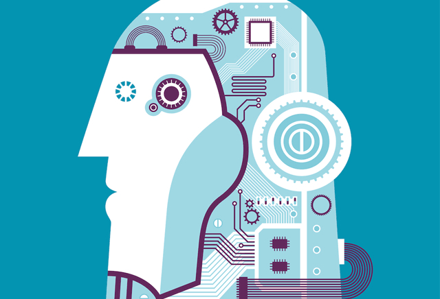
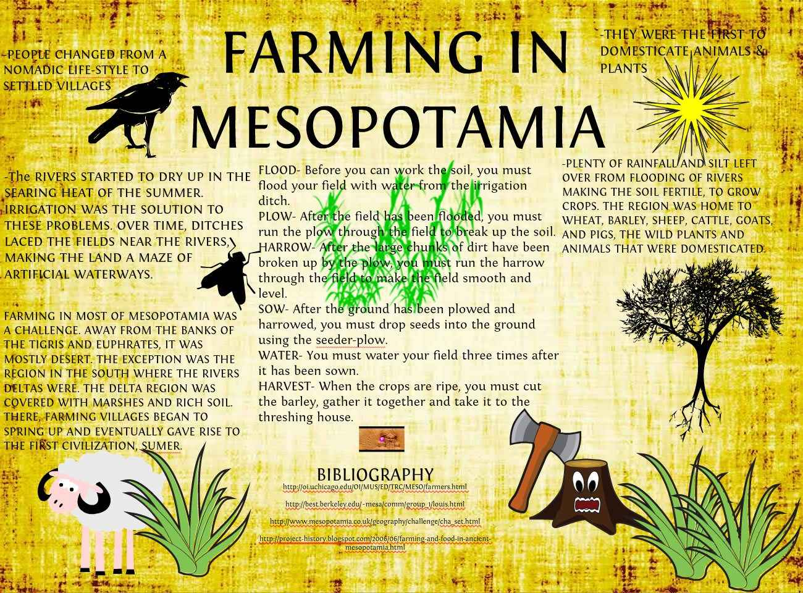
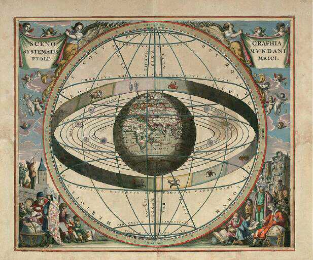

# 3 机器学习漫谈

[上一篇 2 TensorFlow的内核基础](./ML-2017-2-TensorFlow核心编程.md)介绍了TF Core中的基本构造块，在介绍其强大的API之前，我们需要先明了TF所要解决的核心问题：机器学习。

什么是机器学习？

## 人类的学习

### 美索不达米亚文明

公元前4000年，在现今的伊拉克境内，有过世界最早的文明中心之一美索不达米亚（Mesopotamia）。那里的苏美尔人根据观察，发现月亮每隔28-29天就完成从新月到满月再回到新月的周期，而且每过12-13个这样的周期，太阳就回到了原来的位置，据此发明了太阴历。从此，他们具有了预测日食和月食的能力，具有了安排农时的能力。

### 托勒密的地心说

公元2世纪，托勒密提出了“地心说”。托勒密基于过去上百年来的天文观察数据，用最基本的、无法再简化的原型（圆形）对行星运行轨道了进行了建模，该模型在一定情况下是准确的，并可以用于预测。

现代人回头看或许对此相当不以为然，可在当时的天文学界这算的上是最伟大的文明成就，直到14个世纪后才被哥白尼的“日心说”推翻。吴军在其《智能时代》一书中，如此形容其发明者克罗狄斯·托勒密：

> “在我看来，托勒密在近代之前是当之无愧的最伟大的天文学家，没有之一”。

之所以托勒密有如此高的地位，并不完全是因为地心说，而是他的思维方式和方法论（影响了西方世界一千多年），简单概括就是：**“通过观察获得数学模型的雏形，然后利用数据来细化模型”**。直到今天这种朴素的方法论依然管用。

### 人类的学习

前面两个例子揭示了人类学习的一般规律，而文明的形成过程就是上面这个过程的无数次的迭代。现在人类的知识库中积累了大量反应真实世界的模型，比如牛顿三大定律、万有引力、质能方程等，基于这些模型，就可以安排火箭发射，登月，建立粒子加速器。

## 机器学习

在过去，积累观测数据，动辄就是上百年，假设、调整并验证一个模型又是一个漫长的过程。而当今我们面临的是数据爆炸，全世界90%的数据，都是在最近几年产生的。如果能让机器根据大数据动态的发现、调整模型，直到得到一个稳定的、能代表真实世界规律的模型，那么人类就可以大大缩短找到规律的时间，并利用该模型改善自身环境。这就是基于大数据进行机器学习的思想。

### 休谟的问题

机器学习的挑战之一，就是数据的完备性。也就是说数据的收集只有量大还不够，如果不完备，就会得到错误的模型。经常听到的黑天鹅、罗素的归纳主义者火鸡、过拟合都是指向这个问题。

其实不仅机器学习会有这个问题，人也一样。《终极算法》一书中，有一个真实例子：

> 一个白人小女孩，在商场看到拉美裔婴儿时脱口而出：“看，妈妈，那是小女佣”。小女孩并非生下来就是偏执狂。那是因为在她短暂的人生阅历里，她对见过的仅仅几个拉美裔女佣进行了笼统的概况。

早在18世纪，最伟大的经验主义哲学家休谟就提出了这个经典问题：

> 在概括我们见过的东西以及没见过的东西时，怎样才能做到合理？

从某种意义上说，每种学习算法都在尝试回答这个问题。