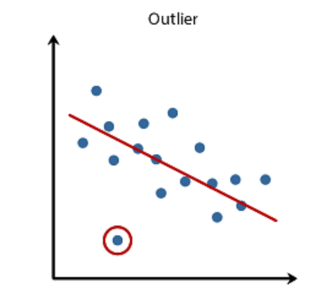
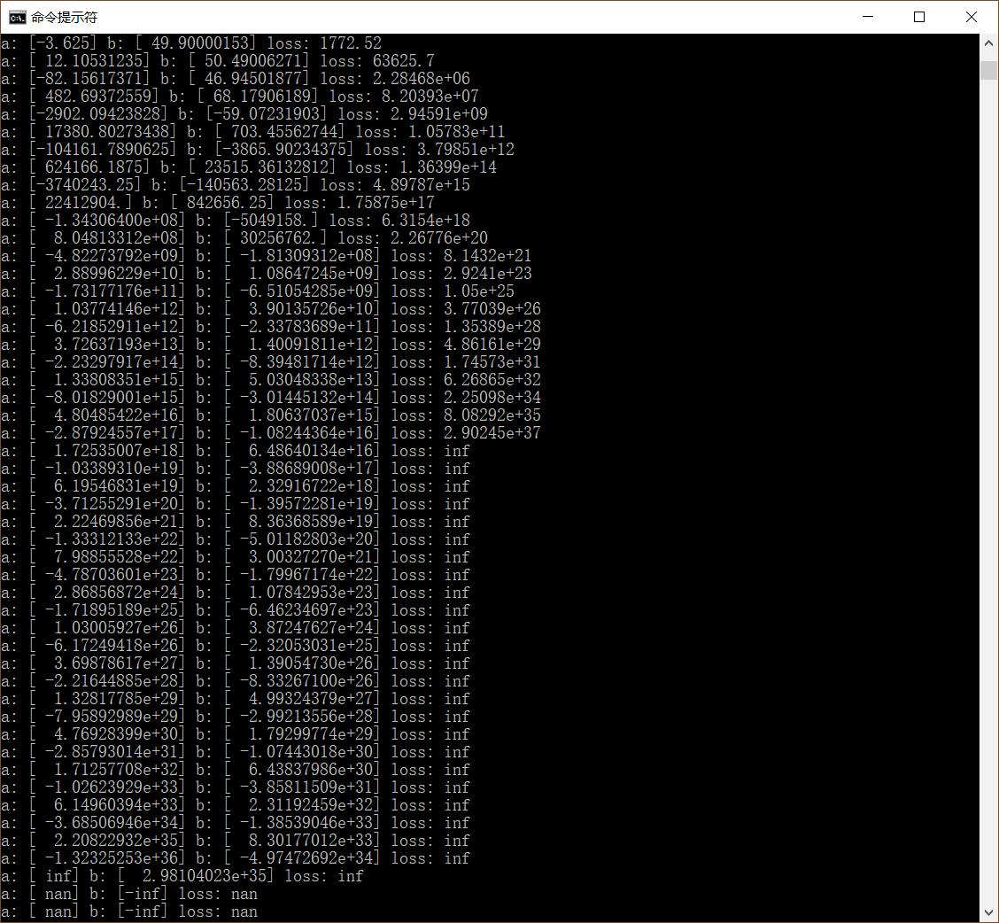

# 5 TF轻松搞定线性回归

[上一篇 4 第一个机器学习问题 ](./ML-2017-4-第一个机器学习问题.md)其实是一个线性回归问题（Linear Regression），呈现了用数据来训练模型的具体方式。本篇从平行世界返回，利用TensorFlow，重新解决一遍该问题。

TensorFlow的API有低级和高级之分。

底层的API基于TensorFlow内核，它主要用于研究或需要对模型进行完全控制的场合。如果你想使用TF来辅助实现某个特定算法、呈现和控制算法的每个细节，那么就该使用低级的API。

高级API基于TensorFlow内核构建，屏蔽了繁杂的细节，适合大多数场景下使用。如果你有一个想法要验证并快速获得结果，那么TF的高级API就是高效的构建工具。

本篇使用TF的低级API来呈现线性回归的每一个步骤。

## 第一个机器学习的TF实现

TensorFlow的计算分为两个阶段：

- 构建计算图；
- 执行计算图。

先给出“平行世界”版本，(a, b)初始值为(-1, 50)，第二次尝试(-1, 40)。

	import tensorflow as tf
	
	# model parameters
	a = tf.Variable([-1.], tf.float32)
	b = tf.Variable([50.], tf.float32)
	
	# model input and output
	x = tf.placeholder(tf.float32)
	linear_model = a * x + b
	y = tf.placeholder(tf.float32)
	
	# loss
	loss = tf.reduce_sum(tf.square(linear_model - y)) / 8
	
	# training data
	x_train = [22, 25, 28, 30]
	y_train = [18, 15, 12, 10]
	
	# training loop
	init = tf.global_variables_initializer()
	sess = tf.Session()
	sess.run(init)  # 1st
	
	print("loss: %s" % (sess.run(loss, {x: x_train, y: y_train})))
	
	# 2nd
	fixa = tf.assign(a, [-1.])
	fixb = tf.assign(b, [40.])
	sess.run([fixa, fixb])
	
	print("loss: %s" % (sess.run(loss, {x: x_train, y: y_train})))
	
程序输出

	loss: 50.0
	loss: 0.0

[下载 tf_5_manual.py](https://github.com/EthanYuan/TensorFlow)

上面的python代码利用了在[2 TensorFlow内核基础 ](./ML-2017-2-TensorFlow核心编程.md)介绍的基本API实现了“第一个机器学习问题”。代码通过一步步构造计算图，最后得到了loss节点。loss即[4 第一个机器学习问题](./ML-2017-4-第一个机器学习问题.md)中定义过的损失函数，这里再次给出其定义：

构建好计算图，接下来开始执行。执行loss节点（同时提供基于tf.placeholder的训练数据），得到loss的值为50。然后开始第二次训练，修改基于tf.Variable的a和b的值，再次执行loss节点，loss的值为0，降到了最低。此时的a和b就是最佳的模型参数了。

还记得那个神秘力量吗？到底是什么让机器在第二次训练中将模型参数(a, b)的值从初始的随机值(-1, 50)迁移到最优的(-1, 40)？如果不靠运气的话，机器如何能自动的找到最优解呢？

## 梯度下降算法

在此之前，或许你已经想到了随机穷举的办法，因为机器不怕累。这的确是个办法，但面临的挑战也不可接受：不可控。因为即便是只有2个参数的模型训练，其枚举域也是无限大的，这和靠运气没有分别。运气差的话，等个几百年也说不定。

不绕圈子，那个神秘力量就是：梯度下降算法（gradient descent）。虽然它也是让机器一小步一小步的去尝试不同的(a, b)的组合，但是它能指导每次前进的方向，使得每尝试一组新的值，loss就能变小一点点，直到趋于稳定。

而这一切TF已经把它封装好了。 本篇先把它当个黑盒子使用。

## tf.train API
	
	import tensorflow as tf
	
	# model parameters
	a = tf.Variable([-1.], tf.float32)
	b = tf.Variable([50.], tf.float32)
	
	# model input and output
	x = tf.placeholder(tf.float32)
	linear_model = a * x + b
	y = tf.placeholder(tf.float32)
	
	# loss
	loss = tf.reduce_sum(tf.square(linear_model - y)) / 8   # sum of the squares
	
	# training data
	x_train = [22, 25, 28, 30]
	y_train = [18, 15, 12, 10]
	
	# optimizer
	optimizer = tf.train.GradientDescentOptimizer(0.01)
	train = optimizer.minimize(loss)
	
	# training loop
	init = tf.global_variables_initializer()
	sess = tf.Session()
	sess.run(init)
	for i in range(1000):
	    sess.run(train, {x: x_train, y: y_train})
	
	# evaluate training accuracy
	curr_a, curr_b, curr_loss = sess.run([a, b, loss], {x: x_train, y: y_train})
	print("a: %s b: %s loss: %s" % (curr_a, curr_b, curr_loss))

代码几乎和TensorFlow Get Started官方代码一致，主要区别在于训练数据不同，以及初始值不同。

- TF官方的训练数据是x_train = [1, 2, 3, 4]，y_train = [0, -1, -2, -3]，而我们的训练数据是“平行世界”的观察记录x_train = [22, 25, 28, 30]，y_train = [18, 15, 12, 10]。
- TF官方的(a, b)初始值是(.3, -.3), 我们的是(-1., 50.)。
- 或许你还发现在官方版本的loss函数末尾没有` / 8`，是因为我使用均方差的缘故，8由4x2得到（4个训练数据）。

重点说下tf.train API。tf.train.GradientDescentOptimizer即封装了梯度下降算法。梯度下降在数学上属于最优化领域，从其名字Optimizater也可体现出。其参数就是“学习率”（learning rate），先记住这个名词，暂不展开，其基本的效用是决定待调整参数的调整幅度。学习率越大，调整幅度越大，学习的越快。反之亦然。可也并不是越大越好，是相对来说的。先取0.01。

另一个需要输入给梯度下降算法的就是loss，它是求最优化解的主体，通过optimizer.minimize(loss)传入，并返回train节点。接下来在循环中执行train节点即可，循环的次数，即训练的步数。

执行计算图，程序输出：

	a: [ nan] b: [-inf] loss: nan

这个结果令人崩溃，仅仅换了下TF官方get started中例子中模型的训练数据和初始值，它就不工作了。

先来看看问题在哪。一个调试的小技巧就是打印每次训练的情况，并调整loop的次数。

	for i in range(49):
	    sess.run(train, {x: x_train, y: y_train})
		curr_a, curr_b, curr_loss = sess.run([a, b, loss], {x: x_train, y: y_train})
		print("a: %s b: %s loss: %s" % (curr_a, curr_b, curr_loss))

程序输出：

TF实际是工作的，并没有撂挑子。只是它训练时每次调整(a, b)都幅度很大，接下来又矫枉过正且幅度越来越大，导致最终承载a和b的tf.float32溢出而产生了nan。这不是TF的一个bug，而是算法本身、训练数据、学习率、训练次数共同导致的(它们有个共同的名字：超参数。)。可见，**训练是一门艺术**。

直觉上，初始值或许有优劣之分，或许是离最优值越近的初始值越容易找到。可是训练数据则应该是无差别的吧？实则不然。但是现在我还不打算把它解释清楚，等后面分析完梯度下降算法后再回来看这个问题。

遇到该问题的也不再少数，[Stack Overflow](https://stackoverflow.com/questions/39314946/why-does-my-linear-regression-get-nan-values-instead-of-learning)上已经很好的回答了。我们先通过调整学习率和训练次数来得到一个完美的Ending。

把学习率从0.01调制0.0028，然后将训练次数从1000调整至70000。

程序输出：

	a: [-1.02855277] b: [ 40.75948715] loss: 0.00379487

最终代码如下：

	import tensorflow as tf
	
	# model parameters
	a = tf.Variable([-1.], tf.float32)
	b = tf.Variable([50.], tf.float32)
	
	# model input and output
	x = tf.placeholder(tf.float32)
	linear_model = a * x + b
	y = tf.placeholder(tf.float32)
	
	# loss
	loss = tf.reduce_sum(tf.square(linear_model - y)) / 8   # sum of the squares
	
	# training data
	x_train = [22, 25, 28, 30]
	y_train = [18, 15, 12, 10]
	
	# optimizer
	optimizer = tf.train.GradientDescentOptimizer(0.0028)
	train = optimizer.minimize(loss)
	
	# training loop
	init = tf.global_variables_initializer()
	sess = tf.Session()
	sess.run(init)
	for i in range(70000):
	    sess.run(train, {x: x_train, y: y_train})
	
	# evaluate training accuracy
	curr_a, curr_b, curr_loss = sess.run([a, b, loss], {x: x_train, y: y_train})
	print("a: %s b: %s loss: %s" % (curr_a, curr_b, curr_loss))

[下载 tf_5_tf.train.py](https://github.com/EthanYuan/TensorFlow/blob/master/TF1_1/tf_5_tf.train.py)

## TensorBoard

TF的另一个强大之处就是可视化算法的TensorBoard，把构造的计算图显示出来。图中显示，每一个基本运算都被独立成了一个节点。除了图中我标注的Rank节点、range节点，start节点、delta节点外，其他节点都是由所写代码构建出来的。

## 词汇表

- derivative； 导数；
- estimator： 估计；
- gradient descent： 梯度下降；
- inference： 推理；
- linear regression：线性回归；
- loss function： 损失函数；
- magnitude： 量；
- optimal： 最优的；
- optimizers： 优化器；