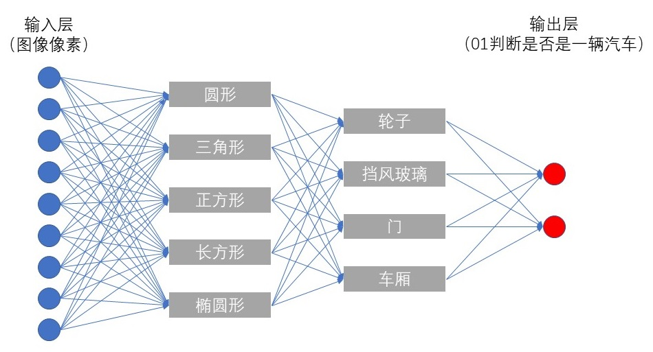

# 1 深度神经网络

上一主题[《TensorFlow从0到1》](https://github.com/EthanYuan/TensorFlow-Zero-to-N/tree/master/TensorFlow%E4%BB%8E0%E5%88%B0N/TensorFlow%E4%BB%8E0%E5%88%B01)介绍人工神经网络的基本概念与其TensorFlow实现，主要基于浅层网络架构，即只包含一个隐藏层的全连接（FC，Full Connected）网络。

新主题[《TensorFlow从1到2》](https://github.com/EthanYuan/TensorFlow-Zero-to-N/tree/master/TensorFlow%E4%BB%8E0%E5%88%B0N/TensorFlow%E4%BB%8E1%E5%88%B02)将探索近5年来取得巨大成功的**深度神经网络(Deep Neural Networks，DNN)**，它已成为机器学习中一个独立的子领域——**深度学习（Deep Learning）**。

本篇将解释“深度”的含义，并引出在纵向扩展神经网络时遇到的障碍。

## 神秘黑盒

神经网络是一个“黑盒”（Black Box）。不仅外行人看它如此，即便是对亲手构建并训练它的工程师而言，亦是如此。

它的神秘，并不在于打不开、看不到，而是**学习过程不可控，识别原理不可解释。**

当预设了网络的架构，完成初始化后，剩下的就是喂数据给它即可。至于网络中数以万计的权重和偏置该如何调整，将止步何处，整个动态优化的过程人类完全插不上手。

最终网络训练收敛，惊艳的输出超越人类的判断。若此时立即打开黑盒，打印出网络中所有的参数和中间结果，会怎样？呈现在我们眼前的无非是一堆调整的恰到好处的数字，可它们究竟意味着什么概念和逻辑，就像密码一样不得而知。

## 理解隐藏层

机器学习的逻辑形式看上去晦涩难懂，但是并没有妨碍它成功的应用在诸多领域。所幸研究者在关注如何进一步提升网络性能的同时，并没有忘记尚未“解码”机器学习的秘密这件事，通过积极的尝试已经获得了很多启发性的理解。

神经网络从输入“裸数据”开始，经历层层前馈（Feedforward），在输出层获得一个高度抽象、人为定义的类别概念，这中间的每一隐藏层其实都是不同层次的概念表示，离输入层越近的抽象程度越低，反之离输出层越近的抽象程度越高。

以一个识别汽车图片的网络为例，来模拟这种理解，如下图所示。

网络中有两个隐藏层。第一个隐藏层，接收图像像素数据，输出表示形状的概念。第二个隐藏层，接收上一层输出的几何形状信息，输出表示汽车零部件的概念。最后到网络的输出层，进行最终的判断——是否可以分类为汽车。

这是对网络隐藏层一种理想的解释。实际情况中，不同的数据和分类目的，会训练出不同的网络，而每一层所对应的意义也会出乎意料。基于这种启发，研究者已经发展出逐层的[可视化分析](http://yosinski.com/deepvis)手段，来帮助人类理解机器学习的机理。

## “深度”的定义

2006年，Hinton发表《基于深度置信网络的快速学习方法》，深度神经网络和深度学习开始被重新关注。

**从形式上，包含两层或更多隐藏层的网络即可称为深度神经网络**。

Goodfellow的[《Deep Learning》](http://www.deeplearningbook.org/)从概念层次的角度诠释了深度学习：

**“（本书所围绕的）这个方案让计算机从经验中学习，并根据层次化的概念体系来理解世界，其中每个概念通过与之关联的更简单的概念来定义。**

**从经验获取知识，可以避免由人类形式化的制定一切计算机所需要的知识。**

**运用层次化的概念，计算机可以通过较简单的概念构建复杂的概念。如果我们能绘制一个图形来表示概念是如何建立在其他概念之上，那这个图形将会很深，具有很多的层。基于这个原因，我们称这种方法为AI深度学习。”**

理解机器视角下的层次化概念意义深远，一旦可以充分解释，人类就可以向机器请教，从而照亮思维的盲区。遭遇过Master（即AlphaGo）的柯洁，在正式对战AlphaGo之前，就领悟到了这一点：

*“人类数千年的实战演练进化，计算机却告诉我们人类全都是错的。我觉得，甚至没有一个人沾到围棋真理的边。但是我想说，从现在开始，我们棋手将会结合计算机，迈进全新的领域达到全新的境界。”*

## 为什么不是宽度？

根据万能近似定理（universal approximation theorem），在一个隐藏层的情况下，只要够宽（wide）——神经元数量足够多，则能以任意精度逼近任意的函数。

然而，该定理并不能指出网络具体要多“宽”，也不能保证训练算法能够学得这个函数。对于逼近一个复杂的函数，有可能需要隐藏层宽到不可实现，也有可能训练产生记忆效果而无法有效的泛化。

研究表明，深度比宽度在以下两方面更加有优势：

- 深层网络表示的函数可能需要浅层网络指数级的神经元数量才能表示；
- 深层的网络能够更好的泛化；

## 多多益善？

基于以上对深度的理解，我们似乎获得了一个简单易行的绝佳方案：增加隐藏层！

可往往事与愿违。

以MNIST识别为例，使用在上一主题中构建好的全连接网络进行训练，测试结果如下表所示：

|    | 隐层数量     | 每隐层神经元数 | 迭代次数  | 识别精度   | 代码      |
|:--:|:-----------:|:-------------:|:--------:|:---------:|:---------:|
| 1  | 隐层x1      |   100         | 30       | 95.25%    |[tf_2-1_1_hidden_layers.py](https://github.com/EthanYuan/TensorFlow/blob/master/TF1_3/tf_2-1_1_hidden_layers.py)|
| 2  | 隐层x2      |   100         | 30       | 95.87%    |[tf_2-1_2_hidden_layers.py](https://github.com/EthanYuan/TensorFlow/blob/master/TF1_3/tf_2-1_2_hidden_layers.py)|
| 3  | 隐层x3      |   100         | 30       | 96.3%     |[tf_2-1_3_hidden_layers.py](https://github.com/EthanYuan/TensorFlow/blob/master/TF1_3/tf_2-1_3_hidden_layers.py)|
| 4  | 隐层x4      |   100         | 60       | 96.08%    |[tf_2-1_4_hidden_layers.py](https://github.com/EthanYuan/TensorFlow/blob/master/TF1_3/tf_2-1_4_hidden_layers.py)|

随着隐藏层数量的增加，识别精度增长并不显著，当隐藏层增加到4层时，收敛不仅需要更多的迭代次数，识别精度反而开始下降了。

可说好的“深度”呢？