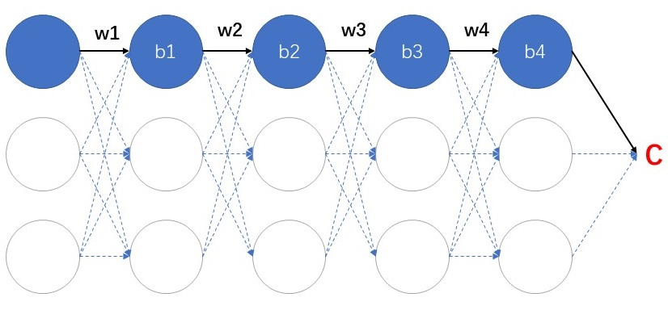
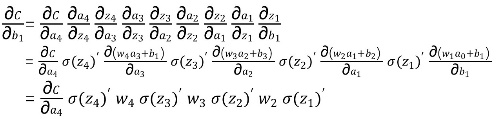
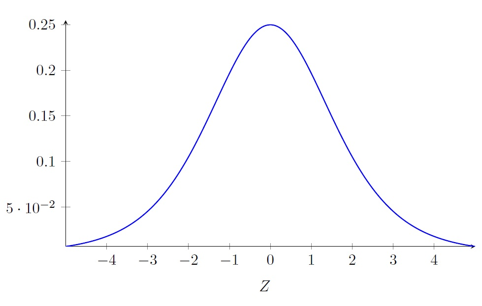
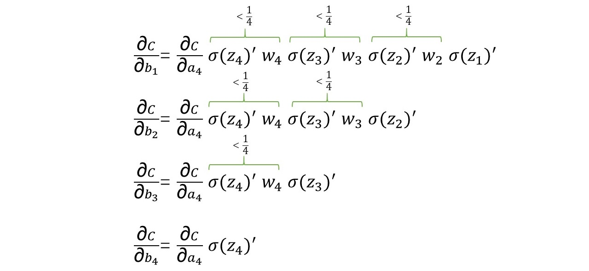
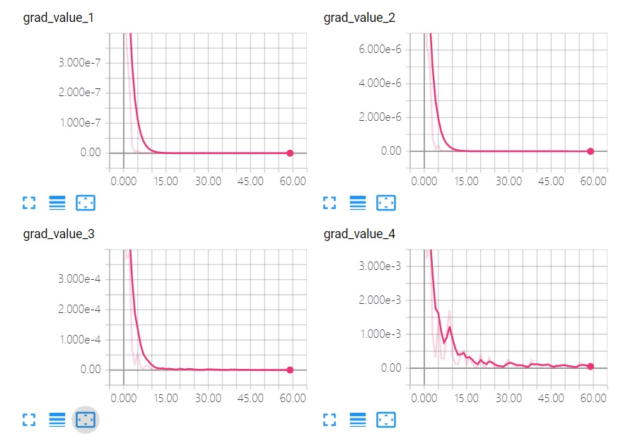
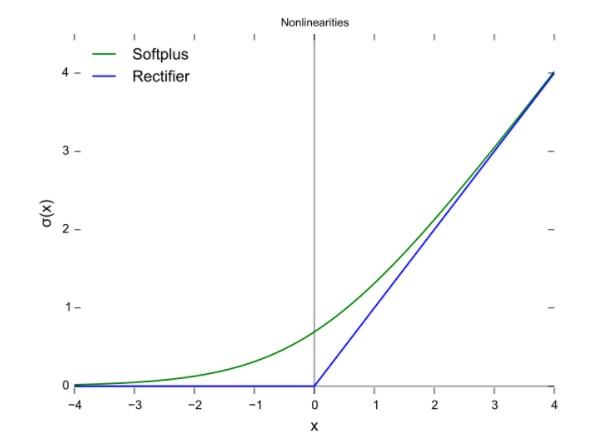

# 2 消失的梯度

上一篇[1 深度神经网络](./1-深度神经网络.md)我们知道，通过追加隐藏层来构建更加“智能”的深度神经网络，并不奏效。

**真正的问题不在“深度”本身，而是由梯度下降算法所指导的训练过程，容易遭遇[梯度消失问题](ftp://ftp.idsia.ch/pub/juergen/gradientflow.pdf)（Vanishing Gradient Problem），以及与之成对存在的梯度爆炸问题（Exploding Gradient Problem）**。

本篇分析梯度消失和爆炸问题，并引入整流线性单元（ReLU）。

## 重现梯度消失

为了凸显这个问题，我们需要一个特别的网络架构，抽出网络中由蓝色神经元构成的路径，形成一个每层只有一个神经元的多层网络，如下图所示：

接下来采用链式法则进行反向传播，来获得最靠前的隐藏层神经元参数的梯度形式：

整理得到下式：

**这个形式可以清晰的反应出在反向传播过程中，靠后的层如何影响靠前的层：神经元梯度会受到其后每层神经元的累积乘性影响，越靠近输出层的，乘性因子越多。这将导致靠前面的神经元层梯度的不稳定——容易过小或者过大，从而产生梯度消失或梯度爆炸。**

以梯度消失为例。假设网络参数初始化符合标准正态分布N(0,1)，且神经元的激活函数采用Sigmoid函数，则有|w| < 1，而Sigmoid的导数σ' < 1/4（见下面的Sigmoid导数曲线）。

根据上述，得到下面推断：网络越深，靠近输入层的神经元的梯度的绝对值越小，也就意味着神经元学习缓慢，甚至停止学习。这种情况下靠前的隐藏层都是不爱“学习”的无效层，如下所示：

对前面的网络结构，进行训练迭代60次，并监测各隐藏层偏置上的梯度，会得到与理论分析相同的结果。如下图所示，从左到右，从上到下，依次是第1个到第4个隐藏层偏置bl上的梯度求模的值，曲线显示越靠前的层偏置向量b的模越小，所用代码[tf_2-2_one_path.py](https://github.com/EthanYuan/TensorFlow/blob/master/TF1_3/tf_2-2_one_path.py)。

## 梯度爆炸

梯度爆炸问题，效果与梯度消失恰恰相反——越靠前的隐藏层的梯度越大。

一个简单的解释是：训练过程中随着权重w的不断更新，分布不再服从初始化时的N(0, 1)。一旦出现权重w的标准差远远大于1，那么越靠前的隐藏层将获得很大的梯度（绝对值），导致权重更新幅度非常大，神经元很难学到稳定的概念。

总的来说，不管是梯度消失还是梯度爆炸，深度网络中靠近输入层的神经元，其梯度的内在结构“不稳定”是学习困难的根本原因。

## Sigmoid三宗罪

前面的神经网络以及相应的问题都是基于S型神经元，即采用Sigmoid作为各层的激活函数。下面来说说Sigmoid的3个主要缺陷。

### 1.输出区间不以0为中心

**Sigmoid的输出范围为(0, 1)，总是正数，不以0为中心。由此可推断，一个由S型神经元构成的网络中，第一个隐藏层之后层的输入永远为正值。这会带来一个问题：网络中一个神经元中的所有权重（除第一个隐藏层之外），其上梯度的符号相同，要么都为正，要么都为负，造成“zig-zagging dynamics”（之字形动态）。**

所谓“zig-zagging”，就是指权重向量的更新方向受到限制，对于某些方向上（各分量梯度符号不同）的目标解，需要“之”字迂回多次才能达到。这就好比两个人的腿绑在一起，对于各自的目标，两人必须步调一致妥协达成，而不能各干各的。

以一个输出层S型神经元为例，来证明权重上梯度的符号相同。

神经元输入输出定义如下，其中σ表示Sigmoid函数：

如下式所示，输入xi恒为正，σ'(z)恒为正，神经元的任一权重wi上的梯度符号也不依赖权重自身（求导后消去），最终要么都为正，要么都为负：

### 2.神经元容易饱和，停止学习

回顾下熟悉的Sigmoid曲线。从图上看，当神经元加权和|z| > 2时，Sigmoid曲线趋于平缓，此时σ'(z) → 0，神经元趋于饱和，权重和偏置更新幅度非常小，学习几乎停滞。如下式所示，以一个输出层神经元为例，如果σ'(z) → 0，在权重w上的梯度也趋于0。

此外，从上一节中Sigmoid导数曲线可以看出，其最大值也不过0.25，使得梯度在反向传播过程中衰减较快。

### 3.计算耗时

Sigmoid表达式中包含了指数函数ex，增加了计算复杂度。

## 神奇ReLU

忍了S型神经元那么久，它的终结者神奇ReLU终于出场了，它的全称整流线性单元，Rectified Linear Units。

**采用整流器Rectifier作为激活函数的神经元（单元）被称为ReLU，很多时候人们也直接用ReLU指代整流线性函数。**整流函数形式非常简单：**f(x) = max(0,x)**。如下图蓝色曲线所示，其中绿色的曲线是Softplus曲线，可以看做ReLU的平滑版本。

关于ReLU的与神经科学的关系，有3篇中文文章值得一读：

- [《Delving Deep into Rectifiers: Surpassing Human-Level Performance on ImageNet Classification》阅读笔记与实现](https://github.com/happynear/gitbook/blob/master/delving_deep_into_rectifiers_surpassing_human-leve.md)
- [一个神经科学工作者眼中的Alexnet（上）](https://zhuanlan.zhihu.com/VisNeuro/26900265)
- [ReLu(Rectified Linear Units)激活函数](http://www.cnblogs.com/neopenx/p/4453161.html)

从应用的角度来说，ReLU有几个很棒的特性：

- 在输入大于0时，它的导数为1，永不饱和；
- 计算简单高效；
- 训练收敛极快（与前面2点有关）；

ReLU在输入>0时导数为1（相比Sigmoid导数最大值为0.25），具有高效的反向传播，且平衡了各层更新速率的差异，很大程度上消除了梯度消失问题。

**ReLU也并非完美，首先它的输出区间也不以0为中心**。

**更加严重的问题是，在它的负区间上，梯度为0，一旦进入到这个区间学习将完全停止**。如果某次权重大幅度更新后，导致ReLU神经元上的权重W非常小（绝对值很大的负数），使得整个数据集的输入都无法激活它，我们称这种情况为**Dying ReLU Problem**。

## ReLU也不是救星

尝试将前面实验的网络隐藏层激活函数都换成ReLU，实验结果如下表所示。识别精度比Sigmoid版本有了2个百分点的大幅提升，而且训练过程中收敛速度确实很快，几次迭代下来就可以让识别精度达到95%。

|    | 隐层数量     | 每隐层神经元数 | 迭代次数  | 识别精度   | 代码      |
|:--:|:-----------:|:-------------:|:--------:|:---------:|:---------:|
| 1  | 隐层x1      |   100             | 30       | 97.57%    |[tf_2-2_1_hidden_layers_relu.py](https://github.com/EthanYuan/TensorFlow/blob/master/TF1_3/tf_2-2_1_hidden_layers_relu.py)|
| 2  | 隐层x2      |   100,100         | 30       | 97.92%    |[tf_2-2_2_hidden_layers_relu.py](https://github.com/EthanYuan/TensorFlow/blob/master/TF1_3/tf_2-2_2_hidden_layers_relu.py)|
| 3  | 隐层x3      |   100,100,100     | 30       | 97.9%     |[tf_2-2_3_hidden_layers_relu.py](https://github.com/EthanYuan/TensorFlow/blob/master/TF1_3/tf_2-2_3_hidden_layers_relu.py)|
| 4  | 隐层x4      |   100,100,100,100 | 60       | 97.81%    |[tf_2-2_4_hidden_layers_relu.py](https://github.com/EthanYuan/TensorFlow/blob/master/TF1_3/tf_2-2_4_hidden_layers_relu.py)|
| 5  | 隐层x4      |   500,300,150,50  | 60       | 97.98%    |[tf_2-2_4_hidden_layers_relu_2.py](https://github.com/EthanYuan/TensorFlow/blob/master/TF1_3/tf_2-2_4_hidden_layers_relu_2.py)|
| 6  | 隐层x4      | 2048,1024,512,256  | 60       | 98.07%    |[tf_2-2_4_hidden_layers_relu_3.py](https://github.com/EthanYuan/TensorFlow/blob/master/TF1_3/tf_2-2_4_hidden_layers_relu_3.py)|

但是遗憾的是，继续增加隐藏层的数量，与Sigmoid类似，识别精度却并未出现明显的提升。虽然ReLU克服了梯度消失问题，但那并不是唯一的问题，太多的因素都在影响训练深度网络训练的难度。如果单靠追加ReLU隐藏层就能构建深度网络，也就没卷积神经网络什么事了。

尽管从理论上讲，深度网络具备极强的分层概念表示能力，但是这并不保证学习过程总能通向成功。我们的训练过程，可能并没有学习到层次化的概念，或者学习了错误的层次化概念。

这或许是基于梯度下降训练全连接网络的宿命。我们知道，全连接网络的每个神经元都会接收上一层所有神经元的输出，进行输入输出的映射，所以在增加深度（隐藏层）的同时，会造成参数量成倍增加，从而加大了训练难度。

现实中，全连接网络（FC）通常较浅，接受相对低维的特征数据，或者小分辨率的图像数据，用于回归或者分类。对于大分辨率图像来说，也都会事先进行特征提取，再将低维特征数据输入网络，而不是构建端到端的深度网络架构。

## 深度的复兴

2006年，Hinton的深度信念网络（Deep Belief Network，DBN），通过对每层神经元单独进行训练完成学习过程，成为了第一批成功应用深度架构训练的非卷积模型之一，由此开启了深度学习的复兴，而将深度学习带入巅峰的则是接下来要介绍的：卷积神经网络。