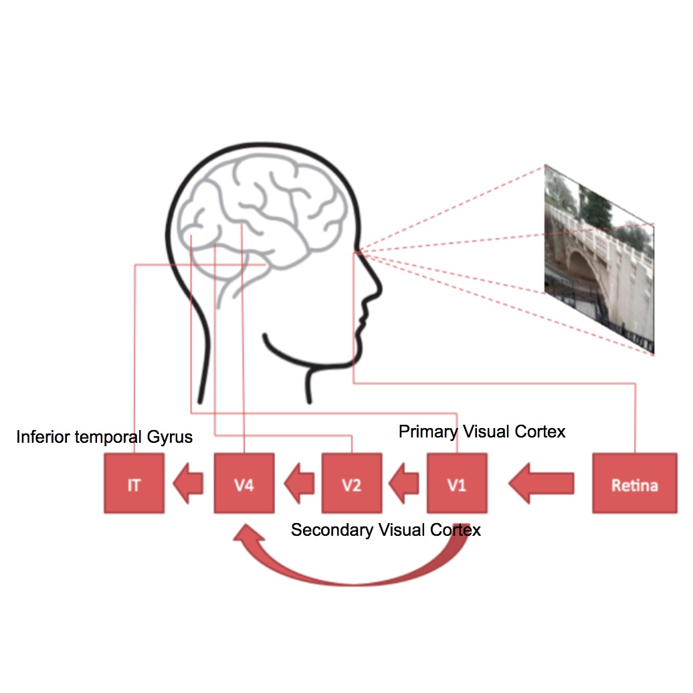
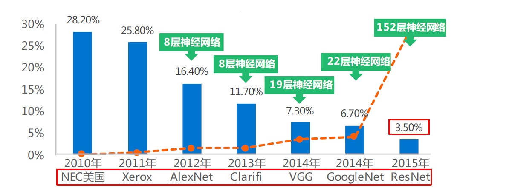
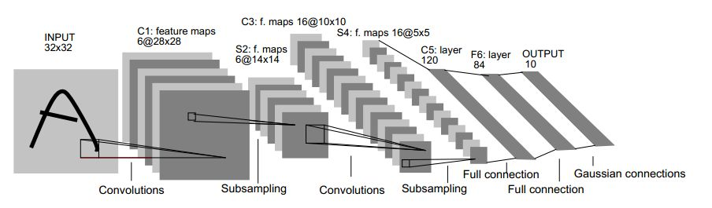

# 3 深度学习革命的开端：卷积神经网络

关于全连接神经网络（Full Connected Neural Network，FC）的讨论已经说的不少了，本篇将要介绍的是，从2006年至今的神经网络第三次浪潮中，取得巨大成功、处于最核心位置的技术——**卷积神经网络，Convolutional Neural Network（CNN）**。

## 一战成名

2012年AlexNet在ImageNet上一战成名，点爆了深度学习革命，这是历史性的时刻。其中的故事，推荐依图科技CEO朱珑（Leo Zhu）的[《深度学习三十年创新路》](http://36kr.com/p/533832.html)，讲的很精彩，下面的引用部分就是片段节选。

> 标志性事件是，2012年底，Geoff Hinton的博士生Alex Krizhevsky、Ilya Sutskever（他们研究深度学习时间并不长）在图片分类的竞赛ImageNet上，识别结果拿了第一名。其实类似的比赛每年很多，但意义在于，Google团队也在这个数据集上做了测试（非公开的，Google没有显式参加学术界的“竞赛”），用的也是深度学习，但识别精度比Geoff Hinton的团队差了很多，这下工业界振奋了。

如上图所示，2012年AlexNet的惊艳之处在于，它比上一年冠军的错误率25.8%低了近10个百分点。正是这前所未有的进步，引领人们穿透迷雾，望见了未来。

> 但更有意思的是（很有启发性并值得思考），Alex Krizhevsky 和 Geoff Hinton的竞赛用的正是 Yann Lecun 发明的卷积神经网，但结果刚出来时（实现细节还没有公布），Yann Lecun和他的NYU实验室成员甚至没法重复Geoff Hinton的结果。自己发明的算法，使用结果不如另外一个组。这下炸了锅，Yann Lecun开了组会，反思的主题是“为什么过去两年我们没有得到这样的成绩” 。

黑马AlexNet并不“新”，如上面节选所说，它其实脱胎于1998年即14年前就被Lecun提出的卷积神经网络LeNet-5，改动非常有限：

- 采用ReLU而非S型神经元；
- 网络更深；
- 训练数据量更大；
- 采用GPU训练；

前两点与网络架构相关，虽然ReLU的应用贡献良多，但就整个算法框架来说它们都算不上有实质性的改变。而后两点或许才是更根本的，得益于**大数据**和**摩尔定律**，AlexNet获得了可以用更多数据来训练网络所需要的算力。

而LeNet-5在当时的数据与算力条件下，显然不如其他的机器学习算法（核方法、图模型、SVM等）更有前景，冰封十余载才获得了认可。

### 神经科学的启示

就像20世纪40、50年代，受神经科学发现的启示，人类构建了人工神经元一样，1959年Hubel和Wiesel对哺乳动物视觉皮层机理的发现，让人类再次受到造物主的馈赠，卷积神经网络就是最成功的应用之一。

哈佛大学的神经生理学博士Hubel和Wiesel观察了[猫大脑中的单个神经元如何响屏幕上的图像](https://www.youtube.com/watch?v=8VdFf3egwfg)，他们发现处于视觉系统较前面的区域神经元对特定的光模式反应强烈，而对其他模式完全没有反应，这个部分被称为初级视觉皮层，Primary Visual Cortex，也被称为V1。他们凭借这个开创性的研究，在1981年获得了诺贝尔生理学或医学奖。

V1的发现开启了对人脑视觉系统进一步的认知，如本篇最前面引用的那幅图中所绘制的，当眼睛查看外界对象时，信息从视网膜流到V1，然后到V2（Secondary Visual Cortex），V4，之后是IT（Inferior Temporal Gyrus，颞下回）。哺乳动物的视觉系统是分层递进的，每一级都比前一级处理更高层次的概念：

- V1：边缘检测；
- V2：提取简单的视觉要素（方向、空间、频率、颜色等）
- V4：监测物体的特征；
- TI：物体识别；

卷积神经网络就是根据V1的3个性质设计的：

- 空间映射：根据V1的空间映射特性，卷积神经网络中的各层都是基于二维空间结构的（末端的全连接层除外）；
- 简单细胞：V1中有许多简单细胞（simple cell），它们具有局部感受野，卷积网络中的卷积核据此设计；
- 复杂细胞：V1中有许多复杂细胞（complex cell），用于响应简单细胞检测的特征，且对于微小偏移具有不变形，这启发了卷积网络中的池化单元；

V1其后的视觉区域，其实与V1具有相同的原理，特征检测与池化策略反复执行。同样，卷积网络架构的设计，也是卷积层和池化层重复叠加，形成深度层级。具有开创性的现代卷积网络LeNet-5，架构如下图所示：

在深度学习之前，图像识别面临的最大挑战就是特征工程，研究者需要根据自己的经验和洞察、具体场景和领域知识，人为的进行特征的设计和提取，之后再进行分类的训练。而卷积神经网络自带特征提取能力，特征学习和分类训练一气呵成，使得网络可以直接使用原始的图像数据作为输入，输出分类结果。这种端到端的图像识别极大的简化了算法设计的复杂度和工作量。

### 迂回前进的历史

卷积神经网络并不是一夜之间发明出来的，从2012年AlexNet开始追溯的话，还需要更多历史性时刻的支撑，即使是最早的卷积神经网络出现，也在Hubel和Wiesel实验的二十年后了。尽管神经科学给出了启示，却并没有告诉我们该如何训练卷积网络：

- 1980年，日本科学家Fukushima构建了卷积神经网络，但当时反向传播算法还未准备好；
- 1986年，Hinton成功将反向传播算法用于训练神经网络；
- 1989年，LeCun开始基于反向传播算法训练二维卷积网络；
- 1998年，LeCun提出第一个正式的卷积神经网络LeNet-5；

历史就是这样迂回前进的，一开始是各个独立、随机的小支流，随着时间的推进，最终汇聚在一起产生革命性的时刻。