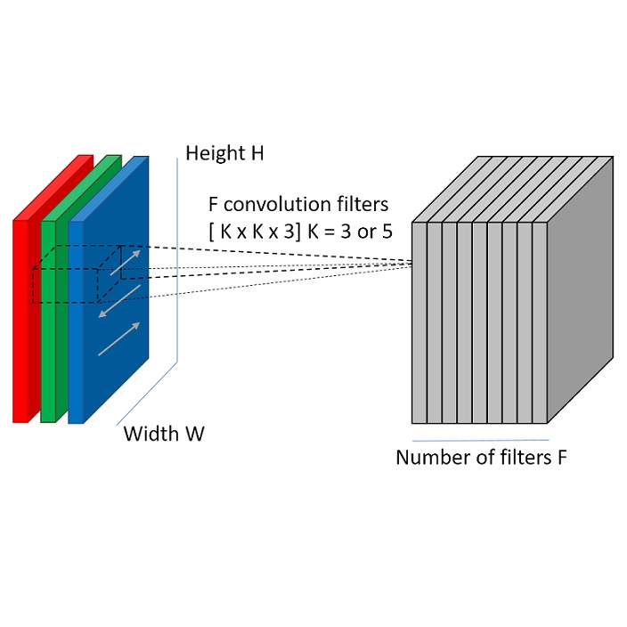
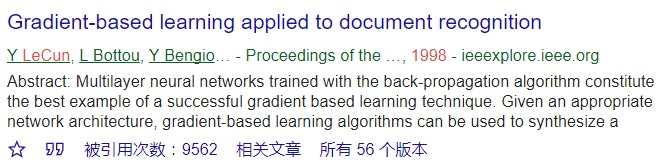
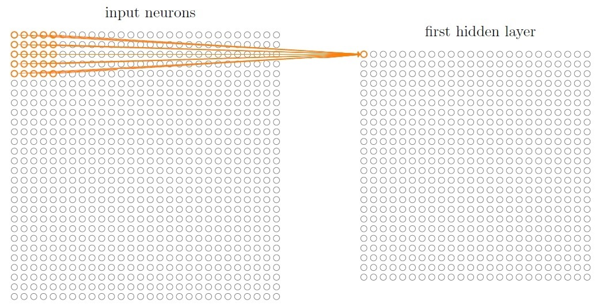
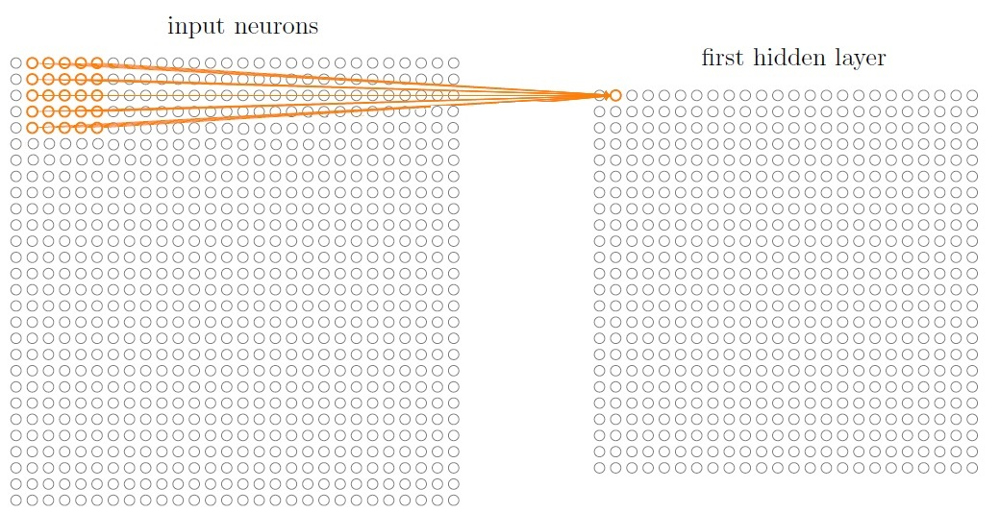
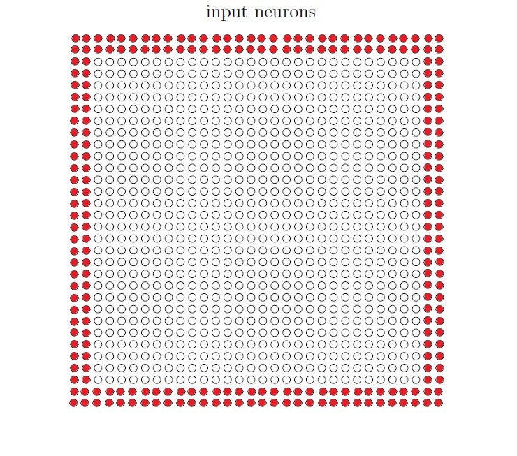
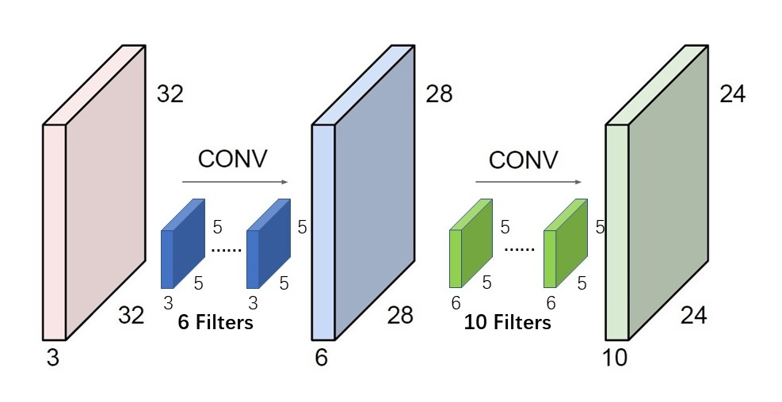
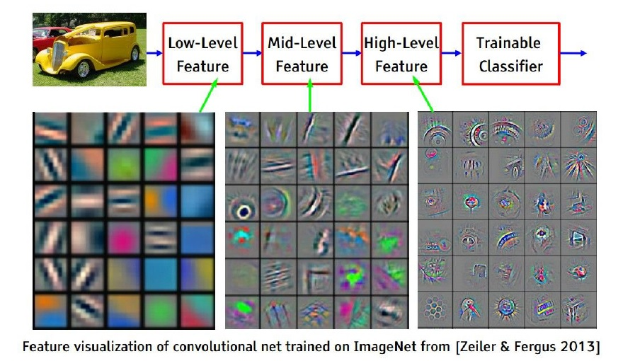
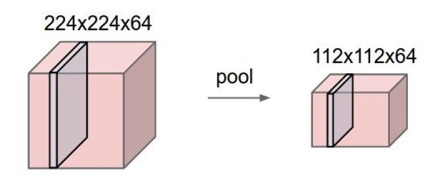
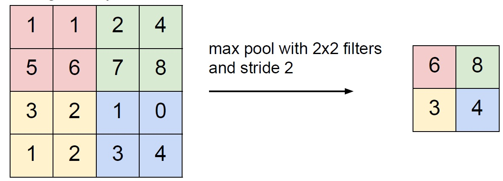

# 4 拆解CNN架构

上一篇[3 深度学习革命的开端：卷积神经网络](./3-深度学习革命的开端：卷积神经网络.md) 快速回顾了CNN的前世今生。

本篇将拆开CNN架构，一探究竟。

## 基于空间映射的架构

**全连接网络架构存在一个“硬”伤：网络中各层神经元的一维排布方式，丢弃了图像的空间结构信息**。

以MNIST识别为例，当输入一副28x28的二维图像，我们首先会把它拉平为一个长度为784的一维的向量，而后才将其连入隐藏层的每个神经元。输入图像中两个相距较近的像素位置，与两个相距较远的像素位置，对于神经元来说并没有差别。全连接网络只能靠大量训练，通过更新神经元对每个像素位置权重这种“软”方法，推断出图像的空间结构。

**与全连接网络不同，CNN中的各层神经元排列都保持了二维的图像空间结构**（末端的全连接层除外），如下图所示。

这就是LeCun在1998年发表[《Gradient-based learning applied to document recognition》](http://www.dengfanxin.cn/wp-content/uploads/2016/03/1998Lecun.pdf)提出的第一个正式的卷积神经网络架构——LeNet-5，Google学术搜索显示被引用9562次，经典程度可见一斑。

以“层”作为拆解粒度的话，刨去输入层和输出层，LeNet-5共有6个隐藏层：从左到右依次是：

- C1卷积层（Convolutional Layer）；
- S2降采样层（Sub-Sampling Layer），即池化层（Pooling Layer）；
- C3卷积层；
- S4降采样层；
- C5卷积层；
- F6全连接层(Full Connected Layer)；

其中，关于全连接层我们已经非常熟悉了（回顾直达[TensorFlow从0到1](https://github.com/EthanYuan/TensorFlow-Zero-to-N/blob/master/TensorFlow%E4%BB%8E0%E5%88%B0N/TensorFlow%E4%BB%8E0%E5%88%B01/19-%E5%9B%9E%E9%A1%BE.md)），而其余的5层中，只有卷积层和降采样层两种类型，交替重复出现。

需要注意的是，LeNet-5是CNN的一种特化架构，在构建自己的CNN的时候完全可以自定义架构的大小和深度（卷积层和降采样层的数量）。

接下来分别去看卷积层和池化层。

## 卷积层

卷积层分为4个小主题来说：

- 局部感受野；
- 共享权重和偏置；
- 多通道算法；
- 滤波器的层次；

### 局部感受野

与全连接网络的另一个迥异是，卷积层神经元具有**局部感受野**，它只能“看到”一小块局部图像，如下图所示。

图中左侧是28x28的输入层，右侧是第一个隐藏层——卷积层，其中第一行第一列的神经元能够“看到”一块5x5的局部图像。

接下来看卷积层的第一行第二个神经元，5x5的“小视窗”从之前的位置，整体向右滑动了1个像素（跨距），形成了它的感受野，见下图。

依照上述这种局部映射逻辑，依次从左到右，从上到下，便构建好了卷积层与上一层输出的位置映射关系。**需要注意的是，卷积网络中各层的二维结构，以及“小视窗”都是正方形的，如果输入原始数据是长方形图片，则需要进行预处理。**

用N代表输入层的尺寸，F代表小视窗尺寸，stride代表跨距，那么卷积层的二维尺寸可以通过公式计算出来：

**K = (N - F) / stride + 1**

已上图为例，输入层的尺寸是28x28，小视窗尺寸为5x5，每次整体挪动1个像素，那么计算得出卷积层的二维尺寸是:

(28 - 5) / 1 + 1 = 24。

经过卷积映射，卷积层的尺寸比输入层尺寸减小了。如果想保持卷积层尺寸不变，一个常规做法是对输入图像沿边界整圈补0。记补0的圈数为P，那么卷积层尺寸的计算公式更新为：

**K = (N + 2P - F) / stride + 1**

已上图为例，在做卷积映射前，对输入图像补0两圈，可以使卷积层尺寸保持与原图像不变：

(28 + 2x2 - 5) / 1 + 1 = 32。 

补0操作如下所示：

归纳当前构建网络用到的超参数：

- 输入层的尺寸，记为N；
- 小视窗尺寸，记为F；
- 跨距，stride；
- 补0圈数，记为P；

### 共享权重和偏置

仍以前面的图[局部感受野-1]为例。

如果“小视窗”的尺寸是5x5，那么卷积层中一个神经元的连接数（即权重数）只需要25个，明显比全连接神经元少很多。不仅如此，更感意外的是，该神经元所在整个隐藏层的权重数量也只需要25个！

这是本篇提到的第3个与全连接网络的迥异之处：**卷积层中的这些神经元的权重和偏置是共享的**。也就是说，这些神经元其实长得一模一样的。

对此一个形象的解释是：**卷积层中的这些神经元其实是在图像不同的局部区域中去“挑选”一组“必须”相同的特征**。基于此理解，代表共享权重和偏置的“小视窗”，被称为Filter（滤波器）也就非常自然了。

局部感受野和权重共享两大特性，直接导致了：

- **网络参数数量与输入大小、神经元数量无关，只与卷积核有关**。无论输入图像有多大，与其连接的隐藏层的参数数量是固定的，上例中对于只有一个5x5滤波器的隐藏层，那权重数量就只有25个。在降低深度网络的参数规模的各种设计中，卷积层居功至首。
- **具有对图像平移、缩放、旋转的不变性。**

对于卷积层位置在(j,k)的神经元，其输出表达式可以记为：

其中：

- σ是神经元的激活函数；
- b是共享偏置；
- wl,m1个5x5的共享权重；
- ax,y是上一层位置为(x,y)的输出值；

基于位置映射规则，以及神经元共享权重和偏置，整个隐藏层的输出，可以用数学上称为卷积（Convolutional）的操作来非常简明的表示出来：

**al+1 = σ(w * al + b)**

其中，符号“*”就表示卷积操作，在这个解释下“小视窗”又有了一个新名字——卷积核。这就是卷积神经网络这个名字的来历。关于更多卷积的解释，可以看看知乎上的精彩讨论：[卷积的物理意义是什么？](https://www.zhihu.com/question/21686447?nr=1)。

### 多通道卷积算法

为了解释清楚局部感受野、参数共享以及神经元输出的计算方法，在前面采用了一个极简的模型：

- 输入图像是单通道的灰度图；
- 卷积层的滤波器（卷积核）也只有1个；
- 卷积层输出仍然是单通道的；

但是在实际情况中，事情要复杂的多。首先输入图像多数是多通道的（比如RGB三通道），再者卷积层做特征检测的滤波器只有1个肯定是远远不够的，我们需要大量不同的滤波器来提取各种特征，进而产生多通道的输出。概括起来，有以下三方面的扩展：

- 多通道输入；
- 多个多通道滤波器；
- 多通道输出；

KEEP CALM！一张动图可以体现出以上的所有扩展：

观察上图，有：

- 输入尺寸：7x7x3；
- 滤波器尺寸：3x3x3；
- 滤波器数量：2；
- 滤波器跨距：2；
- 补0圈数：1；
- 输出尺寸：3x3x2；

其中输入，滤波器，输出都变成了三维结构，多出的一维就是通道，Channel。3者的关归纳如下，务必牢记：

- **输入的通道数 == 滤波器的通道数**；
- **滤波器的个数 == 输出的通道数**；

这个关系可以用另一种视图辅助记忆，见下：

### 滤波器的层次

上一篇[3 深度学习革命的开端：卷积神经网络](./3-深度学习革命的开端：卷积神经网络.md)，介绍了哺乳动物的视觉系统，它是分层递进的，每一级都比前一级处理更高层次的视觉概念。而据此启发设计的卷积神经网络，是如何体现分层递进的呢？

2013年Zeiler与Fergus的[《Visualizing and Understanding Convolutional Networks》](https://arxiv.org/abs/1311.2901)给出了回答，他们将训练好的卷积网络的各卷积层卷积核，通过可视化手段呈现了出来。卷积神经网络果真如同生物视觉皮层那样，先从边缘检测开始，然后逐层提升检测特征的抽象层次，如下图所示：

## 池化层

在卷积网络架构中，一个卷积层后面，会紧跟一个池化层（Pooling Layer），它的主要作用就是降采样（Sub-Sampling），只保留最显著的特征，简化卷积层输出信息的同时，也提升了抗畸变能力。

池化层的行为比较简单，输入和输出的通道数并不发生改变，仅仅是二维尺寸的缩小，如下图：

最常用的池化滤波器之一是最大值池化（Max Pooling），同卷积滤波器一样它也有自己的超参数：尺寸和跨距（stride）。以一个尺寸为2x2，跨距为2的Max Pooling为例，池化操作对输入逐通道进行操作，只保留局部感受野中的最大值形成新的输出通道，如下图所示：

## 全连接层

经历了多次的卷积和池化，网络最终提取出了原始输入的最高级特征，它是一个W x H x D的三维数据体。此时就轮到全连接网络登场了，因为做分类或者回归，是全连接网络的长项。

向全连接网络输入数据，请记得首先将三维数据拉平为一个一维向量。

## 为什么深度CNN可以训练

“深度网络的训练存在各种障碍与困难”，我们在[2 消失的梯度](./2-消失的梯度.md)中曾讨论过。可是到了CNN这里，少则不低于四层，多则上百层，深度的问题似乎自动解决了，这是为什么？如果不考虑数据量大与运算能力强，卷积神经网络从理论上是如何克服深度问题的？

遗憾的是，确切的原因并不完全清楚。我们所了解的一些不充分（必要）的原因有：

- 网络各层参数量级的有效控制，降低了计算复杂度，也改善了过拟合。这得益于卷积层的共享权重和偏置。以之前MNIST识别所采用的全连接网络为例，在输入长度为784，第一个隐藏层为30个神经元的情况下，就已经产生了23520个权重。而CNN的第一个隐藏层，使用32个5x5x1滤波器，权重数量仅有800个；
- ReLU等改进方法的应用使网络计算效率更高；
- 其他烧脑的思考留给科学家们吧；

最后值得一提的是，虽然卷积神经网络是基于生物视觉系统启发的，但是在现实应用中，它不仅能够处理二维图像数据，对于任何具有清晰网格结构的数据它都能进行学习，这种普适性使其能够脱离生物神经科学范畴，成为了一种通用的人工智能方法。