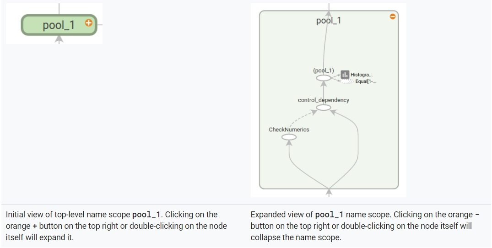
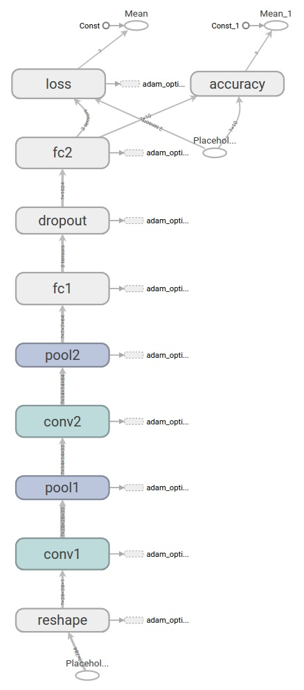
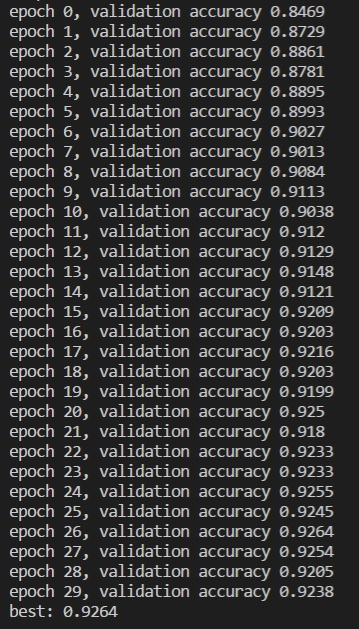

# 5 非专家莫入！TensorFlow实现CNN

当看到本篇时，根据TensorFlow官方标准[《Deep MNIST for Experts》](https://tensorflow.google.cn/get_started/mnist/pros)，你已经达到Expert Level，要恭喜了。

且不说是否夸大其词，换一种角度，假如能乘坐时光机仅往回飞5年，借此CNN实现，你也能在ImageNet上叱咤风云，战无不胜。就算飞不回去，它在今天依然是大杀伤力武器，大批大批老算法等着你去枪毙，大片大片垂直领域换代产品等着你去落地。这还不够么？

上一篇[4 深入拆解CNN架构](./4-深入拆解CNN架构.md)准备好了CNN的理论基础，本篇从代码层面，来看看TensorFlow如何搞定CNN，使识别精度达到99%以上。

## 分析代码的方式

再次说明下分析代码的方式。

与逐行分析代码不同，我偏好先清理代码涉及到的语言、工具的知识点，然后再去扫描逻辑。所以“Python必知必会”、“TensorFlow必知必会”将是首先出现的章节。

当然你也可以直接跳到代码部分：

- [tf_2-5_cnn.py](https://github.com/EthanYuan/TensorFlow/blob/master/TF1_3/tf_2-5_cnn.py)：CNN识别MNIST数字，基于官方文档[《Deep MNIST for Experts》](https://www.tensorflow.org/get_started/mnist/pros)，略有微调； 
- [tf_2-5_cnn_fashion_mnist.py](https://github.com/EthanYuan/TensorFlow/blob/master/TF1_3/tf_2-5_cnn_fashion_mnist.py)：CNN识别[Fashion-MNIST](http://www.jianshu.com/p/2ed1707c610d)；

代码运行环境：

- Python 3.6.2；
- TensorFlow 1.3.0 CPU version；

## Python必知必会

### With

在本篇所分析的代码中，用到了大量的`With`，值得一说。

**`With`要搭配上下文管理器（Context Manager）对象使用**。

所谓的上下文管理器对象，就是实现了**上下文管理器协议（Context Manager Protocol）**的对象。协议要求对象定义中必须实现`__enter__()`和`__exit__()`方法。

当看到下面语句时：

	With Context Manager Object [as target]：
		Body

它有4个意思：

- With块会在`Body`开始前自动调用Context Manager Object的`__enter__()`方法；
- With块会在`Body`结束前自动调用Context Manager Object的`__exit__()`方法，即使`Body`还未执行完时发生了异常，`__exit__()`也总会被调用；
- `Body`中出现异常时，Context Manager Object的`__exit__()`执行如果返回`False`，异常继续向上层抛出，如果返回`True`则该异常被忽略；
- 可选的`as target`并非是Context Manager Object本身，而是其调用`__enter__()`的返回值；

总的来说，With语句帮助上下文管理器对象实现了两个自动化的操作enter和exit，并充分考虑了异常情况。对于资源类对象（用完需要尽快释放）的使用，比如文件句柄、数据库连接等等，这无疑是一种简洁而完善的代码形式。

如果还想了解更多的细节，推荐阅读一篇老文章《[浅谈Python的with语句](https://www.ibm.com/developerworks/cn/opensource/os-cn-pythonwith/)》。

## TensorFlow必知必会

上面说的`with`，主要是为了配合TensorFlow的`tf.name_scope`。

### tf.name_scope

先来体会下我设计的“玩具”[代码](https://github.com/EthanYuan/TensorFlow/blob/master/TF1_3/tf_2-5_tf_name_scope.py)：

	import tensorflow as tf
	
	with tf.name_scope('V1'):
	    a1 = tf.Variable([50])
	    a2 = tf.Variable([100], name='a1')
	
	assert a1.name == 'V1/Variable:0'
	assert a2.name == 'V1/a1:0'
	
	with tf.name_scope("V2"):
	    a1 = tf.add(a1, a2, name="Add_Variable_a1")
	    a2 = tf.multiply(a1, a2, name="Add_Variable_a1")
	
	with tf.Session() as sess:
	    sess.run(tf.global_variables_initializer())
	
	    assert a1.name == 'V2/Add_Variable_a1:0'
	    assert sess.run(a1) == 150
	    assert a2.name == 'V2/Add_Variable_a1_1:0'
	    assert sess.run(a2) == 15000
	
	a2 = tf.get_collection(tf.GraphKeys.GLOBAL_VARIABLES, scope='V1/a1:0')[0]
	assert a2.name == 'V1/a1:0'

可以看到，其中有两类与`With`的搭配。

一种是资源类的tf.Session，手工使用时总要记得在使用后调用tf.Session.close方法释放，而与`With`搭配使用，则会自动调用其`__exit__()`进行释放。

另一种是本节的重点，与`With`搭配的并不是“资源”，而是**`tf.name_scope()`方法返回的对象，此时在With块中定义的节点，都会自动在属性name上添加name scope前缀**：

- 通过`tf.Variable`定义的变量节点，其属性name都添加了前缀；
- 通过`tf.add`和`tf.multiply`定义的运算节点，其属性name也添加了前缀；

*注意：通过`tf.get_variable`定义的节点，其属性name不受影响，tf.get_variable需要与`tf.variable_scope`搭配产生类似效果。*

TensorFlow的name scope有什么作用呢？主要是两点：

- 起到名字空间的作用，name scope还可以嵌套，方便管理大规模计算图节点；
- 可视化优化控制，能够生成层次化的计算图，节点可以按照name scope进行折叠，见下图；

如果对上述介绍仍有疑问，请仔细读读下面我为此准备的：

- **tf.Variable()返回的a1、a2、a3等等Python变量，是对节点的引用，与节点的name属性没有半毛钱关系**；
- **Node的name属性是计算图中节点的标识，Python层面的节点引用变量则不是，后者可以随时更改为对其他节点的引用**；
- **如果在Python层面失去了对某一节点的引用，节点并没有消失，也不会被自动回收，找回方法见玩具代码倒数第2行**；
- 有关TensorFlow计算图（Graph）基本构建单元Node的概念，请回顾《[TensorFlow从0到1 - 2 - TensorFlow核心编程](http://www.jianshu.com/p/28df688b2778)》。

## CNN架构

扫清了障碍，终于可以开始构建CNN了。

TensorFlow官方[《Deep MNIST for Experts》](https://tensorflow.google.cn/get_started/mnist/pros)中构建的CNN与LeNet-5的深度规模相当，具有5个隐藏层，但是卷积层滤波器的数量可多了不少：

- 输入层placeholder；
- reshape；
- 隐藏层1：conv1卷积层，32个滤波器；
- 隐藏层2：pool1池化层；
- 隐藏层3：conv2卷积层，64个滤波器；
- 隐藏层4：pool2池化层；
- 隐藏层5：fc1全连接层；
- dropout；
- fc2输出层；

计算下网络中权重的数量：

5x5x1x32 + 5x5x32x64 + 7x7x64x1024 + 1024x10 = 800 + 51200 + 3211264 + 10240 = **3273504**

这个并不算深的CNN有三百多万个参数，比之前识别MNIST所用的浅层神经网络，多了两个数量级。不过再仔细看下，两个卷积层包含的权重数量所占比例极小，导致参数量激增的是全连接网络层fc1。

下图是构建好的计算图（Computational Graph），得益于name scope的使用，它能够以“层”为粒度，清晰的显示出网络的骨架：

## Tensors和Filters

示例代码中，有了更多工程化的考虑，对CNN的构建进行了封装，形成了函数`deepnn`，在函数内部，With代码块的使用，使得网络的前馈路径也相当清楚，这部分就不再赘述了。

本节的重点是我们构建的计算图节点上流动的Tensors，以及参与运算的Filters：

- **Tensor：4阶，shape形式为：[batch, width, height, channels]**；
- **Filter：4阶，shape形式为：[width, height, channels，F-amount]**；

`deepnn`函数定义如下（省略处用……代替）：

	def deepnn(x):
	    with tf.name_scope('reshape'):
	        x_image = tf.reshape(x, [-1, 28, 28, 1])
	
	    with tf.name_scope('conv1'):
	        W_conv1 = weight_variable([5, 5, 1, 32])
	        ……
	
	    with tf.name_scope('pool1'):
	        h_pool1 = max_pool_2x2(h_conv1)
	
	    with tf.name_scope('conv2'):
	        W_conv2 = weight_variable([5, 5, 32, 64])
			……
	
	    with tf.name_scope('pool2'):
	        h_pool2 = max_pool_2x2(h_conv2)
	
	    with tf.name_scope('fc1'):
	        W_fc1 = weight_variable([7 * 7 * 64, 1024])
	        b_fc1 = bias_variable([1024])
	
	        h_pool2_flat = tf.reshape(h_pool2, [-1, 7 * 7 * 64])
	        h_fc1 = tf.nn.relu(tf.matmul(h_pool2_flat, W_fc1) + b_fc1)

	    with tf.name_scope('dropout'):
			……
	
	    with tf.name_scope('fc2'):
	        W_fc2 = weight_variable([1024, 10])
	        b_fc2 = bias_variable([10])
	
	        y_conv = tf.matmul(h_fc1_drop, W_fc2) + b_fc2
	    return y_conv, keep_prob

**Tensors**-[batch, width, height, channels]：

- `x_image = tf.reshape(x, [-1, 28, 28, 1])`：要将数据输入进二维的卷积网络，首先要进行一次reshape，把[batch, 784]的数据变成[-1, 28, 28, 1]，其中batch位填入“-1”可以自适应输入，width和height位为输入图像的原始宽高，最后一位是原始图像的通道数1（灰度图为单通道）；
- `h_pool2_flat = tf.reshape(h_pool2, [-1, 7 * 7 * 64])`：在将卷积网络的输出数据，输入全连接层时，需要再把数据拉平回一个2阶Tensor；

**Filters**-[width, height, channels，F-amount]：

- `W_conv1 = weight_variable([5, 5, 1, 32])`：第一卷积层滤波器，width和height位为卷积核的宽高，channels位代表滤波器通道数（匹配输入），最后一位F-amount位代表滤波器的数量为32个（官方文档从输出数据的角度定义其为output channels也颇为合理）；
- `W_conv2 = weight_variable([5, 5, 32, 64])`：第二卷积层滤波器，仍采用5x5卷积核，具有32个channels，滤波器数量64个；

## 跨距strides

为防止代码重复，卷积和池化这两项操作也进行了封装，前面缺失的滤波器的跨距（strides）定义，包含在这里。

`conv2d`定义：

	def conv2d(x, W):
	    return tf.nn.conv2d(x, W, strides=[1, 1, 1, 1], padding='SAME')

- `strides=[1, 1, 1, 1]`：跨距（strides）默认情况下第一个参数batch与最后一个参数channels都是1，第二位width和第三位height这里也设为1；
	
`max_pool_2x2`定义：

	def max_pool_2x2(x):
	    return tf.nn.max_pool(x, ksize=[1, 2, 2, 1],
	                          strides=[1, 2, 2, 1], padding='SAME')

- `ksize=[1, 2, 2, 1]`：池化滤波器采用了固定尺寸，池化操作是逐channel进行的，所以默认情况下第一个参数batch与最后一个参数channels都是1，第二位width和第三位height这里设为2，视野范围如一个“田”字；
- `strides=[1, 2, 2, 1]`：跨距（strides）默认情况下第一个参数batch与最后一个参数channels都是1，第二位width和第三位height这里设为2，表示从左到右、从上到下以“田”字进行搜索；

滤波器还有一个padding参数，官方文档给出的[计算方法](https://tensorflow.google.cn/api_docs/python/tf/nn/convolution)见下：

- `padding == 'SAME'`：output_spatial_shape = ceil(input_spatial_shape / strides)
- `padding == 'VALID'`：output_spatial_shape = ceil((input_spatial_shape - (spatial_filter_shape-1)) / strides)；

## 测试结果

代码实测结果，与TensorFlow官方基本一致：

- MNIST识别达到**99.3%**，明显超越了浅层神经网络；
- 60次迭代CPU运行时间：4 hours，接近无法忍受，更深的网络必须上GPU了；

相同架构下，基于[Fashion MNIST](http://www.jianshu.com/p/2ed1707c610d)数据集对网络重新进行了训练，验证集识别精度达到了**92.64%**。CNN的全能型，由此可见一斑。

## 附完整代码

	import argparse
	import sys
	from tensorflow.examples.tutorials.mnist import input_data
	import tensorflow as tf
	
	FLAGS = None
	
	
	def deepnn(x):
	    """deepnn builds the graph for a deep net for classifying digits.
	    Args:
	      x: an input tensor with the dimensions (N_examples, 784), where 784 is
	      the number of pixels in a standard MNIST image.
	    Returns:
	      A tuple (y, keep_prob). y is a tensor of shape (N_examples, 10), with
	      values equal to the logits of classifying the digit into one of 10
	      classes (the digits 0-9). keep_prob is a scalar placeholder for the
	      probability of dropout.
	    """
	    # Reshape to use within a convolutional neural net.
	    # Last dimension is for "features" - there is only one here, since images
	    # are grayscale -- it would be 3 for an RGB image, 4 for RGBA, etc.
	    with tf.name_scope('reshape'):
	        x_image = tf.reshape(x, [-1, 28, 28, 1])
	
	    # First convolutional layer - maps one grayscale image to 32 feature maps.
	    with tf.name_scope('conv1'):
	        W_conv1 = weight_variable([5, 5, 1, 32])
	        b_conv1 = bias_variable([32])
	        h_conv1 = tf.nn.relu(conv2d(x_image, W_conv1) + b_conv1)
	
	    # Pooling layer - downsamples by 2X.
	    with tf.name_scope('pool1'):
	        h_pool1 = max_pool_2x2(h_conv1)
	
	    # Second convolutional layer -- maps 32 feature maps to 64.
	    with tf.name_scope('conv2'):
	        W_conv2 = weight_variable([5, 5, 32, 64])
	        b_conv2 = bias_variable([64])
	        h_conv2 = tf.nn.relu(conv2d(h_pool1, W_conv2) + b_conv2)
	
	    # Second pooling layer.
	    with tf.name_scope('pool2'):
	        h_pool2 = max_pool_2x2(h_conv2)
	
	    # Fully connected layer 1 -- after 2 round of downsampling, our 28x28 image
	    # is down to 7x7x64 feature maps -- maps this to 1024 features.
	    with tf.name_scope('fc1'):
	        W_fc1 = weight_variable([7 * 7 * 64, 1024])
	        b_fc1 = bias_variable([1024])
	
	        h_pool2_flat = tf.reshape(h_pool2, [-1, 7 * 7 * 64])
	        h_fc1 = tf.nn.relu(tf.matmul(h_pool2_flat, W_fc1) + b_fc1)
	
	    # Dropout - controls the complexity of the model, prevents co-adaptation of
	    # features.
	    with tf.name_scope('dropout'):
	        keep_prob = tf.placeholder(tf.float32)
	        h_fc1_drop = tf.nn.dropout(h_fc1, keep_prob)
	
	    # Map the 1024 features to 10 classes, one for each digit
	    with tf.name_scope('fc2'):
	        W_fc2 = weight_variable([1024, 10])
	        b_fc2 = bias_variable([10])
	
	        y_conv = tf.matmul(h_fc1_drop, W_fc2) + b_fc2
	    return y_conv, keep_prob
	
	
	def conv2d(x, W):
	    """conv2d returns a 2d convolution layer with full stride."""
	    return tf.nn.conv2d(x, W, strides=[1, 1, 1, 1], padding='SAME')
	
	
	def max_pool_2x2(x):
	    """max_pool_2x2 downsamples a feature map by 2X."""
	    return tf.nn.max_pool(x, ksize=[1, 2, 2, 1],
	                          strides=[1, 2, 2, 1], padding='SAME')
	
	
	def weight_variable(shape):
	    """weight_variable generates a weight variable of a given shape."""
	    initial = tf.truncated_normal(shape, stddev=0.1)
	    return tf.Variable(initial)
	
	
	def bias_variable(shape):
	    """bias_variable generates a bias variable of a given shape."""
	    initial = tf.constant(0.1, shape=shape)
	    return tf.Variable(initial)
	
	
	def main(_):
	    # Import data
	    mnist = input_data.read_data_sets(FLAGS.data_dir, one_hot=True,
	                                      validation_size=10000)
	
	    # Create the model
	    x = tf.placeholder(tf.float32, [None, 784])
	
	    # Define loss and optimizer
	    y_ = tf.placeholder(tf.float32, [None, 10])
	
	    # Build the graph for the deep net
	    y_conv, keep_prob = deepnn(x)
	
	    with tf.name_scope('loss'):
	        cross_entropy = tf.nn.softmax_cross_entropy_with_logits(labels=y_,
	                                                                logits=y_conv)
	        cross_entropy = tf.reduce_mean(cross_entropy)
	
	    with tf.name_scope('adam_optimizer'):
	        train_step = tf.train.AdamOptimizer(1e-4).minimize(cross_entropy)
	
	    with tf.name_scope('accuracy'):
	        correct_prediction = tf.equal(tf.argmax(y_conv, 1), tf.argmax(y_, 1))
	        correct_prediction = tf.cast(correct_prediction, tf.float32)
	        accuracy = tf.reduce_mean(correct_prediction)
	
	    graph_location = 'MNIST/logs/tf2-4/train'
	    print('Saving graph to: %s' % graph_location)
	    train_writer = tf.summary.FileWriter(graph_location)
	    train_writer.add_graph(tf.get_default_graph())
	
	    best = 0
	    with tf.Session() as sess:
	        sess.run(tf.global_variables_initializer())
	        for epoch in range(60):
	            for _ in range(1000):
	                batch = mnist.train.next_batch(50)
	                train_step.run(
	                    feed_dict={x: batch[0], y_: batch[1], keep_prob: 0.5})
	            accuracy_validation = accuracy.eval(
	                feed_dict={
	                    x: mnist.validation.images,
	                    y_: mnist.validation.labels,
	                    keep_prob: 1.0})
	            print('epoch %d, validation accuracy %s' % (
	                epoch, accuracy_validation))
	            best = (best, accuracy_validation)[
	                best <= accuracy_validation]
	
	    # Test trained model
	    print("best: %s" % best)
	
	
	if __name__ == '__main__':
	    parser = argparse.ArgumentParser()
	    parser.add_argument('--data_dir', type=str, default='../MNIST/',
	                        help='Directory for storing input data')
	    FLAGS, unparsed = parser.parse_known_args()
	    tf.app.run(main=main, argv=[sys.argv[0]] + unparsed)

[下载tf_2-5_cnn.py](https://github.com/EthanYuan/TensorFlow/blob/master/TF1_3/tf_2-5_cnn.py)